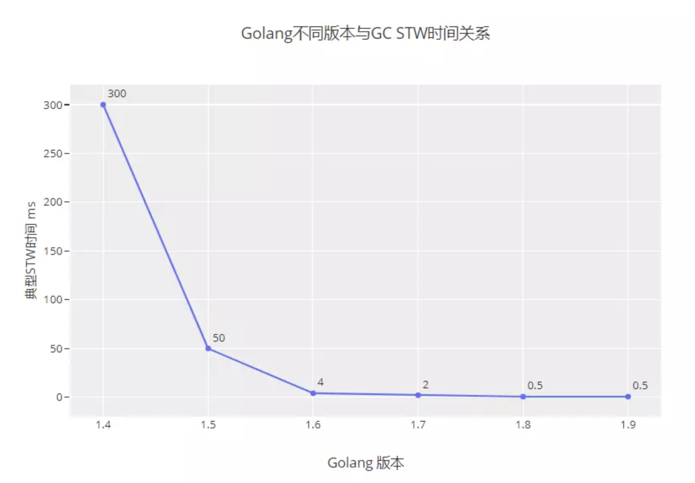
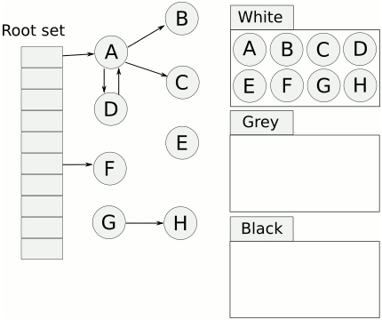
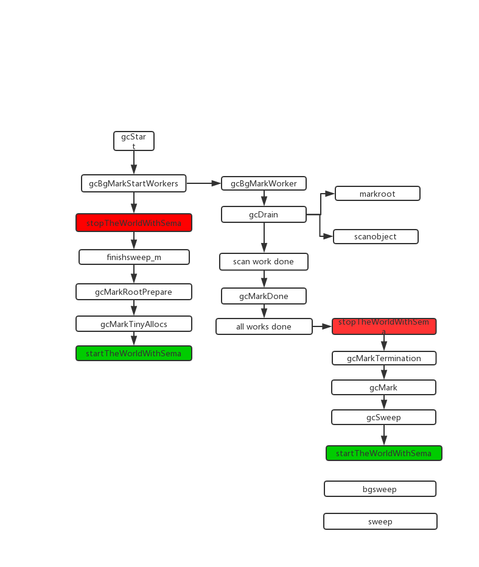

## 深入理解GC

垃圾回收其实就是内存回收，在一个对象不再被程序使用时，它所占用的空间就需要回收。

### 垃圾回收方法
我之前都用Python和Go，所以接触到的垃圾回收大致有这么几种：

#### 引用计数法
引用计数是Python中使用的垃圾回收方法，通过对一个对象计数，当计数等于0，就代表没有其他对象引用，可以清除，但是这个方法有个缺陷，就是无法解决循环引用

优点：
1. 简单，实时

缺点：
1. 需要维护计数资源
2. 循环使用

#### 标记清除
通过标记垃圾对象，然后进行清除， Golang的三色标记法就是这一种


#### 分代回收
根据对象的存活周期的不同而将内存分为3代：
* 年轻代: 新创建的对象都会分配在年轻代，比如局部变量
* 中年代：年轻代不会回收的就会放到中年代
* 老年代：老年代的对象存活最久


### Golang 各个版本GC改进

版本|发布时间|GC算法|STW时间|重大改变
---|---|---|---|---
1.1| 2013.5|STW|秒级|
1.3| 2014.6|Mark和Sweep分离. Mark STW, Sweep并发|百ms级别|
1.4| 2014.12|runtime代码基本都由C和少量汇编改为Go和少量汇编, 包括GC部分, 以此实现了准确式GC,减少了堆大小, 同时对指针的写入引入了write barrier, 为1.5铺垫|百ms级别|
1.5| 2015.8|三色标记法, 并发Mark, 并发Sweep. 非分代, 非移动, 并发的收集器|10ms-40ms级别|重要更新版本,生产上GC基本不会成为问题
1.6| 2016.2|1.5中一些与并发GC不协调的地方更改. 集中式的GC协调协程, 改为状态机实现|5-20ms|
1.7| 2016.8|GC时栈收缩改为并发, span中对象分配状态由freelist改为bitmap|1-3ms左右|
1.8| 2017.2|hybird write barrier, 消除了stw中的重新扫描栈|sub ms|Golang GC进入Sub ms时代，hybrid write barrier


### Stop The World
各个版本的STW时间



### 三色标记法
Golang三色标记法通过标记，将对象全部归类到3个集合，分别是白色对象、灰色对象和黑色对象。标记结束后，白色对象会被回收掉。



1. 首先将所有节点都放到白色对象集合
2. 从根节点开始遍历对象，遍历到的白色对象从白色集合放到灰色集合中
3. 遍历灰色集合中的对象，把灰色对象引用的白色对象放入到灰色集合，通过把遍历过的灰色对象放到黑色集合中
4. 循环步骤3，直到灰色集合中没有对象
5. 完成扫描后，白色对象就是不可达的对象，进行回收

### Stop The World
在扫描之前执行STW操作，就是Runtime把所有的线程全部冻结掉，所有的线程全部冻结掉意味着⽤户逻辑肯定都是暂停的，所有的⽤户对象都不会被修改了，这时候去扫描肯定是安全的

在执行STW过程中，用户的逻辑是暂停的，那么我们就需要保证这个时间尽量短，才能不影响我们的功能，那Golang是如何处理的：
* 新生的对象，一律标记为灰色对象
* 如果灰色或者黑色对象引用了白色对象，就会触发写屏障，GC就会将白色对象标记为灰色对象

### 写屏障
在标记的阶段，对象是可以进行修改的，如果在标记的过程中，对象引用发生了变更，就可能会导致回收错误，所以需要加入写屏障。 写屏障会将写操作和之后写操作对比。


### 流程图



### GC触发条件

gcTriggerAlways: 强制触发GC
gcTriggerHeap: 当堆内存大小到达一定值则触发GC
gcTriggerTime: 当具体上次GC时间超过2min，则触发GC
gcTriggerCycle: 启动新一轮GC，如果已启动则跳过，手动触发GC(runtime.GC)会使用这个条件

触发条件在gcTrigger.test方法，其中gcTriggerHeap会动态判断：
当heap_live大于gc_trigger，则触发gc
```go
func (t gcTrigger) test() bool {
    // ...
        return memstats.heap_live >= memstats.gc_trigger
    // ...
}
```

gc_trigger是触发gc的值，在gcSetTriggerRatio中计算，初始值是7 / 8.0

gcpercent和Golang里的一个环境变量有关，GOGC，默认是100，意思是live heap size 自上次垃圾回收后，增长1倍GC触发运行，gcpercent 默认也是100
 gcController.endCycle()
```go
	// 触发比例
	const triggerGain = 0.5

	// 目标heap增长率，默认是1.0
	goalGrowthRatio := float64(gcpercent) / 100
	// 实际heap增长率， 总大小 / (上一次GC标记的bytes) - 1
	actualGrowthRatio := float64(memstats.heap_live)/float64(memstats.heap_marked) - 1
	// GC标记阶段时间
	assistDuration := nanotime() - c.markStartTime

	// GC标记阶段CPU使用率，0.25
	utilization := gcBackgroundUtilization
	// Add assist utilization; avoid divide by zero.

	if assistDuration > 0 {
		// assistTime 是G辅助GC标记对象所使用的时间总和
		// utilization += 辅助gc标记总时间/ GC标记时间*CPU个数
		utilization += float64(c.assistTime) / float64(assistDuration*int64(gomaxprocs))
	}

	// 
	triggerError := goalGrowthRatio - memstats.triggerRatio - utilization/gcGoalUtilization*(actualGrowthRatio-memstats.triggerRatio)

	// 渐进式调整，每次只调整一半的值
	triggerRatio := memstats.triggerRatio + triggerGain*triggerError
}
```

### 辅助GC(mutator assist)

### GC过程
为了防止heap增速太快，在GC执行过程中如果同时运行G分配了内存，则这个G会被要求辅助GC做一部分工作

assistWorkPerByte计算公式在revise
assistBytesPerWork
```go
func (c *gcControllerState) revise() {
	gcpercent := gcpercent
	if gcpercent < 0 {
		// If GC is disabled but we're running a forced GC,
		// act like GOGC is huge for the below calculations.
		gcpercent = 100000
	}
	live := atomic.Load64(&memstats.heap_live)

	var heapGoal, scanWorkExpected int64
	// 当前活动的heap大于下一次gc的heap_live
	if live <= memstats.next_gc {
		// 我们在软目标下
		heapGoal = int64(memstats.next_gc)

		// 计算预期剩余扫描工作，如果GOGC=100，只有扫描heap一半的被认为是live
		scanWorkExpected = int64(float64(memstats.heap_scan) * 100 / float64(100+gcpercent))
	} else {
		// 我们达到了硬限制，
		const maxOvershoot = 1.1
		heapGoal = int64(float64(memstats.next_gc) * maxOvershoot)

		// 计算扫描工作的上线
		scanWorkExpected = int64(memstats.heap_scan)
	}

	// 计算剩余扫描工作
	scanWorkRemaining := scanWorkExpected - c.scanWork
	if scanWorkRemaining < 1000 {
		// We set a somewhat arbitrary lower bound on
		// remaining scan work since if we aim a little high,
		// we can miss by a little.
		//
		// We *do* need to enforce that this is at least 1,
		// since marking is racy and double-scanning objects
		// may legitimately make the remaining scan work
		// negative, even in the hard goal regime.
		scanWorkRemaining = 1000
	}

	// 计算剩余堆
	heapRemaining := heapGoal - int64(live)
	if heapRemaining <= 0 {
		// This shouldn't happen, but if it does, avoid
		// dividing by zero or setting the assist negative.
		heapRemaining = 1
	}

	// 计算辅助助手
	c.assistWorkPerByte = float64(scanWorkRemaining) / float64(heapRemaining)
	c.assistBytesPerWork = float64(heapRemaining) / float64(scanWorkRemaining)
}

```

#### gcStart
gc触发函数
```go
func gcStart(trigger gcTrigger) {
	// 判断当前g是否可抢占， 不抢占不触发
	mp := acquirem()
	if gp := getg(); gp == mp.g0 || mp.locks > 1 || mp.preemptoff != "" {
		releasem(mp)
		return
	}
	releasem(mp)
	mp = nil

	// 触发gc并且开始并行扫描
	for trigger.test() && sweepone() != ^uintptr(0) {
		sweep.nbgsweep++
	}

	// 加锁
	semacquire(&work.startSema)
	// 检测是否触发gc
	if !trigger.test() {
		semrelease(&work.startSema)
		return
	}

	// 检查是否强制触发gc
	work.userForced = trigger.kind == gcTriggerAlways || trigger.kind == gcTriggerCycle

	// 判断是否禁止了并行gc
	mode := gcBackgroundMode
	if debug.gcstoptheworld == 1 {
		mode = gcForceMode
	} else if debug.gcstoptheworld == 2 {
		mode = gcForceBlockMode
	}

	// Ok, we're doing it! Stop everybody else
	semacquire(&worldsema)

	if trace.enabled {
		traceGCStart()
	}

    // 如果.mcache.flushGen不等于mheap_.sweepgen，说明有旧的数据
	for _, p := range allp {
		if fg := atomic.Load(&p.mcache.flushGen); fg != mheap_.sweepgen {
			println("runtime: p", p.id, "flushGen", fg, "!= sweepgen", mheap_.sweepgen)
			throw("p mcache not flushed")
		}
	}

	// 启动后台扫描任务
	gcBgMarkStartWorkers()

	// 重置标记状态
	gcResetMarkState()
	// 重置参数
	work.stwprocs, work.maxprocs = gomaxprocs, gomaxprocs
	if work.stwprocs > ncpu {
		// This is used to compute CPU time of the STW phases,
		// so it can't be more than ncpu, even if GOMAXPROCS is.
		work.stwprocs = ncpu
	}
	work.heap0 = atomic.Load64(&memstats.heap_live)
	work.pauseNS = 0
	work.mode = mode
	// 记录开始时间
	now := nanotime()
	work.tSweepTerm = now
	work.pauseStart = now
	if trace.enabled {
		traceGCSTWStart(1)
	}

	// STOP THE WORLD
	systemstack(stopTheWorldWithSema)

	// 并发扫描前确认已经完成gc标记
	systemstack(func() {
		finishsweep_m()
	})

	// clear sched.sudogcache和sched.deferpool
	clearpools()

	work.cycles++

	// 开启新一轮gc前重置gcController
	gcController.startCycle()
	work.heapGoal = memstats.next_gc

	// In STW mode, disable scheduling of user Gs. This may also
	// disable scheduling of this goroutine, so it may block as
	// soon as we start the world again.
	if mode != gcBackgroundMode {
		schedEnableUser(false)
	}

	// 进入并发标记阶段，开启写屏障
	setGCPhase(_GCmark)

	// 重置后台标记任务的计数器(nproc, nwait)
	gcBgMarkPrepare()

	// 计算扫描根对象的任务数量
	gcMarkRootPrepare()

	// 标记所有活动的tiny 
	gcMarkTinyAllocs()

	// 启动辅助gc
	atomic.Store(&gcBlackenEnabled, 1)

	// 标记开始的时间
	gcController.markStartTime = now

	// 并发标记
	systemstack(func() {
		// START THE WORLD
		// 标记已经在进行
		now = startTheWorldWithSema(trace.enabled)
		// 记录停止了多久
		work.pauseNS += now - work.pauseStart
		work.tMark = now
	})

	// STW模式下，block
	if mode != gcBackgroundMode {
		Gosched()
	}

	semrelease(&work.startSema)
}
```

#### gcBgMarkStartWorkers
后台标记任务
```go
func gcBgMarkStartWorkers() {
	// Background marking is performed by per-P G's. Ensure that
	// each P has a background GC G.
	for _, p := range allp {
		// 是否未启动
		if p.gcBgMarkWorker == 0 {
			go gcBgMarkWorker(p)
			// 启动后等待该任务通知信号量bgMarkReady再继续
			notetsleepg(&work.bgMarkReady, -1)
			noteclear(&work.bgMarkReady)
		}
	}
}

```

#### gcBgMarkWorker
后台标记任务
```go
func gcBgMarkWorker(_p_ *p) {
	gp := getg()

	type parkInfo struct {
		m      muintptr // Release this m on park.
		attach puintptr // If non-nil, attach to this p on park.
	}
	// We pass park to a gopark unlock function, so it can't be on
	// the stack (see gopark). Prevent deadlock from recursively
	// starting GC by disabling preemption.
	gp.m.preemptoff = "GC worker init"
	park := new(parkInfo)
	gp.m.preemptoff = ""

	// M禁止抢占
	park.m.set(acquirem())
	// 绑定P
	park.attach.set(_p_)
	// 通知gcBgMarkStartWorkers已准备完毕，可以继续
	notewakeup(&work.bgMarkReady)

	for {
		// Go to sleep until woken by gcController.findRunnable.
		// We can't releasem yet since even the call to gopark
		// may be preempted.
		// 休眠直到被gcController.findRunnable唤醒
		gopark(func(g *g, parkp unsafe.Pointer) bool {
			park := (*parkInfo)(parkp)

			// The worker G is no longer running, so it's
			// now safe to allow preemption.
			// 扫描任务不在运行，允许抢占
			releasem(park.m.ptr())

			// 如果worker没有关联P，需要关联下
			if park.attach != 0 {
				p := park.attach.ptr()
				park.attach.set(nil)
				// 把当前G设置成gcBgMarkWorker的成员
				if !p.gcBgMarkWorker.cas(0, guintptr(unsafe.Pointer(g))) {
					// 已经有任务，设置失败，退出休眠
					return false
				}
			}
			return true
		}, unsafe.Pointer(park), waitReasonGCWorkerIdle, traceEvGoBlock, 0)

		// 如果P的gcBgMarkWorker和当前G不一致，则退出
		if _p_.gcBgMarkWorker.ptr() != gp {
			break
		}

		// 禁止抢占
		park.m.set(acquirem())

		if gcBlackenEnabled == 0 {
			throw("gcBgMarkWorker: blackening not enabled")
		}

		// 开始时间
		startTime := nanotime()
		_p_.gcMarkWorkerStartTime = startTime

		decnwait := atomic.Xadd(&work.nwait, -1)
		if decnwait == work.nproc {
			println("runtime: work.nwait=", decnwait, "work.nproc=", work.nproc)
			throw("work.nwait was > work.nproc")
		}

		systemstack(func() {
			// 标记G可抢占以便能够扫描栈（两个标记任务可以互相扫描对方），标记任务禁止栈收缩
			casgstatus(gp, _Grunning, _Gwaiting)
			switch _p_.gcMarkWorkerMode {
			default:
				throw("gcBgMarkWorker: unexpected gcMarkWorkerMode")
			case gcMarkWorkerDedicatedMode:
				// 只执行标记
				gcDrain(&_p_.gcw, gcDrainUntilPreempt|gcDrainFlushBgCredit)
				if gp.preempt {
					// 抢占成功，踢出所有的runq，然后执行gp
					lock(&sched.lock)
					for {
						gp, _ := runqget(_p_)
						if gp == nil {
							break
						}
						globrunqput(gp)
					}
					unlock(&sched.lock)
				}
				// Go back to draining, this time
				// without preemption.
				// 继续标记，直到没有更多任务，并且需要计算后台的扫描量来减少辅助GC和唤醒等待中的G
				gcDrain(&_p_.gcw, gcDrainFlushBgCredit)
			case gcMarkWorkerFractionalMode:
				// 执行标记，直到被抢占
				// 需要计算后台的扫描量来减少辅助GC和唤醒等待中的G
				gcDrain(&_p_.gcw, gcDrainFractional|gcDrainUntilPreempt|gcDrainFlushBgCredit)
			case gcMarkWorkerIdleMode:
				// 只有在P空闲的时候执行标记，直到被抢占或者达到一定量
				// 需要计算后台的扫描量来减少辅助GC和唤醒等待中的G
				gcDrain(&_p_.gcw, gcDrainIdle|gcDrainUntilPreempt|gcDrainFlushBgCredit)
			}
			// 恢复G的状态到运行中
			casgstatus(gp, _Gwaiting, _Grunning)
		})

		// 计算时间
		duration := nanotime() - startTime
		switch _p_.gcMarkWorkerMode {
		case gcMarkWorkerDedicatedMode:
			atomic.Xaddint64(&gcController.dedicatedMarkTime, duration)
			atomic.Xaddint64(&gcController.dedicatedMarkWorkersNeeded, 1)
		case gcMarkWorkerFractionalMode:
			atomic.Xaddint64(&gcController.fractionalMarkTime, duration)
			atomic.Xaddint64(&_p_.gcFractionalMarkTime, duration)
		case gcMarkWorkerIdleMode:
			atomic.Xaddint64(&gcController.idleMarkTime, duration)
		}

		// Was this the last worker and did we run out
		// of work?
		incnwait := atomic.Xadd(&work.nwait, +1)
		if incnwait > work.nproc {
			println("runtime: p.gcMarkWorkerMode=", _p_.gcMarkWorkerMode,
				"work.nwait=", incnwait, "work.nproc=", work.nproc)
			throw("work.nwait > work.nproc")
		}


		// 判断是否所有后台标记任务都完成了，并且没有多余的任务
		if incnwait == work.nproc && !gcMarkWorkAvailable(nil) {
			// 标记G可抢占，并且取消关联
			_p_.gcBgMarkWorker.set(nil)
			releasem(park.m.ptr())

			// 准备进入完成标记阶段
			gcMarkDone()

			// 禁止抢占准备重新关联P
			park.m.set(acquirem())
			// 重新关联之前的P
			park.attach.set(_p_)
		}
	}
}

```

#### startCycle
startCycle会为新一轮的GC重置状态和估计值
```go
func (c *gcControllerState) startCycle() {
	c.scanWork = 0
	c.bgScanCredit = 0
	c.assistTime = 0
	c.dedicatedMarkTime = 0
	c.fractionalMarkTime = 0
	c.idleMarkTime = 0

	// If this is the first GC cycle or we're operating on a very
	// small heap, fake heap_marked so it looks like gc_trigger is
	// the appropriate growth from heap_marked, even though the
	// real heap_marked may not have a meaningful value (on the
	// first cycle) or may be much smaller (resulting in a large
	// error response).

	// 如果是第一次GC或者当前的heap非常小，我们需要伪装一个heap_marked来防止后面triggerRatio过小
	if memstats.gc_trigger <= heapminimum {
		memstats.heap_marked = uint64(float64(memstats.gc_trigger) / (1 + memstats.triggerRatio))
	}

	// 重新计算gc的heap的目标
	memstats.next_gc = memstats.heap_marked + memstats.heap_marked*uint64(gcpercent)/100
	if gcpercent < 0 {
		memstats.next_gc = ^uint64(0)
	}

	// 确保本次heap的目标只要应该大于活动的对大小，至少应该高1MB
	if memstats.next_gc < memstats.heap_live+1024*1024 {
		memstats.next_gc = memstats.heap_live + 1024*1024
	}

	// Compute the background mark utilization goal. In general,
	// this may not come out exactly. We round the number of
	// dedicated workers so that the utilization is closest to
	// 25%. For small GOMAXPROCS, this would introduce too much
	// error, so we add fractional workers in that case.
	// 计算后台标记任务的使用率，一般情况下是25%
	// totalUtilizationGoal = cpu * 0.25
	// 专用的标记任务数 dedicatedMarkWorkersNeeded = cpu * 0.25 + 0.5
	totalUtilizationGoal := float64(gomaxprocs) * gcBackgroundUtilization
	c.dedicatedMarkWorkersNeeded = int64(totalUtilizationGoal + 0.5)
	// 
	utilError := float64(c.dedicatedMarkWorkersNeeded)/totalUtilizationGoal - 1
	const maxUtilError = 0.3
	if utilError < -maxUtilError || utilError > maxUtilError {
		// Rounding put us more than 30% off our goal. With
		// gcBackgroundUtilization of 25%, this happens for
		// GOMAXPROCS<=3 or GOMAXPROCS=6. Enable fractional
		// workers to compensate.
		if float64(c.dedicatedMarkWorkersNeeded) > totalUtilizationGoal {
			// 太多任务
			c.dedicatedMarkWorkersNeeded--
		}
		c.fractionalUtilizationGoal = (totalUtilizationGoal - float64(c.dedicatedMarkWorkersNeeded)) / float64(gomaxprocs)
	} else {
		c.fractionalUtilizationGoal = 0
	}

	// In STW mode, we just want dedicated workers.
	if debug.gcstoptheworld > 0 {
		c.dedicatedMarkWorkersNeeded = int64(gomaxprocs)
		c.fractionalUtilizationGoal = 0
	}

	// 重置辅助gc的时间统计和gcFractionalMarkTime
	for _, p := range allp {
		p.gcAssistTime = 0
		p.gcFractionalMarkTime = 0
	}

	// Compute initial values for controls that are updated
	// throughout the cycle.
	// 计算辅助gc的参数
	c.revise()

	if debug.gcpacertrace > 0 {
		print("pacer: assist ratio=", c.assistWorkPerByte,
			" (scan ", memstats.heap_scan>>20, " MB in ",
			work.initialHeapLive>>20, "->",
			memstats.next_gc>>20, " MB)",
			" workers=", c.dedicatedMarkWorkersNeeded,
			"+", c.fractionalUtilizationGoal, "\n")
	}
}
```

#### revise
```go
func (c *gcControllerState) revise() {
	gcpercent := gcpercent
	if gcpercent < 0 {
		// If GC is disabled but we're running a forced GC,
		// act like GOGC is huge for the below calculations.
		gcpercent = 100000
	}
	live := atomic.Load64(&memstats.heap_live)

	var heapGoal, scanWorkExpected int64
	// 当前活动的heap大于下一次gc的heap_live
	if live <= memstats.next_gc {
		// 我们在软目标下
		heapGoal = int64(memstats.next_gc)

		// 计算预期剩余扫描工作，如果GOGC=100，只有扫描heap一半的被认为是live
		scanWorkExpected = int64(float64(memstats.heap_scan) * 100 / float64(100+gcpercent))
	} else {
		// 我们达到了硬限制，
		const maxOvershoot = 1.1
		heapGoal = int64(float64(memstats.next_gc) * maxOvershoot)

		// 计算扫描工作的上线
		scanWorkExpected = int64(memstats.heap_scan)
	}

	// 计算剩余扫描工作
	scanWorkRemaining := scanWorkExpected - c.scanWork
	if scanWorkRemaining < 1000 {
		// We set a somewhat arbitrary lower bound on
		// remaining scan work since if we aim a little high,
		// we can miss by a little.
		//
		// We *do* need to enforce that this is at least 1,
		// since marking is racy and double-scanning objects
		// may legitimately make the remaining scan work
		// negative, even in the hard goal regime.
		scanWorkRemaining = 1000
	}

	// 计算剩余堆
	heapRemaining := heapGoal - int64(live)
	if heapRemaining <= 0 {
		// This shouldn't happen, but if it does, avoid
		// dividing by zero or setting the assist negative.
		heapRemaining = 1
	}

	// Compute the mutator assist ratio so by the time the mutator
	// allocates the remaining heap bytes up to next_gc, it will
	// have done (or stolen) the remaining amount of scan work.
	c.assistWorkPerByte = float64(scanWorkRemaining) / float64(heapRemaining)
	c.assistBytesPerWork = float64(heapRemaining) / float64(scanWorkRemaining)
}
```

#### gcMarkRootPrepare
计算扫描根对象的任务数量
```go
func gcMarkRootPrepare() {
	work.nFlushCacheRoots = 0

	// 计算有多少数据和BSS， rootBlockBytes是256KB
	nBlocks := func(bytes uintptr) int {
		return int((bytes + rootBlockBytes - 1) / rootBlockBytes)
	}

	work.nDataRoots = 0
	work.nBSSRoots = 0

	// Scan globals.
	// 计算扫描可读写的全局变量的任务数量
	for _, datap := range activeModules() {
		nDataRoots := nBlocks(datap.edata - datap.data)
		if nDataRoots > work.nDataRoots {
			work.nDataRoots = nDataRoots
		}
	}

	// 计算扫描只读的全局变量的任务数量
	for _, datap := range activeModules() {
		nBSSRoots := nBlocks(datap.ebss - datap.bss)
		if nBSSRoots > work.nBSSRoots {
			work.nBSSRoots = nBSSRoots
		}
	}

	// Scan span roots for finalizer specials.
	//
	// We depend on addfinalizer to mark objects that get
	// finalizers after root marking.
	//
	// We're only interested in scanning the in-use spans,
	// which will all be swept at this point. More spans
	// may be added to this list during concurrent GC, but
	// we only care about spans that were allocated before
	// this mark phase.
	// 计算扫描span中finalizer的数量
	work.nSpanRoots = mheap_.sweepSpans[mheap_.sweepgen/2%2].numBlocks()

	// Scan stacks.
	//
	// Gs may be created after this point, but it's okay that we
	// ignore them because they begin life without any roots, so
	// there's nothing to scan, and any roots they create during
	// the concurrent phase will be scanned during mark
	// termination.
	// 计算扫描栈的任务数量
	work.nStackRoots = int(atomic.Loaduintptr(&allglen))

	// 计算总任务数量
	work.markrootNext = 0
	work.markrootJobs = uint32(fixedRootCount + work.nFlushCacheRoots + work.nDataRoots + work.nBSSRoots + work.nSpanRoots + work.nStackRoots)
}
```

#### gcMarkTinyAllocs
gcMarkTinyAllocs会标记所有的tiny 
```go
func gcMarkTinyAllocs() {
	for _, p := range allp {
		c := p.mcache
		if c == nil || c.tiny == 0 {
			continue
		}
		_, span, objIndex := findObject(c.tiny, 0, 0)
		gcw := &p.gcw
		greyobject(c.tiny, 0, 0, span, gcw, objIndex)
	}
}
```

#### findRunnableGCWorker
findRunnableGCWorker会获取后台的标记任务，决定是否运行
```go
func (c *gcControllerState) findRunnableGCWorker(_p_ *p) *g {
	if gcBlackenEnabled == 0 {
		throw("gcControllerState.findRunnable: blackening not enabled")
	}
	if _p_.gcBgMarkWorker == 0 {
		// The mark worker associated with this P is blocked
		// performing a mark transition. We can't run it
		// because it may be on some other run or wait queue.
		return nil
	}

	if !gcMarkWorkAvailable(_p_) {
		// No work to be done right now. This can happen at
		// the end of the mark phase when there are still
		// assists tapering off. Don't bother running a worker
		// now because it'll just return immediately.
		return nil
	}

	// 原子减少值，如果减少后大于等于0则返回true， 否则返回true
	decIfPositive := func(ptr *int64) bool {
		if *ptr > 0 {
			if atomic.Xaddint64(ptr, -1) >= 0 {
				return true
			}
			// We lost a race
			atomic.Xaddint64(ptr, +1)
		}
		return false
	}

	// 减少dedicatedMarkWorkersNeeded，成功后是dedicated
	if decIfPositive(&c.dedicatedMarkWorkersNeeded) {
		// This P is now dedicated to marking until the end of
		// the concurrent mark phase.
		_p_.gcMarkWorkerMode = gcMarkWorkerDedicatedMode
	} else if c.fractionalUtilizationGoal == 0 {
		// No need for fractional workers.
		// 不需要
		return nil
	} else {
		// Is this P behind on the fractional utilization
		// goal?
		//
		// This should be kept in sync with pollFractionalWorkerExit.
		delta := nanotime() - gcController.markStartTime
		if delta > 0 && float64(_p_.gcFractionalMarkTime)/float64(delta) > c.fractionalUtilizationGoal {
			// Nope. No need to run a fractional worker.
			return nil
		}
		// Run a fractional worker.
		_p_.gcMarkWorkerMode = gcMarkWorkerFractionalMode
	}

	// 运行后台标记任务
	gp := _p_.gcBgMarkWorker.ptr()
	casgstatus(gp, _Gwaiting, _Grunnable)
	if trace.enabled {
		traceGoUnpark(gp, 0)
	}
	return gp
}
```

### startTheWorldWithSema
```go
func stopTheWorldWithSema() {
	_g_ := getg()

	// If we hold a lock, then we won't be able to stop another M
	// that is blocked trying to acquire the lock.
	if _g_.m.locks > 0 {
		throw("stopTheWorld: holding locks")
	}

	lock(&sched.lock)
	// 需要停止P的数量
	sched.stopwait = gomaxprocs
	atomic.Store(&sched.gcwaiting, 1)
	// 抢占所有运行中的G
	preemptall()
	// 停止当前的P
	_g_.m.p.ptr().status = _Pgcstop // Pgcstop is only diagnostic.
	// 减少停止的P-当前的P
	sched.stopwait--
	// try to retake all P's in Psyscall status
	// 尝试抢占所有处在Psyscall状态的P
	for _, p := range allp {
		s := p.status
		if s == _Psyscall && atomic.Cas(&p.status, s, _Pgcstop) {
			if trace.enabled {
				traceGoSysBlock(p)
				traceProcStop(p)
			}
			p.syscalltick++
			sched.stopwait--
		}
	}
	// stop idle P's
	// 再次停止空闲的P，防止进入调度
	for {
		p := pidleget()
		if p == nil {
			break
		}
		p.status = _Pgcstop
		sched.stopwait--
	}
	wait := sched.stopwait > 0
	unlock(&sched.lock)

	// wait for remaining P's to stop voluntarily
	// 等待剩余的P停止
	if wait {
		for {
			// 等待100微秒，然后尝试重新抢占
			if notetsleep(&sched.stopnote, 100*1000) {
				noteclear(&sched.stopnote)
				break
			}
			preemptall()
		}
	}

	// 再次检查
	bad := ""
	if sched.stopwait != 0 {
		bad = "stopTheWorld: not stopped (stopwait != 0)"
	} else {
		for _, p := range allp {
			if p.status != _Pgcstop {
				bad = "stopTheWorld: not stopped (status != _Pgcstop)"
			}
		}
	}
	if atomic.Load(&freezing) != 0 {
		// Some other thread is panicking. This can cause the
		// sanity checks above to fail if the panic happens in
		// the signal handler on a stopped thread. Either way,
		// we should halt this thread.
		lock(&deadlock)
		lock(&deadlock)
	}
	if bad != "" {
		throw(bad)
	}
}
```

### startTheWorldWithSema
```go
func startTheWorldWithSema(emitTraceEvent bool) int64 {
	_g_ := getg()

	// 禁止g抢占
	_g_.m.locks++ // disable preemption because it can be holding p in a local var

	if netpollinited() {
		// 获取netpoll事件，并将其加入到待运行队列
		list := netpoll(false) // non-blocking
		injectglist(&list)
	}
	lock(&sched.lock)

	// 获取当前gomaxprocs
	procs := gomaxprocs
	if newprocs != 0 {
		procs = newprocs
		newprocs = 0
	}
	p1 := procresize(procs)
	// 取消gc等待标记
	sched.gcwaiting = 0

	// 如果sysmon在等待则唤醒它
	if sched.sysmonwait != 0 {
		sched.sysmonwait = 0
		notewakeup(&sched.sysmonnote)
	}
	unlock(&sched.lock)
	// 唤醒所有可运行的P
	for p1 != nil {
		p := p1
		p1 = p1.link.ptr()
		if p.m != 0 {
			mp := p.m.ptr()
			p.m = 0
			if mp.nextp != 0 {
				throw("startTheWorld: inconsistent mp->nextp")
			}
			mp.nextp.set(p)
			notewakeup(&mp.park)
		} else {
			// Start M to run P.  Do not start another M below.
			newm(nil, p)
		}
	}

	// Capture start-the-world time before doing clean-up tasks.
	// 记录事件
	startTime := nanotime()
	if emitTraceEvent {
		traceGCSTWDone()
	}

	// Wakeup an additional proc in case we have excessive runnable goroutines
	// in local queues or in the global queue. If we don't, the proc will park itself.
	// If we have lots of excessive work, resetspinning will unpark additional procs as necessary.
	// 如果这里还有的空闲pidle并且m还在自旋，则继续环境
	if atomic.Load(&sched.npidle) != 0 && atomic.Load(&sched.nmspinning) == 0 {
		wakep()
	}

	_g_.m.locks--
	// 恢复抢占请求
	if _g_.m.locks == 0 && _g_.preempt { // restore the preemption request in case we've cleared it in newstack
		_g_.stackguard0 = stackPreempt
	}

	return startTime
}

```

#### gcDrain
gcDrain 从根部和对象开始扫描，将灰色对象变黑直到没有任务需要处理
```go
func gcDrain(gcw *gcWork, flags gcDrainFlags) {
	if !writeBarrier.needed {
		throw("gcDrain phase incorrect")
	}

	gp := getg().m.curg
	// 当前g在抢占中，直接返回
	preemptible := flags&gcDrainUntilPreempt != 0
	// 刷新gc扫描任务
	flushBgCredit := flags&gcDrainFlushBgCredit != 0
	// 是否空闲
	idle := flags&gcDrainIdle != 0

	// 记录初始已扫描的数量
	initScanWork := gcw.scanWork

	// checkWork is the scan work before performing the next
	// self-preempt check.
	// checkWork 在扫描之前检查
	checkWork := int64(1<<63 - 1)
	var check func() bool
	if flags&(gcDrainIdle|gcDrainFractional) != 0 {
		checkWork = initScanWork + drainCheckThreshold
		if idle {
			check = pollWork
		} else if flags&gcDrainFractional != 0 {
			check = pollFractionalWorkerExit
		}
	}

	// 如果根对象未扫描完， 则先扫描根对象
	if work.markrootNext < work.markrootJobs {
		for !(preemptible && gp.preempt) {
			// 从扫描队列中取出一个值
			job := atomic.Xadd(&work.markrootNext, +1) - 1
			if job >= work.markrootJobs {
				break
			}
			// 执行跟对象扫描
			markroot(gcw, job)
			// 如果是idle模式并且有其他工作，则返回
			if check != nil && check() {
				goto done
			}
		}
	}

	// 消费标记队列
	for !(preemptible && gp.preempt) {
		// 如果全局标记队列为空，把本地标记队列的一部分分过去
		if work.full == 0 {
			gcw.balance()
		}

		b := gcw.tryGetFast()
		if b == 0 {
			b = gcw.tryGet()
			if b == 0 {
				// 刷新写屏障buffer，尝试再次获取标记队列
				wbBufFlush(nil, 0)
				b = gcw.tryGet()
			}
		}
		if b == 0 {
			// 为空，则退出
			break
		}
		scanobject(b, gcw)

		// 如果扫描的对象已经超过gcCreditSlack=2000
		if gcw.scanWork >= gcCreditSlack {
			// 把扫描的对象加入到全局
			atomic.Xaddint64(&gcController.scanWork, gcw.scanWork)
			// 减少辅助GC的工作量和唤醒等待的G
			if flushBgCredit {
				gcFlushBgCredit(gcw.scanWork - initScanWork)
				initScanWork = 0
			}
			checkWork -= gcw.scanWork
			gcw.scanWork = 0

			if checkWork <= 0 {
				checkWork += drainCheckThreshold
				if check != nil && check() {
					break
				}
			}
		}
	}

done:
	// 把扫描的对象数量添加到全局
	if gcw.scanWork > 0 {
		atomic.Xaddint64(&gcController.scanWork, gcw.scanWork)
		// 减少辅助GC的工作量和唤醒等待的G
		if flushBgCredit {
			gcFlushBgCredit(gcw.scanWork - initScanWork)
		}
		gcw.scanWork = 0
	}
}
```

#### markroot
根对象扫描工作
```go
func markroot(gcw *gcWork, i uint32) {
	// 根据算出的数组去执行对应的任务
	baseFlushCache := uint32(fixedRootCount)
	baseData := baseFlushCache + uint32(work.nFlushCacheRoots)
	baseBSS := baseData + uint32(work.nDataRoots)
	baseSpans := baseBSS + uint32(work.nBSSRoots)
	baseStacks := baseSpans + uint32(work.nSpanRoots)
	end := baseStacks + uint32(work.nStackRoots)

	// Note: if you add a case here, please also update heapdump.go:dumproots.
	switch {
	case baseFlushCache <= i && i < baseData:
		// 释放mache中的span
		flushmcache(int(i - baseFlushCache))

	case baseData <= i && i < baseBSS:
		// 扫描可读写的全局变量
		for _, datap := range activeModules() {
			markrootBlock(datap.data, datap.edata-datap.data, datap.gcdatamask.bytedata, gcw, int(i-baseData))
		}

	case baseBSS <= i && i < baseSpans:
		// 扫描只读的环境变量
		for _, datap := range activeModules() {
			markrootBlock(datap.bss, datap.ebss-datap.bss, datap.gcbssmask.bytedata, gcw, int(i-baseBSS))
		}

	case i == fixedRootFinalizers:
		// 扫描析构器队列
		for fb := allfin; fb != nil; fb = fb.alllink {
			cnt := uintptr(atomic.Load(&fb.cnt))
			scanblock(uintptr(unsafe.Pointer(&fb.fin[0])), cnt*unsafe.Sizeof(fb.fin[0]), &finptrmask[0], gcw, nil)
		}

	case i == fixedRootFreeGStacks:
		// 释放中止的栈（Gdead）
		systemstack(markrootFreeGStacks)

	case baseSpans <= i && i < baseStacks:
		// 扫描各个span的特殊对象
		markrootSpans(gcw, int(i-baseSpans))

	default:
		// 扫描各个栈
		var gp *g
		// 获取需要扫描的g
		if baseStacks <= i && i < end {
			gp = allgs[i-baseStacks]
		} else {
			throw("markroot: bad index")
		}

		// 记录开始的时间
		status := readgstatus(gp) // We are not in a scan state
		if (status == _Gwaiting || status == _Gsyscall) && gp.waitsince == 0 {
			gp.waitsince = work.tstart
		}

		// scang must be done on the system stack in case
		// we're trying to scan our own stack.
		systemstack(func() {
			// 判断当前扫描的栈是不是自己的
			userG := getg().m.curg
			selfScan := gp == userG && readgstatus(userG) == _Grunning
			if selfScan {
				// 如果扫描的栈则将状态改成Gwaiting，防止死锁
				casgstatus(userG, _Grunning, _Gwaiting)
				userG.waitreason = waitReasonGarbageCollectionScan
			}

			// 阻塞式的扫描
			scang(gp, gcw)

			if selfScan {
				// 切换状态
				casgstatus(userG, _Gwaiting, _Grunning)
			}
		})
	}
}
```

#### scang
扫描g的栈
```go
func scang(gp *g, gcw *gcWork) {
	// Invariant; we (the caller, markroot for a specific goroutine) own gp.gcscandone.
	// Nothing is racing with us now, but gcscandone might be set to true left over
	// from an earlier round of stack scanning (we scan twice per GC).
	// We use gcscandone to record whether the scan has been done during this round.
	// 标记扫描未完成
	gp.gcscandone = false

	// See https://golang.org/cl/21503 for justification of the yield delay.
	const yieldDelay = 10 * 1000
	var nextYield int64

	// Endeavor to get gcscandone set to true,
	// either by doing the stack scan ourselves or by coercing gp to scan itself.
	// gp.gcscandone can transition from false to true when we're not looking
	// (if we asked for preemption), so any time we lock the status using
	// castogscanstatus we have to double-check that the scan is still not done.
loop:
	for i := 0; !gp.gcscandone; i++ {
		switch s := readgstatus(gp); s {
		default:
			dumpgstatus(gp)
			throw("stopg: invalid status")

		case _Gdead:
			// 处于dead，跳过
			gp.gcscandone = true
			break loop

		case _Gcopystack:
		// 切换堆栈中

		case _Grunnable, _Gsyscall, _Gwaiting:
			// 运行中，将状态置为待扫描，一旦抢占后立即扫描
			if castogscanstatus(gp, s, s|_Gscan) {
				if !gp.gcscandone {
					scanstack(gp, gcw)
					gp.gcscandone = true
				}
				restartg(gp)
				break loop
			}

		case _Gscanwaiting:
		// 扫描等待中

		case _Grunning:
			// Goroutine运行中，尝试抢占
			if gp.preemptscan && gp.preempt && gp.stackguard0 == stackPreempt {
				break
			}
			// 要求抢占，进行扫描
			if castogscanstatus(gp, _Grunning, _Gscanrunning) {
				if !gp.gcscandone {
					gp.preemptscan = true
					gp.preempt = true
					gp.stackguard0 = stackPreempt
				}
				casfrom_Gscanstatus(gp, _Gscanrunning, _Grunning)
			}
		}

		if i == 0 {
			// 第一次等10ms
			nextYield = nanotime() + yieldDelay
		}
		if nanotime() < nextYield {
			procyield(10)
		} else {
			osyield()
			// 第二次5ms，后续每次递减
			nextYield = nanotime() + yieldDelay/2
		}
	}
	// 扫描完成，取消抢占标记
	gp.preemptscan = false // cancel scan request if no longer needed
}
```


#### scanstack
扫描栈
```go
func scanstack(gp *g, gcw *gcWork) {
	if gp.gcscanvalid {
		return
	}

	if readgstatus(gp)&_Gscan == 0 {
		print("runtime:scanstack: gp=", gp, ", goid=", gp.goid, ", gp->atomicstatus=", hex(readgstatus(gp)), "\n")
		throw("scanstack - bad status")
	}

	switch readgstatus(gp) &^ _Gscan {
	default:
		print("runtime: gp=", gp, ", goid=", gp.goid, ", gp->atomicstatus=", readgstatus(gp), "\n")
		throw("mark - bad status")
	case _Gdead:
		return
	case _Grunning:
		print("runtime: gp=", gp, ", goid=", gp.goid, ", gp->atomicstatus=", readgstatus(gp), "\n")
		throw("scanstack: goroutine not stopped")
	case _Grunnable, _Gsyscall, _Gwaiting:
		// 只有这三种状态允许扫描
	}

	if gp == getg() {
		throw("can't scan our own stack")
	}

	// 如果不适用太多栈，则收缩栈
	shrinkstack(gp)

	var state stackScanState
	state.stack = gp.stack

	if stackTraceDebug {
		println("stack trace goroutine", gp.goid)
	}

	// Scan the saved context register. This is effectively a live
	// register that gets moved back and forth between the
	// register and sched.ctxt without a write barrier.
	if gp.sched.ctxt != nil {
		scanblock(uintptr(unsafe.Pointer(&gp.sched.ctxt)), sys.PtrSize, &oneptrmask[0], gcw, &state)
	}

	// 扫描栈
	scanframe := func(frame *stkframe, unused unsafe.Pointer) bool {
		scanframeworker(frame, &state, gcw)
		return true
	}
	// 枚举所有的调用帧，分别调用scanframe
	gentraceback(^uintptr(0), ^uintptr(0), 0, gp, 0, nil, 0x7fffffff, scanframe, nil, 0)

	// 扫描其他从堆指向对象指针， 通常是defers和panics
	tracebackdefers(gp, scanframe, nil)
	for d := gp._defer; d != nil; d = d.link {
		// tracebackdefers above does not scan the func value, which could
		// be a stack allocated closure. See issue 30453.
		if d.fn != nil {
			scanblock(uintptr(unsafe.Pointer(&d.fn)), sys.PtrSize, &oneptrmask[0], gcw, &state)
		}
	}
	if gp._panic != nil {
		state.putPtr(uintptr(unsafe.Pointer(gp._panic)))
	}

	// Find and scan all reachable stack objects.
	// 查找和扫描所有可达的对象
	state.buildIndex()
	for {
		p := state.getPtr()
		if p == 0 {
			break
		}
		obj := state.findObject(p)
		if obj == nil {
			continue
		}
		t := obj.typ
		if t == nil {
			// We've already scanned this object.
			continue
		}
		obj.setType(nil) // Don't scan it again.
		if stackTraceDebug {
			println("  live stkobj at", hex(state.stack.lo+uintptr(obj.off)), "of type", t.string())
		}
		gcdata := t.gcdata
		var s *mspan
		if t.kind&kindGCProg != 0 {
			// This path is pretty unlikely, an object large enough
			// to have a GC program allocated on the stack.
			// We need some space to unpack the program into a straight
			// bitmask, which we allocate/free here.
			// TODO: it would be nice if there were a way to run a GC
			// program without having to store all its bits. We'd have
			// to change from a Lempel-Ziv style program to something else.
			// Or we can forbid putting objects on stacks if they require
			// a gc program (see issue 27447).
			s = materializeGCProg(t.ptrdata, gcdata)
			gcdata = (*byte)(unsafe.Pointer(s.startAddr))
		}

		scanblock(state.stack.lo+uintptr(obj.off), t.ptrdata, gcdata, gcw, &state)

		if s != nil {
			dematerializeGCProg(s)
		}
	}

	// Deallocate object buffers.
	// (Pointer buffers were all deallocated in the loop above.)
	for state.head != nil {
		x := state.head
		state.head = x.next
		if stackTraceDebug {
			for _, obj := range x.obj[:x.nobj] {
				if obj.typ == nil { // reachable
					continue
				}
				println("  dead stkobj at", hex(gp.stack.lo+uintptr(obj.off)), "of type", obj.typ.string())
				// Note: not necessarily really dead - only reachable-from-ptr dead.
			}
		}
		x.nobj = 0
		putempty((*workbuf)(unsafe.Pointer(x)))
	}
	if state.buf != nil || state.freeBuf != nil {
		throw("remaining pointer buffers")
	}

	gp.gcscanvalid = true
}
```


#### scanblock
扫描函数，和scanobject不同的是bitmap需要手动传入
```go
func scanblock(b0, n0 uintptr, ptrmask *uint8, gcw *gcWork, stk *stackScanState) {
	// Use local copies of original parameters, so that a stack trace
	// due to one of the throws below shows the original block
	// base and extent.
	b := b0
	n := n0

	// 枚举扫描的地址
	for i := uintptr(0); i < n; {
		// 找到bitmap对应的byte
		bits := uint32(*addb(ptrmask, i/(sys.PtrSize*8)))
		if bits == 0 {
			i += sys.PtrSize * 8
			continue
		}
		// 枚举byte
		for j := 0; j < 8 && i < n; j++ {
			// 如果包含指针
			if bits&1 != 0 {
				// 和scanobject一样，
				p := *(*uintptr)(unsafe.Pointer(b + i))
				if p != 0 {
					// 找到这个对象的span和bitmap
					if obj, span, objIndex := findObject(p, b, i); obj != 0 {
						// 标记该对象存活，并加入标记队列，并且变为会死
						greyobject(obj, b, i, span, gcw, objIndex)
					} else if stk != nil && p >= stk.stack.lo && p < stk.stack.hi {
						// stk.obj
						stk.putPtr(p)
					}
				}
			}
			// 指向下一位
			bits >>= 1
			// 指向下个指针
			i += sys.PtrSize
		}
	}
}
```


#### greyobject
标记一个对象存活，并将其放入到灰色标记队列
```go
func greyobject(obj, base, off uintptr, span *mspan, gcw *gcWork, objIndex uintptr) {
	// obj should be start of allocation, and so must be at least pointer-aligned.
	if obj&(sys.PtrSize-1) != 0 {
		throw("greyobject: obj not pointer-aligned")
	}
	mbits := span.markBitsForIndex(objIndex)

	if useCheckmark {
		if !mbits.isMarked() {
			printlock()
			print("runtime:greyobject: checkmarks finds unexpected unmarked object obj=", hex(obj), "\n")
			print("runtime: found obj at *(", hex(base), "+", hex(off), ")\n")

			// Dump the source (base) object
			gcDumpObject("base", base, off)

			// Dump the object
			gcDumpObject("obj", obj, ^uintptr(0))

			getg().m.traceback = 2
			throw("checkmark found unmarked object")
		}
		hbits := heapBitsForAddr(obj)
		if hbits.isCheckmarked(span.elemsize) {
			return
		}
		hbits.setCheckmarked(span.elemsize)
		if !hbits.isCheckmarked(span.elemsize) {
			throw("setCheckmarked and isCheckmarked disagree")
		}
	} else {
		if debug.gccheckmark > 0 && span.isFree(objIndex) {
			print("runtime: marking free object ", hex(obj), " found at *(", hex(base), "+", hex(off), ")\n")
			gcDumpObject("base", base, off)
			gcDumpObject("obj", obj, ^uintptr(0))
			getg().m.traceback = 2
			throw("marking free object")
		}

		// If marked we have nothing to do.
		// 如果对象所在span的gcMarkBits对应的bit位已经标记为1，则返回
		if mbits.isMarked() {
			return
		}
		// 设置gcMarkBits对应的bit位为1
		mbits.setMarked()

		// 标记span
		arena, pageIdx, pageMask := pageIndexOf(span.base())
		if arena.pageMarks[pageIdx]&pageMask == 0 {
			atomic.Or8(&arena.pageMarks[pageIdx], pageMask)
		}

		// If this is a noscan object, fast-track it to black
		// instead of greying it.
		// 如果是个noscan对象，则直接将放入灰色对象标记队列
		if span.spanclass.noscan() {
			gcw.bytesMarked += uint64(span.elemsize)
			return
		}
	}

	// 把对象放入标记队列，如果放入本地队列失败，则将其放入全局队列
	if !gcw.putFast(obj) {
		gcw.put(obj)
	}
}
```


#### scanobject

```go
func scanobject(b uintptr, gcw *gcWork) {
	// Find the bits for b and the size of the object at b.
	//
	// b is either the beginning of an object, in which case this
	// is the size of the object to scan, or it points to an
	// oblet, in which case we compute the size to scan below.
	// 获取对象的bitmap
	hbits := heapBitsForAddr(b)
	// 获取对象的span
	s := spanOfUnchecked(b)
	// 获取对象的大小
	n := s.elemsize
	if n == 0 {
		throw("scanobject n == 0")
	}

	// 对象大于128KB需要切割扫描
	if n > maxObletBytes {
		// Large object. Break into oblets for better
		// parallelism and lower latency.
		if b == s.base() {
			// It's possible this is a noscan object (not
			// from greyobject, but from other code
			// paths), in which case we must *not* enqueue
			// oblets since their bitmaps will be
			// uninitialized.
			if s.spanclass.noscan() {
				// Bypass the whole scan.
				gcw.bytesMarked += uint64(n)
				return
			}

			// Enqueue the other oblets to scan later.
			// Some oblets may be in b's scalar tail, but
			// these will be marked as "no more pointers",
			// so we'll drop out immediately when we go to
			// scan those.
			for oblet := b + maxObletBytes; oblet < s.base()+s.elemsize; oblet += maxObletBytes {
				if !gcw.putFast(oblet) {
					gcw.put(oblet)
				}
			}
		}

		// Compute the size of the oblet. Since this object
		// must be a large object, s.base() is the beginning
		// of the object.
		n = s.base() + s.elemsize - b
		if n > maxObletBytes {
			n = maxObletBytes
		}
	}
	// 扫描对象的指针
	var i uintptr
	for i = 0; i < n; i += sys.PtrSize {
		// Find bits for this word.
		// 获取对应的bit
		if i != 0 {
			// Avoid needless hbits.next() on last iteration.
			hbits = hbits.next()
		}
		// Load bits once. See CL 22712 and issue 16973 for discussion.
		bits := hbits.bits()
		// During checkmarking, 1-word objects store the checkmark
		// in the type bit for the one word. The only one-word objects
		// are pointers, or else they'd be merged with other non-pointer
		// data into larger allocations.
		// 检查scan bit判断是否扫描
		if i != 1*sys.PtrSize && bits&bitScan == 0 {
			break // no more pointers in this object
		}
		// 不是指针则跳过
		if bits&bitPointer == 0 {
			continue // not a pointer
		}

		// 取值
		obj := *(*uintptr)(unsafe.Pointer(b + i))

		// At this point we have extracted the next potential pointer.
		// Quickly filter out nil and pointers back to the current object.
		if obj != 0 && obj-b >= n {
			// Test if obj points into the Go heap and, if so,
			// mark the object.
			//
			// Note that it's possible for findObject to
			// fail if obj points to a just-allocated heap
			// object because of a race with growing the
			// heap. In this case, we know the object was
			// just allocated and hence will be marked by
			// allocation itself.
			if obj, span, objIndex := findObject(obj, b, i); obj != 0 {
				greyobject(obj, b, i, span, gcw, objIndex)
			}
		}
	}
	gcw.bytesMarked += uint64(n)
	gcw.scanWork += int64(i)
}
```

#### gcMarkDone
调用gcMarkDone进入完成标记阶段
在并行GC中gcMarkDone会被执行两次, 第一次会禁止本地标记队列然后重新开始后台标记任务, 第二次会进入完成标记阶段(mark termination)
```go
func gcMarkDone() {
	// 加锁确定同一时间只有1个线程在运行
	semacquire(&work.markDoneSema)

top:
	// Re-check transition condition under transition lock.
	//
	// It's critical that this checks the global work queues are
	// empty before performing the ragged barrier. Otherwise,
	// there could be global work that a P could take after the P
	// has passed the ragged barrier.
	// 再次检查
	if !(gcphase == _GCmark && work.nwait == work.nproc && !gcMarkWorkAvailable(nil)) {
		semrelease(&work.markDoneSema)
		return
	}

	// Flush all local buffers and collect flushedWork flags.
	// 刷新所有本地缓存并收集刷新任务标示
	gcMarkDoneFlushed = 0
	systemstack(func() {
		gp := getg().m.curg
		// Mark the user stack as preemptible so that it may be scanned.
		// Otherwise, our attempt to force all P's to a safepoint could
		// result in a deadlock as we attempt to preempt a worker that's
		// trying to preempt us (e.g. for a stack scan).
		// 标记g为可抢占，以便对其扫描
		casgstatus(gp, _Grunning, _Gwaiting)
		forEachP(func(_p_ *p) {
			// Flush the write barrier buffer, since this may add
			// work to the gcWork.
			// 刷新写屏障buffer
			wbBufFlush1(_p_)
			// For debugging, shrink the write barrier
			// buffer so it flushes immediately.
			// wbBuf.reset will keep it at this size as
			// long as throwOnGCWork is set.
			if debugCachedWork {
				b := &_p_.wbBuf
				b.end = uintptr(unsafe.Pointer(&b.buf[wbBufEntryPointers]))
				b.debugGen = gcWorkPauseGen
			}
			// Flush the gcWork, since this may create global work
			// and set the flushedWork flag.
			//
			// TODO(austin): Break up these workbufs to
			// better distribute work.
			_p_.gcw.dispose()
			// Collect the flushedWork flag.
			// 统计flushedWork
			if _p_.gcw.flushedWork {
				atomic.Xadd(&gcMarkDoneFlushed, 1)
				_p_.gcw.flushedWork = false
			} else if debugCachedWork {
				// For debugging, freeze the gcWork
				// until we know whether we've reached
				// completion or not. If we think
				// we've reached completion, but
				// there's a paused gcWork, then
				// that's a bug.
				_p_.gcw.pauseGen = gcWorkPauseGen
				// Capture the G's stack.
				for i := range _p_.gcw.pauseStack {
					_p_.gcw.pauseStack[i] = 0
				}
				callers(1, _p_.gcw.pauseStack[:])
			}
		})
		// 重置g的状
		casgstatus(gp, _Gwaiting, _Grunning)
	})

	if gcMarkDoneFlushed != 0 {
		if debugCachedWork {
			// Release paused gcWorks.
			atomic.Xadd(&gcWorkPauseGen, 1)
		}
		// More grey objects were discovered since the
		// previous termination check, so there may be more
		// work to do. Keep going. It's possible the
		// transition condition became true again during the
		// ragged barrier, so re-check it.
		goto top
	}

	if debugCachedWork {
		throwOnGCWork = true
		// Release paused gcWorks. If there are any, they
		// should now observe throwOnGCWork and panic.
		atomic.Xadd(&gcWorkPauseGen, 1)
	}

	// 记录完成标记的时间和开始STW的时间
	now := nanotime()
	work.tMarkTerm = now
	work.pauseStart = now
	// 禁止G抢占
	getg().m.preemptoff = "gcing"
	if trace.enabled {
		traceGCSTWStart(0)
	}
	// STW 
	systemstack(stopTheWorldWithSema)
	// The gcphase is _GCmark, it will transition to _GCmarktermination
	// below. The important thing is that the wb remains active until
	// all marking is complete. This includes writes made by the GC.

	if debugCachedWork {
		// For debugging, double check that no work was added after we
		// went around above and disable write barrier buffering.
		for _, p := range allp {
			gcw := &p.gcw
			if !gcw.empty() {
				printlock()
				print("runtime: P ", p.id, " flushedWork ", gcw.flushedWork)
				if gcw.wbuf1 == nil {
					print(" wbuf1=<nil>")
				} else {
					print(" wbuf1.n=", gcw.wbuf1.nobj)
				}
				if gcw.wbuf2 == nil {
					print(" wbuf2=<nil>")
				} else {
					print(" wbuf2.n=", gcw.wbuf2.nobj)
				}
				print("\n")
				if gcw.pauseGen == gcw.putGen {
					println("runtime: checkPut already failed at this generation")
				}
				throw("throwOnGCWork")
			}
		}
	} else {
		// For unknown reasons (see issue #27993), there is
		// sometimes work left over when we enter mark
		// termination. Detect this and resume concurrent
		// mark. This is obviously unfortunate.
		//
		// Switch to the system stack to call wbBufFlush1,
		// though in this case it doesn't matter because we're
		// non-preemptible anyway.
		restart := false
		systemstack(func() {
			for _, p := range allp {
				// 刷新写屏障buffer
				wbBufFlush1(p)
				if !p.gcw.empty() {
					restart = true
					break
				}
			}
		})
		if restart {
			// 标记为可抢占
			getg().m.preemptoff = ""
			systemstack(func() {
				// 启动STW
				now := startTheWorldWithSema(true)
				// 暂停的时间
				work.pauseNS += now - work.pauseStart
			})
			goto top
		}
	}

	// 禁止gc辅助助手和后台任务
	atomic.Store(&gcBlackenEnabled, 0)

	// 唤醒所有因为辅助GC而休眠的G
	gcWakeAllAssists()

	// Likewise, release the transition lock. Blocked
	// workers and assists will run when we start the
	// world again.
	semrelease(&work.markDoneSema)

	// In STW mode, re-enable user goroutines. These will be
	// queued to run after we start the world.
	schedEnableUser(true)

	// 计算下一次GC需要的heap大小
	nextTriggerRatio := gcController.endCycle()

	// 完成标记界面，会重新Start the world
	gcMarkTermination(nextTriggerRatio)
}
```

#### gcMarkTermination
进入标记完成阶段
```go
func gcMarkTermination(nextTriggerRatio float64) {
	// 世界停止了....

	// 禁止辅助GC和后台标记任务运行
	atomic.Store(&gcBlackenEnabled, 0)

	// 进入GC完成标记阶段，开启写屏障
	setGCPhase(_GCmarktermination)

	work.heap1 = memstats.heap_live
	// 记录开始时间
	startTime := nanotime()

	mp := acquirem()
	// 禁止抢占
	mp.preemptoff = "gcing"
	_g_ := getg()
	_g_.m.traceback = 2
	gp := _g_.m.curg
	// 设置Gwaiting状态
	casgstatus(gp, _Grunning, _Gwaiting)
	gp.waitreason = waitReasonGarbageCollection

	// 切换到g0
	systemstack(func() {
		// 开始标记
		gcMark(startTime)
		// 必须直接返回，因为外面的栈有可能被移动，所以我们不能直接访问外面的变量
	})

	// 重新切换到g0执行
	systemstack(func() {
		work.heap2 = work.bytesMarked
		// 如果启动了checkmark，检查所有的对象是否都有标记
		if debug.gccheckmark > 0 {
			// Run a full non-parallel, stop-the-world
			// mark using checkmark bits, to check that we
			// didn't forget to mark anything during the
			// concurrent mark process.
			gcResetMarkState()
			initCheckmarks()
			gcw := &getg().m.p.ptr().gcw
			gcDrain(gcw, 0)
			wbBufFlush1(getg().m.p.ptr())
			gcw.dispose()
			clearCheckmarks()
		}

		// 更新GC状态为关闭，关闭写屏障
		setGCPhase(_GCoff)
		// 唤醒后台庆松任务
		gcSweep(work.mode)
	})

	_g_.m.traceback = 0
	// 将g状态修改为运行中
	casgstatus(gp, _Gwaiting, _Grunning)

	if trace.enabled {
		traceGCDone()
	}

	// 运行g抢占
	mp.preemptoff = ""

	if gcphase != _GCoff {
		throw("gc done but gcphase != _GCoff")
	}

	// 更新下一轮的gc trigger
	gcSetTriggerRatio(nextTriggerRatio)

	// 更新时间统计
	now := nanotime()
	sec, nsec, _ := time_now()
	unixNow := sec*1e9 + int64(nsec)
	work.pauseNS += now - work.pauseStart
	work.tEnd = now
	atomic.Store64(&memstats.last_gc_unix, uint64(unixNow)) // must be Unix time to make sense to user
	atomic.Store64(&memstats.last_gc_nanotime, uint64(now)) // monotonic time for us
	memstats.pause_ns[memstats.numgc%uint32(len(memstats.pause_ns))] = uint64(work.pauseNS)
	memstats.pause_end[memstats.numgc%uint32(len(memstats.pause_end))] = uint64(unixNow)
	memstats.pause_total_ns += uint64(work.pauseNS)

	// 更新任务总时间
	sweepTermCpu := int64(work.stwprocs) * (work.tMark - work.tSweepTerm)
	// We report idle marking time below, but omit it from the
	// overall utilization here since it's "free".
	markCpu := gcController.assistTime + gcController.dedicatedMarkTime + gcController.fractionalMarkTime
	markTermCpu := int64(work.stwprocs) * (work.tEnd - work.tMarkTerm)
	cycleCpu := sweepTermCpu + markCpu + markTermCpu
	work.totaltime += cycleCpu

	// 计算总的GC CPU利用率
	totalCpu := sched.totaltime + (now-sched.procresizetime)*int64(gomaxprocs)
	memstats.gc_cpu_fraction = float64(work.totaltime) / float64(totalCpu)

	// 重置清扫状态
	sweep.nbgsweep = 0
	sweep.npausesweep = 0

	if work.userForced {
		memstats.numforcedgc++
	}

	// 统计GC执行的次数和唤醒等待清扫的G
	lock(&work.sweepWaiters.lock)
	memstats.numgc++
	injectglist(&work.sweepWaiters.list)
	unlock(&work.sweepWaiters.lock)

	// Finish the current heap profiling cycle and start a new
	// heap profiling cycle. We do this before starting the world
	// so events don't leak into the wrong cycle.
	// 性能统计
	mProf_NextCycle()

	// START THE WORLD
	systemstack(func() { startTheWorldWithSema(true) })

	// Flush the heap profile so we can start a new cycle next GC.
	// This is relatively expensive, so we don't do it with the
	// world stopped.
	// 性能统计
	mProf_Flush()

	// Prepare workbufs for freeing by the sweeper. We do this
	// asynchronously because it can take non-trivial time.
	// 移动
	prepareFreeWorkbufs()

	// 释放空闲的spans
	systemstack(freeStackSpans)

	// Ensure all mcaches are flushed. Each P will flush its own
	// mcache before allocating, but idle Ps may not. Since this
	// is necessary to sweep all spans, we need to ensure all
	// mcaches are flushed before we start the next GC cycle.
	systemstack(func() {
		forEachP(func(_p_ *p) {
			_p_.mcache.prepareForSweep()
		})
	})

	// Print gctrace before dropping worldsema. As soon as we drop
	// worldsema another cycle could start and smash the stats
	// we're trying to print.
	if debug.gctrace > 0 {
		util := int(memstats.gc_cpu_fraction * 100)

		var sbuf [24]byte
		printlock()
		print("gc ", memstats.numgc,
			" @", string(itoaDiv(sbuf[:], uint64(work.tSweepTerm-runtimeInitTime)/1e6, 3)), "s ",
			util, "%: ")
		prev := work.tSweepTerm
		for i, ns := range []int64{work.tMark, work.tMarkTerm, work.tEnd} {
			if i != 0 {
				print("+")
			}
			print(string(fmtNSAsMS(sbuf[:], uint64(ns-prev))))
			prev = ns
		}
		print(" ms clock, ")
		for i, ns := range []int64{sweepTermCpu, gcController.assistTime, gcController.dedicatedMarkTime + gcController.fractionalMarkTime, gcController.idleMarkTime, markTermCpu} {
			if i == 2 || i == 3 {
				// Separate mark time components with /.
				print("/")
			} else if i != 0 {
				print("+")
			}
			print(string(fmtNSAsMS(sbuf[:], uint64(ns))))
		}
		print(" ms cpu, ",
			work.heap0>>20, "->", work.heap1>>20, "->", work.heap2>>20, " MB, ",
			work.heapGoal>>20, " MB goal, ",
			work.maxprocs, " P")
		if work.userForced {
			print(" (forced)")
		}
		print("\n")
		printunlock()
	}

	semrelease(&worldsema)
	// Careful: another GC cycle may start now.

	// 允许g可以被抢占
	releasem(mp)
	mp = nil

	// now that gc is done, kick off finalizer thread if needed
	// gc已完成
	if !concurrentSweep {
		// give the queued finalizers, if any, a chance to run
		// 非并行GC，让M开始调度
		Gosched()
	}
}

```
#### gcSweep
唤醒后台清扫任务
```go
func gcSweep(mode gcMode) {
	if gcphase != _GCoff {
		throw("gcSweep being done but phase is not GCoff")
	}

	// 增加sweepgen，sweepSpan两个队列角色会交换，所有的span会变成待清扫
	lock(&mheap_.lock)
	mheap_.sweepgen += 2
	mheap_.sweepdone = 0
	if mheap_.sweepSpans[mheap_.sweepgen/2%2].index != 0 {
		// We should have drained this list during the last
		// sweep phase. We certainly need to start this phase
		// with an empty swept list.
		throw("non-empty swept list")
	}
	mheap_.pagesSwept = 0
	mheap_.sweepArenas = mheap_.allArenas
	mheap_.reclaimIndex = 0
	mheap_.reclaimCredit = 0
	unlock(&mheap_.lock)

	// 非并行GC或者是强制模式(runtime.GC)
	if !_ConcurrentSweep || mode == gcForceBlockMode {
		// Special case synchronous sweep.
		// Record that no proportional sweeping has to happen.
		lock(&mheap_.lock)
		mheap_.sweepPagesPerByte = 0
		unlock(&mheap_.lock)
		// Sweep all spans eagerly.
		for sweepone() != ^uintptr(0) {
			sweep.npausesweep++
		}
		// Free workbufs eagerly.
		prepareFreeWorkbufs()
		for freeSomeWbufs(false) {
		}
		// All "free" events for this mark/sweep cycle have
		// now happened, so we can make this profile cycle
		// available immediately.
		mProf_NextCycle()
		mProf_Flush()
		return
	}

	// 后台清扫
	lock(&sweep.lock)
	if sweep.parked {
		sweep.parked = false
		ready(sweep.g, 0, true)
	}
	unlock(&sweep.lock)
}

```

#### bgsweep
```go
func bgsweep(c chan int) {
	sweep.g = getg()

	// 等待唤醒
	lock(&sweep.lock)
	sweep.parked = true
	c <- 1
	goparkunlock(&sweep.lock, waitReasonGCSweepWait, traceEvGoBlock, 1)
	// 循环清扫
	for {
		// sweepone清扫heap上的数据，如果返回page number ==^uintptr(0)表示清理完成
		for sweepone() != ^uintptr(0) {
			sweep.nbgsweep++
			Gosched()
		}
		// 释放一些未标记队列buf到heap，返回true则需要再释放一些
		for freeSomeWbufs(true) {
			Gosched()
		}
		lock(&sweep.lock)
		// 是否清扫完成，未完成则继续循环， sweepdone != 0
		if !isSweepDone() {
			// This can happen if a GC runs between
			// gosweepone returning ^0 above
			// and the lock being acquired.
			unlock(&sweep.lock)
			continue
		}
		// 让清扫任务进入休眠
		// goparkunlock 会将goroutine变为等待状态，并且解锁，等待goready唤醒
		sweep.parked = true
		goparkunlock(&sweep.lock, waitReasonGCSweepWait, traceEvGoBlock, 1)
	}
}
```

#### sweepone
```go
func sweepone() uintptr {
	_g_ := getg()
	sweepRatio := mheap_.sweepPagesPerByte // For debugging

	// 禁止抢占
	_g_.m.locks++
	if atomic.Load(&mheap_.sweepdone) != 0 {
		_g_.m.locks--
		return ^uintptr(0)
	}
	// 同时执行sweep任务数量
	atomic.Xadd(&mheap_.sweepers, +1)

	// 找出一个需要清扫的span
	var s *mspan
	sg := mheap_.sweepgen
	for {
		s = mheap_.sweepSpans[1-sg/2%2].pop()
		// 没有需要清扫的span，退出
		if s == nil {
			atomic.Store(&mheap_.sweepdone, 1)
			break
		}
		// span没在使用，换而言之其他M正在清扫这个span
		if s.state != mSpanInUse {
			// This can happen if direct sweeping already
			// swept this span, but in that case the sweep
			// generation should always be up-to-date.
			if !(s.sweepgen == sg || s.sweepgen == sg+3) {
				print("runtime: bad span s.state=", s.state, " s.sweepgen=", s.sweepgen, " sweepgen=", sg, "\n")
				throw("non in-use span in unswept list")
			}
			continue
		}
		// 增加span的sweepgen，如果增加失败，表示有其他M已经操作了，直接退出
		if s.sweepgen == sg-2 && atomic.Cas(&s.sweepgen, sg-2, sg-1) {
			break
		}
	}

	// 清扫sapn
	npages := ^uintptr(0)
	if s != nil {
		npages = s.npages
		if s.sweep(false) {
			// Whole span was freed. Count it toward the
			// page reclaimer credit since these pages can
			// now be used for span allocation.
			atomic.Xadduintptr(&mheap_.reclaimCredit, npages)
		} else {
			// Span is still in-use, so this returned no
			// pages to the heap and the span needs to
			// move to the swept in-use list.
			npages = 0
		}
	}

	// 更新sweepers
	if atomic.Xadd(&mheap_.sweepers, -1) == 0 && atomic.Load(&mheap_.sweepdone) != 0 {
		if debug.gcpacertrace > 0 {
			print("pacer: sweep done at heap size ", memstats.heap_live>>20, "MB; allocated ", (memstats.heap_live-mheap_.sweepHeapLiveBasis)>>20, "MB during sweep; swept ", mheap_.pagesSwept, " pages at ", sweepRatio, " pages/byte\n")
		}
	}
	_g_.m.locks--
	return npages
}
```

#### sweep
清扫单个span
```go
func (s *mspan) sweep(preserve bool) bool {
	// It's critical that we enter this function with preemption disabled,
	// GC must not start while we are in the middle of this function.
	_g_ := getg()
	if _g_.m.locks == 0 && _g_.m.mallocing == 0 && _g_ != _g_.m.g0 {
		throw("mspan.sweep: m is not locked")
	}
	sweepgen := mheap_.sweepgen
	if s.state != mSpanInUse || s.sweepgen != sweepgen-1 {
		print("mspan.sweep: state=", s.state, " sweepgen=", s.sweepgen, " mheap.sweepgen=", sweepgen, "\n")
		throw("mspan.sweep: bad span state")
	}

	if trace.enabled {
		traceGCSweepSpan(s.npages * _PageSize)
	}

	// 计数++
	atomic.Xadd64(&mheap_.pagesSwept, int64(s.npages))

	spc := s.spanclass
	size := s.elemsize
	res := false

	c := _g_.m.mcache
	freeToHeap := false

	// The allocBits indicate which unmarked objects don't need to be
	// processed since they were free at the end of the last GC cycle
	// and were not allocated since then.
	// If the allocBits index is >= s.freeindex and the bit
	// is not marked then the object remains unallocated
	// since the last GC.
	// This situation is analogous to being on a freelist.

	// Unlink & free special records for any objects we're about to free.
	// Two complications here:
	// 1. An object can have both finalizer and profile special records.
	//    In such case we need to queue finalizer for execution,
	//    mark the object as live and preserve the profile special.
	// 2. A tiny object can have several finalizers setup for different offsets.
	//    If such object is not marked, we need to queue all finalizers at once.
	// Both 1 and 2 are possible at the same time.
	specialp := &s.specials
	special := *specialp
	for special != nil {
		// A finalizer can be set for an inner byte of an object, find object beginning.
		objIndex := uintptr(special.offset) / size
		p := s.base() + objIndex*size
		mbits := s.markBitsForIndex(objIndex)
		if !mbits.isMarked() {
			// This object is not marked and has at least one special record.
			// Pass 1: see if it has at least one finalizer.
			hasFin := false
			endOffset := p - s.base() + size
			for tmp := special; tmp != nil && uintptr(tmp.offset) < endOffset; tmp = tmp.next {
				if tmp.kind == _KindSpecialFinalizer {
					// Stop freeing of object if it has a finalizer.
					mbits.setMarkedNonAtomic()
					hasFin = true
					break
				}
			}
			// Pass 2: queue all finalizers _or_ handle profile record.
			for special != nil && uintptr(special.offset) < endOffset {
				// Find the exact byte for which the special was setup
				// (as opposed to object beginning).
				p := s.base() + uintptr(special.offset)
				if special.kind == _KindSpecialFinalizer || !hasFin {
					// Splice out special record.
					y := special
					special = special.next
					*specialp = special
					freespecial(y, unsafe.Pointer(p), size)
				} else {
					// This is profile record, but the object has finalizers (so kept alive).
					// Keep special record.
					specialp = &special.next
					special = *specialp
				}
			}
		} else {
			// object is still live: keep special record
			specialp = &special.next
			special = *specialp
		}
	}

	if debug.allocfreetrace != 0 || debug.clobberfree != 0 || raceenabled || msanenabled {
		// Find all newly freed objects. This doesn't have to
		// efficient; allocfreetrace has massive overhead.
		mbits := s.markBitsForBase()
		abits := s.allocBitsForIndex(0)
		for i := uintptr(0); i < s.nelems; i++ {
			if !mbits.isMarked() && (abits.index < s.freeindex || abits.isMarked()) {
				x := s.base() + i*s.elemsize
				if debug.allocfreetrace != 0 {
					tracefree(unsafe.Pointer(x), size)
				}
				if debug.clobberfree != 0 {
					clobberfree(unsafe.Pointer(x), size)
				}
				if raceenabled {
					racefree(unsafe.Pointer(x), size)
				}
				if msanenabled {
					msanfree(unsafe.Pointer(x), size)
				}
			}
			mbits.advance()
			abits.advance()
		}
	}

	// 计算这个span上要释放的对象数量
	nalloc := uint16(s.countAlloc())
	if spc.sizeclass() == 0 && nalloc == 0 {
		// 如果span sizeclass=0，代表大对象，需要释放到heap
		s.needzero = 1
		freeToHeap = true
	}

	nfreed := s.allocCount - nalloc
	if nalloc > s.allocCount {
		print("runtime: nelems=", s.nelems, " nalloc=", nalloc, " previous allocCount=", s.allocCount, " nfreed=", nfreed, "\n")
		throw("sweep increased allocation count")
	}

	s.allocCount = nalloc
	wasempty := s.nextFreeIndex() == s.nelems
	// 重置freeindex
	s.freeindex = 0 // reset allocation index to start of span.
	if trace.enabled {
		getg().m.p.ptr().traceReclaimed += uintptr(nfreed) * s.elemsize
	}

	// 将gcmarkBits变为allocBits
	s.allocBits = s.ggcmarkBitscmarkBits
	// 重新分配
	s.gcmarkBits = newMarkBits(s.nelems)

	// 初始化allocBits
	s.refillAllocCache(0)

	// 如果需要释放到heap或者span无存活对象则更新sweepgen
	if freeToHeap || nfreed == 0 {
		// The span must be in our exclusive ownership until we update sweepgen,
		// check for potential races.
		if s.state != mSpanInUse || s.sweepgen != sweepgen-1 {
			print("mspan.sweep: state=", s.state, " sweepgen=", s.sweepgen, " mheap.sweepgen=", sweepgen, "\n")
			throw("mspan.sweep: bad span state after sweep")
		}
		// Serialization point.
		// At this point the mark bits are cleared and allocation ready
		// to go so release the span.
		atomic.Store(&s.sweepgen, sweepgen)
	}

	if nfreed > 0 && spc.sizeclass() != 0 {
		// 将span返回mcentral，res表示是否成功
		c.local_nsmallfree[spc.sizeclass()] += uintptr(nfreed)
		res = mheap_.central[spc].mcentral.freeSpan(s, preserve, wasempty)
		// mcentral.freeSpan updates sweepgen
	} else if freeToHeap {
		// 释放大块span到heap
		// Free large span to heap

		// NOTE(rsc,dvyukov): The original implementation of efence
		// in CL 22060046 used sysFree instead of sysFault, so that
		// the operating system would eventually give the memory
		// back to us again, so that an efence program could run
		// longer without running out of memory. Unfortunately,
		// calling sysFree here without any kind of adjustment of the
		// heap data structures means that when the memory does
		// come back to us, we have the wrong metadata for it, either in
		// the mspan structures or in the garbage collection bitmap.
		// Using sysFault here means that the program will run out of
		// memory fairly quickly in efence mode, but at least it won't
		// have mysterious crashes due to confused memory reuse.
		// It should be possible to switch back to sysFree if we also
		// implement and then call some kind of mheap.deleteSpan.
		if debug.efence > 0 {
			s.limit = 0 // prevent mlookup from finding this span
			sysFault(unsafe.Pointer(s.base()), size)
		} else {
			mheap_.freeSpan(s, true)
		}
		c.local_nlargefree++
		c.local_largefree += size
		res = true
	}
	if !res {
		// The span has been swept and is still in-use, so put
		// it on the swept in-use list.
		// span已经清扫过但是还是使用则放到swept in-use队列
		mheap_.sweepSpans[sweepgen/2%2].push(s)
	}
	return res
}
```

### 参考
https://www.cnblogs.com/zkweb/p/7880099.html