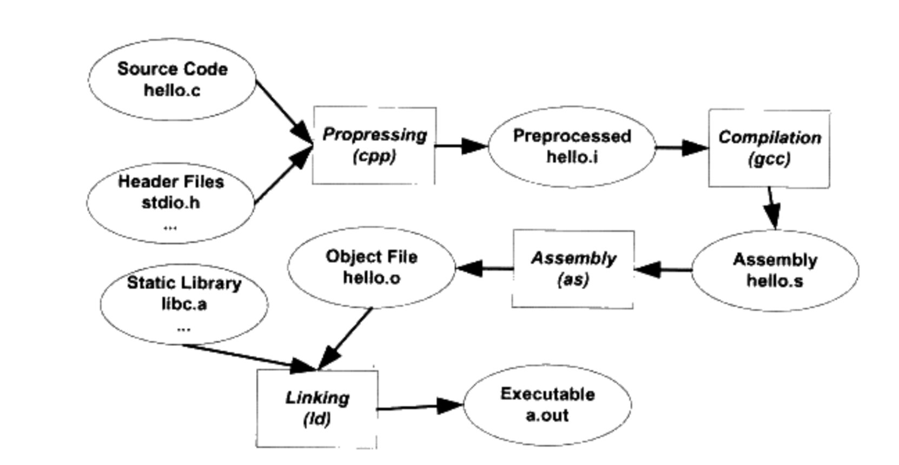
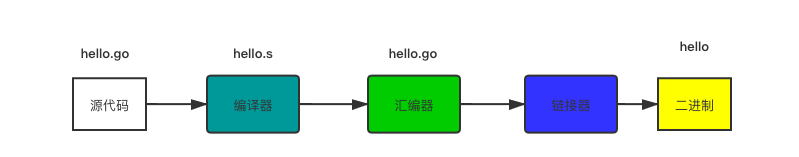
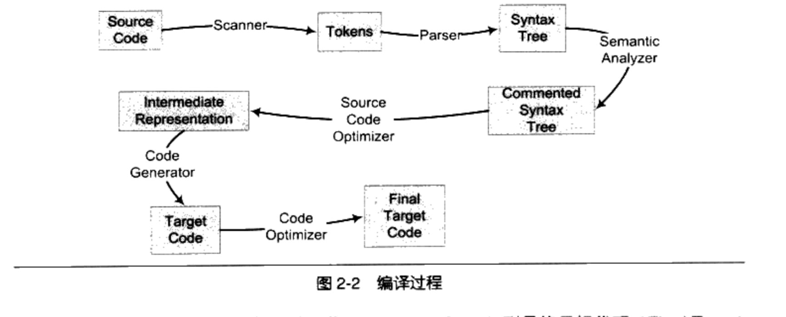

## 深入理解go程序运行和编译
Go是一门需要编译才能运行语言。这篇文章主要讲解Go编译和运行原理。

### 编译
。
计算机程序编译一般分为4个部分：
* 预处理：
* 编译：编译过程就是把预处理完的文件进行一系列词法分析、语法分析、语义分析及优化后生产响应的汇编代码文件
* 汇编：汇编器将汇编代码转变成机器可以执行的指令，每一个汇编语句对应一条机器指令
* 链接：

GCC编译过程分解


那么一个go程序是怎么编译的呢？这里我们写hello.go

```go
package main

import "fmt"

func main(){
    fmt.Println("Hello World!")
}
```

当我们运行`go build`后，会生成一个hello的二进制文件，下图是生成的过程



这样一个go程序就完成编译了。

#### 编译器
编译器一般分为前端和后端，前端主要负责生成机器无关的中间代码，后端负责代码优化和生成。Go编译器在逻辑上分为四个阶段：
* 词法分析
* 语法分析
* 语义分析
* 中间码生成   
* 机器代码生成




#### 链接器
人们将每个源代码独立地编译，然后按照需要讲它们“组装”起来，这个组装模块的过程就是链接。


### go run 原理
`go run`是用来运行源码文件的命令，`go run`只能接受一个`main`包的文件作为参数，那我们看下这个文件具体做了哪些？
ioutil.TempDir(os.Getenv("GOTMPDIR"), "go-build")，生成的文件/tmp/go-build043758764

执行go run 会生成4个临时文件，
```bash
/tmp/go-build992497858/b001/
├── exe
│   └── main    // 可执行文件
├── importcfg   // import config
├── importcfg.link  // 链接器
└── _pkg_.a       // 归档文件
```

#### 静态链接和动态链接

### 静态链接

* 占用磁盘和内存
* 部署、更新困难

### 动态链接

动态链接的好处：
* 增加程序的兼容性
* 减少物理页面的换入换出
* 增加CPU缓存的命中率


动态链接的升级：只要将旧模块覆盖掉，无需将所有程序再重新链接一遍，当程序下一次运行的时候，新版本的目标文件就会自动装载到内存中并且链接起来，程序就完成了升级


### go程序启动
go程序启动主要分为下面几个阶段：

#### 设置TLS
即Thread Local Storage，线程私有存储，每个CPU的寄存器内存少之又少，所以为了保证线程互不干扰，就有了TLS，设置TLS

#### 初始化参数runtime.args


#### osinit
获取CPU的数量
```go
func osinit() {
	ncpu = getproccount()
}
```

#### schedinit
```go
func schedinit() {
	// raceinit must be the first call to race detector.
	// In particular, it must be done before mallocinit below calls racemapshadow.
	// 获取当前g
  _g_ := getg()
	if raceenabled {
		_g_.racectx, raceprocctx0 = raceinit()
	}
  // 最大线程数量
	sched.maxmcount = 10000

	tracebackinit()
  moduledataverify()
  // 栈初始化
	stackinit()
	mallocinit()
	mcommoninit(_g_.m)
	cpuinit()       // must run before alginit
	alginit()       // maps must not be used before this call
	modulesinit()   // provides activeModules
	typelinksinit() // uses maps, activeModules
	itabsinit()     // uses activeModules

	msigsave(_g_.m)
	initSigmask = _g_.m.sigmask

	goargs()
	goenvs()
	parsedebugvars()
	gcinit()

	sched.lastpoll = uint64(nanotime())
	procs := ncpu
	if n, ok := atoi32(gogetenv("GOMAXPROCS")); ok && n > 0 {
		procs = n
	}
	if procresize(procs) != nil {
		throw("unknown runnable goroutine during bootstrap")
	}

	// For cgocheck > 1, we turn on the write barrier at all times
	// and check all pointer writes. We can't do this until after
	// procresize because the write barrier needs a P.
	if debug.cgocheck > 1 {
		writeBarrier.cgo = true
		writeBarrier.enabled = true
		for _, p := range allp {
			p.wbBuf.reset()
		}
	}

	if buildVersion == "" {
		// Condition should never trigger. This code just serves
		// to ensure runtime·buildVersion is kept in the resulting binary.
		buildVersion = "unknown"
	}
}
```

#### newproc&mstart
newoproc和mstart的作用创建goroutine绑定到用户main方法，并且开始调度，具体可以看之前的文章[深入理解goroutine](goroutine.md)


### 参考
1. Golang启动流程 https://blog.iceinto.com/posts/go/start/
2. https://draveness.me/golang/docs/part1-prerequisite/ch02-compile/golang-machinecode/
3. 初探Go的编译命令执行过程 https://halfrost.com/go_command/
4. 也谈Go的可移植性https://tonybai.com/2017/06/27/an-intro-about-go-portability/