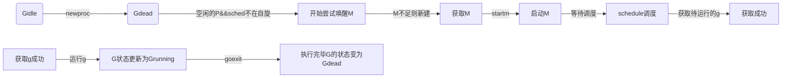

## 深入理解Goroutine

### CSP
CSP模型的全称为Communicating Sequential Processes，是一个很强大的并发数据模型，是上个世纪七十年代提出的，用于描述两个独立的并发实体通过共享的通讯 channel(管道)进行通信的并发模型。相对于Actor模型，CSP中channel是第一类对象，它不关注发送消息的实体，而关注与发送消息时使用的channel。

### 理解并发不是并行
举个排队的例子，有两个队伍，但是只有1个窗口审核，是并发，如果有两个窗口则是并行，Golang里面就是并发

MGP

`M`指的是Machine，一个M关联了一个内核线程
`P`指的是Processor，代表了M的上下文环境
`G`指的是Goroutine
三者关系如下：

P的数量可以由runtime.GOMAXPROCS()来指定，它代表了真正的并发能力


### 数据结构
注：下面的代码有些地方省略显示
#### G(goroutine)

```go
type g struct {
	// Stack parameters.
	// stack describes the actual stack memory: [stack.lo, stack.hi).
	// stackguard0 is the stack pointer compared in the Go stack growth prologue.
	// It is stack.lo+StackGuard normally, but can be StackPreempt to trigger a preemption.
	// stackguard1 is the stack pointer compared in the C stack growth prologue.
	// It is stack.lo+StackGuard on g0 and gsignal stacks.
    // It is ~0 on other goroutine stacks, to trigger a call to morestackc (and crash).
    
	// 当前g使用的栈空间，栈结构包含两个成员lo和hi
	stack       stack   // offset known to runtime/cgo
	// 检测栈是否需要扩展，用Go实现
	stackguard0 uintptr // offset known to liblink
	// 检测栈是否需要扩展，用C实现
	stackguard1 uintptr // offset known to liblink
	// 最内层的Panic
	_panic         *_panic // innermost panic - offset known to liblink
	// 最内层的dfer
	_defer         *_defer // innermost defer
	// 当前所绑定的M
	m              *m      // current m; offset known to arm liblink
	// 当前g的调度数据，当goroutine切换时，保留当前g的上下文，用于恢复g
	sched          gobuf


	syscallsp      uintptr        // if status==Gsyscall, syscallsp = sched.sp to use during gc
	syscallpc      uintptr        // if status==Gsyscall, syscallpc = sched.pc to use during gc
	stktopsp       uintptr        // expected sp at top of stack, to check in traceback
	param          unsafe.Pointer // 传递唤醒参数

	// 当前g的状态
	atomicstatus   uint32
	stackLock      uint32 // sigprof/scang lock; TODO: fold in to atomicstatus
	// 当前g的id
	goid           int64
	// 下一个g的地址，通过guintptr
	schedlink      guintptr
	waitsince      int64      // 当前g阻塞的时间
	waitreason     waitReason // 当前g被阻塞的原因，当前g处在Gwaiting
	// 是否抢占
	preempt        bool       // preemption signal, duplicates stackguard0 = stackpreempt
	paniconfault   bool       // panic (instead of crash) on unexpected fault address
	preemptscan    bool       // 被强占是否进行gc
}

```
G的状态
```
_Gidle 表示Goroutine刚刚被分配，还未初始化
_Grunnable 表示Goroutine已经在运行队列中，但是还未运行代码，没有自己的堆栈
_Grunning 表示Goroutine可能在运行用户代码，已经拥有自己的堆栈，并且已经分配到M和P
_Gsyscall 表示Goroutine正在执行系统调用，分配有M
_Gwaiting 表示Goroutine被系统库Block
_Gmoribund_unused 没使用，但是在gdb脚本中硬编码
_Gdead 表示Goroutine不在使用，可能是刚退出、或者刚刚初始化，没有自己的堆栈
_Genqueue_unused 没有使用
_Gscan 表示Gc正在扫描
```

#### P(process)
```go
type p struct {
	lock mutex

	id          int32
	status      uint32 // P的状态
	link        puintptr
	schedtick   uint32     // 每次调度都增加
	syscalltick uint32     // 每次系统调用时增加
	sysmontick  sysmontick // last tick observed by sysmon
	m           muintptr   // 反向连接当前m，如果空闲则为nil
	mcache      *mcache
	racectx     uintptr

	deferpool    [5][]*_defer // pool of available defer structs of different sizes (see panic.go)
	deferpoolbuf [5][32]*_defer

	// 缓存goroutine ids
	goidcache    uint64
	goidcacheend uint64

	// Queue of runnable goroutines. Accessed without lock.
	runqhead uint32
	runqtail uint32
	// 本地可运行的g，用数组实现
	runq     [256]guintptr
	// runnext, if non-nil, is a runnable G that was ready'd by
	// the current G and should be run next instead of what's in
	// runq if there's time remaining in the running G's time
	// slice. It will inherit the time left in the current time
	// slice. If a set of goroutines is locked in a
	// communicate-and-wait pattern, this schedules that set as a
	// unit and eliminates the (potentially large) scheduling
	// latency that otherwise arises from adding the ready'd
	// goroutines to the end of the run queue.
	// 如果不为nil， 则存放待运行的g
	runnext guintptr

	// Available G's (status == Gdead)
	gFree struct {
		gList
		n int32
	}
}
```

P的状态

```
_Pidle         空闲状态，未和M绑定
_Prunning      运行状态，已和M绑定，并且执行G
_Psyscall      系统调用，此时P中运行的G正在执行系统调用
_Pgcstop       runtime正在进行GC
_Pdead         此时P不在使用(调用runtime.GOMAXPROCS减少P的数量的时候，多余的P就会处于这个状态)
```

#### M(machine)
```go
type m struct {
	g0      *g     // 系统调度时候使用的g
	gsignal       *g           // 处理信号的g
	tls           [6]uintptr   // thead-local storage
	mstartfn      func()
	curg          *g       // 当前正在运行的Goroutine
	caughtsig     guintptr // goroutine running during fatal signal
	p             puintptr // 关联p和执行p代码（不执行时为nil）
	nextp         puintptr // 唤醒m时， m就绑定这个p
	oldp          puintptr // the p that was attached before executing a syscall
	id            int64
	mallocing     int32
	throwing      int32
	preemptoff    string // if != "", keep curg running on this m
	locks         int32
	dying         int32
	profilehz     int32
	spinning      bool // m 是否是处在自旋状态，用于判断m是否空闲，如果空闲则寻找g
	blocked       bool // m 是否阻塞
	inwb          bool // m 是否在执行写屏障
	newSigstack   bool // minit on C thread called sigaltstack
	printlock     int8
	incgo         bool   // m 执行cgo调用
	ncgocall      uint64      // cgo调用的数量
	ncgo          int32       // 当前cgo正在调用的数量
	alllink       *m // 链接m
	schedlink     muintptr
	mcache        *mcache
	lockedg       guintptr  // 锁定g在当前m上
	waittraceev   byte
	waittraceskip int
	startingtrace bool
	syscalltick   uint32
	thread        uintptr // thread handle
	freelink      *m      // on sched.freem
}
```

M的状态
```
spinning     自旋状态，此时M正在寻找P
执行go代码     M正在执行g的代码，此时拥有一个P
执行远程代码   此时M正在执行原生代码或者阻塞syscall，此时M不拥有P
休眠中        M发现没有待运行的g，则会加入到空闲列表，这时不拥有P
```

#### schedt 调度
全局调度使用的数据结构，保存有M的idle队列，P的idle队列
```go
type schedt struct {
	// 访问是原子性的
	goidgen  uint64
	lastpoll uint64

	lock mutex

	// When increasing nmidle, nmidlelocked, nmsys, or nmfreed, be
	// sure to call checkdead().

	midle        muintptr // 空闲的M，用链表存储
	nmidle       int32    // 空闲M的数量
	nmidlelocked int32    // M被锁定并等待中的数量
	mnext        int64    // 下一个M的id，用来记录创建的M的数量
	maxmcount    int32    // 最多允许M的数量
	nmsys        int32    // number of system m's not counted for deadlock
	nmfreed      int64    // 释放m的数量

	ngsys uint32 // Goroutine的数量

	pidle      puintptr // 空闲的P，用链表存储
	npidle     uint32
	nmspinning uint32 // See "Worker thread parking/unparking" comment in proc.go.

	// 全局队列， 当本地g过多或者过少时本地的队列会跟全局队列平衡
	runq     gQueue
	runqsize int32

	// 存放释放掉的g，链表结构
	gFree struct {
		lock    mutex
		stack   gList // Gs with stacks
		noStack gList // Gs without stacks
		n       int32
	}


	// freem is the list of m's waiting to be freed when their
	// m.exited is set. Linked through m.freelink.
	// 等待释放的m
	freem *m
}
```

### 创建Goroutine

#### newproc
```go
func newproc(siz int32, fn *funcval) {
	// 获取参数的地址
	argp := add(unsafe.Pointer(&fn), sys.PtrSize)
	// 获取当前执行的g
	gp := getg()
	// 获取g的pc地址
	pc := getcallerpc()
	systemstack(func() {
		// 调用g0去执行newproc1
		newproc1(fn, (*uint8)(argp), siz, gp, pc)
	})
}
```

#### newproc1
newproc1会创建或是获取一个空闲的g，并进行初始化，并尝试去寻找m和p去执行g
```go
func newproc1(fn *funcval, argp *uint8, narg int32, callergp *g, callerpc uintptr) {
	_g_ := getg()

	if fn == nil {
		_g_.m.throwing = -1 // do not dump full stacks
		throw("go of nil func value")
	}

	_g_.m.locks++ // 加锁禁止抢占
	siz := narg
	siz = (siz + 7) &^ 7

	// We could allocate a larger initial stack if necessary.
	// Not worth it: this is almost always an error.
	// 4*sizeof(uintreg): extra space added below
	// sizeof(uintreg): caller's LR (arm) or return address (x86, in gostartcall).
	//  如果参数太多，就会抛出异常，栈的大小是2k
	if siz >= _StackMin-4*sys.RegSize-sys.RegSize {
		throw("newproc: function arguments too large for new goroutine")
	}

	_p_ := _g_.m.p.ptr()
	// 尝试获取一个空闲的g，如果获取不到，则新建一个，并且放到allgs里面
	// gfget优先会尝试从绑定的p上获取g，如果获取不到，则会从全局中平衡一些到本地p
	newg := gfget(_p_)
	if newg == nil {
		newg = malg(_StackMin)
		casgstatus(newg, _Gidle, _Gdead)
		// append到allgs
		allgadd(newg) // publishes with a g->status of Gdead so GC scanner doesn't look at uninitialized stack.
	}
	if newg.stack.hi == 0 {
		throw("newproc1: newg missing stack")
	}
	// 判断g的状态
	if readgstatus(newg) != _Gdead {
		throw("newproc1: new g is not Gdead")
	}

	totalSize := 4*sys.RegSize + uintptr(siz) + sys.MinFrameSize // extra space in case of reads slightly beyond frame
	// 空间大小对齐
	totalSize += -totalSize & (sys.SpAlign - 1)                  // align to spAlign
	sp := newg.stack.hi - totalSize
	spArg := sp
	if usesLR {
		// caller's LR
		*(*uintptr)(unsafe.Pointer(sp)) = 0
		prepGoExitFrame(sp)
		spArg += sys.MinFrameSize
	}
	if narg > 0 {
		// 将参数拷贝入栈
		memmove(unsafe.Pointer(spArg), unsafe.Pointer(argp), uintptr(narg))
		// This is a stack-to-stack copy. If write barriers
		// are enabled and the source stack is grey (the
		// destination is always black), then perform a
		// barrier copy. We do this *after* the memmove
		// because the destination stack may have garbage on
		// it.
		if writeBarrier.needed && !_g_.m.curg.gcscandone {
			f := findfunc(fn.fn)
			stkmap := (*stackmap)(funcdata(f, _FUNCDATA_ArgsPointerMaps))
			if stkmap.nbit > 0 {
				// We're in the prologue, so it's always stack map index 0.
				bv := stackmapdata(stkmap, 0)
				bulkBarrierBitmap(spArg, spArg, uintptr(bv.n)*sys.PtrSize, 0, bv.bytedata)
			}
		}
	}

	memclrNoHeapPointers(unsafe.Pointer(&newg.sched), unsafe.Sizeof(newg.sched))
	newg.sched.sp = sp
	newg.stktopsp = sp
	// 这里保存了goexit的地址，在函数调用结束后，会根据pc来执行goexit
	newg.sched.pc = funcPC(goexit) + sys.PCQuantum // +PCQuantum so that previous instruction is in same function
	newg.sched.g = guintptr(unsafe.Pointer(newg))
	gostartcallfn(&newg.sched, fn)
	newg.gopc = callerpc
	newg.ancestors = saveAncestors(callergp)
	newg.startpc = fn.fn
	if _g_.m.curg != nil {
		newg.labels = _g_.m.curg.labels
	}
	if isSystemGoroutine(newg, false) {
		atomic.Xadd(&sched.ngsys, +1)
	}
	newg.gcscanvalid = false
	// Gdead => Grunnable
	casgstatus(newg, _Gdead, _Grunnable)
	// 如果goid用完了，则在从Sched申请一部分
	if _p_.goidcache == _p_.goidcacheend {
		// Sched.goidgen is the last allocated id,
		// this batch must be [sched.goidgen+1, sched.goidgen+GoidCacheBatch].
		// At startup sched.goidgen=0, so main goroutine receives goid=1.
		_p_.goidcache = atomic.Xadd64(&sched.goidgen, _GoidCacheBatch)
		_p_.goidcache -= _GoidCacheBatch - 1
		_p_.goidcacheend = _p_.goidcache + _GoidCacheBatch
	}
	// 分配goid
	newg.goid = int64(_p_.goidcache)
	_p_.goidcache++
	if raceenabled {
		newg.racectx = racegostart(callerpc)
	}
	if trace.enabled {
		traceGoCreate(newg, newg.startpc)
	}
	// 把g加入到p的可执行队列中
	runqput(_p_, newg, true)
	// 判断是否需要空闲的p，且是否需要一个m来执行g
	if atomic.Load(&sched.npidle) != 0 && atomic.Load(&sched.nmspinning) == 0 && mainStarted {
		wakep()
	}
	_g_.m.locks--
	if _g_.m.locks == 0 && _g_.preempt { // restore the preemption request in case we've cleared it in newstack
		_g_.stackguard0 = stackPreempt
	}
}
```

#### gfget
看下p有没有空闲的g，如果没有，则从gFree中获取
```go
func gfget(_p_ *p) *g {
retry:
	if _p_.gFree.empty() && (!sched.gFree.stack.empty() || !sched.gFree.noStack.empty()) {
		lock(&sched.gFree.lock)
		// Move a batch of free Gs to the P.
		for _p_.gFree.n < 32 {
			// Prefer Gs with stacks.
			gp := sched.gFree.stack.pop()
			if gp == nil {
				gp = sched.gFree.noStack.pop()
				if gp == nil {
					break
				}
			}
			sched.gFree.n--
			_p_.gFree.push(gp)
			_p_.gFree.n++
		}
		unlock(&sched.gFree.lock)
		goto retry
	}
	gp := _p_.gFree.pop()
	if gp == nil {
		return nil
	}
	_p_.gFree.n--
	if gp.stack.lo == 0 {
		// Stack was deallocated in gfput. Allocate a new one.
		systemstack(func() {
			gp.stack = stackalloc(_FixedStack)
		})
		gp.stackguard0 = gp.stack.lo + _StackGuard
	} else {
		if raceenabled {
			racemalloc(unsafe.Pointer(gp.stack.lo), gp.stack.hi-gp.stack.lo)
		}
		if msanenabled {
			msanmalloc(unsafe.Pointer(gp.stack.lo), gp.stack.hi-gp.stack.lo)
		}
	}
	return gp
}
```

#### runqput
runqput尝试将g放入到本地队列中, 如果next是false，则runqput会把g放到runnable队尾，否则，把g放入了runnext，
如果本地队列满了，会把g放到全局队列中
```go
func runqput(_p_ *p, gp *g, next bool) {
	if randomizeScheduler && next && fastrand()%2 == 0 {
		next = false
	}
	// 把g放到runnext中
	if next {
	retryNext:
		oldnext := _p_.runnext
		if !_p_.runnext.cas(oldnext, guintptr(unsafe.Pointer(gp))) {
			goto retryNext
		}
		if oldnext == 0 {
			return
		}
		// Kick the old runnext out to the regular run queue.
		gp = oldnext.ptr()
	}

retry:
	h := atomic.LoadAcq(&_p_.runqhead) // load-acquire, synchronize with consumers
	t := _p_.runqtail
	// 判断p的队列长度是否超出，runq长度是256，如果超出了则放到全局队列中
	if t-h < uint32(len(_p_.runq)) {
		_p_.runq[t%uint32(len(_p_.runq))].set(gp)
		atomic.StoreRel(&_p_.runqtail, t+1) // store-release, makes the item available for consumption
		return
	}
	// 将本地队列的g丢到全局队列中
	if runqputslow(_p_, gp, h, t) {
		return
	}
	// the queue is not full, now the put above must succeed
	goto retry
}
```

至此，新建任务已经结束，剩下就等着调度就行，从上面看队列的优先级是p.runnext > p.runq > sched.runq


#### wakeup
newproc1创建任务后，会调用wakep 来唤醒M
```go
func wakep() {
	// be conservative about spinning threads
	// 一次只允许1个M在自旋，否则退出
	if !atomic.Cas(&sched.nmspinning, 0, 1) {
		return
	}
	// 开始唤醒M
	startm(nil, true)
}
```

### 创建M
#### startm 
调度或者创建M来运行P，如果p==nil则会去获取一个空闲的g
```go
func startm(_p_ *p, spinning bool) {
	lock(&sched.lock)
	if _p_ == nil {
		_p_ = pidleget()   // 如果p为nil，则尝试获取一个空闲的p
		if _p_ == nil {
			unlock(&sched.lock)
			if spinning {
				// The caller incremented nmspinning, but there are no idle Ps,
				// so it's okay to just undo the increment and give up.
				if int32(atomic.Xadd(&sched.nmspinning, -1)) < 0 {
					throw("startm: negative nmspinning")
				}
			}
			return
		}
	}
	mp := mget()
	unlock(&sched.lock)
	if mp == nil {
		// 如果后去不到m，则创建一个spinning为true的M，并将p绑定到M上返回
		var fn func()
		if spinning {
			// The caller incremented nmspinning, so set m.spinning in the new M.
			fn = mspinning
		}
		newm(fn, _p_)
		return
	}
	// 判断M是否为自旋
	if mp.spinning {
		throw("startm: m is spinning")
	}
	// 判断获取到的M是否有P
	if mp.nextp != 0 {
		throw("startm: m has p")
	}

	if spinning && !runqempty(_p_) {
		throw("startm: p has runnable gs")
	}
	// 这里spinning已经被父函数增加，这里只要设置spinning即可
	mp.spinning = spinning
	mp.nextp.set(_p_)
	// 唤醒m
	notewakeup(&mp.park)
}

```

#### newm
创建新的M
```go
func newm(fn func(), _p_ *p) {
	mp := allocm(_p_, fn)
	mp.nextp.set(_p_)   // 将新建的M绑定到指定的P上
	// 省略...
	newm1(mp)
}

func newm1(mp *m) {
	// ...省略...
	newosproc(mp)
	// ...省略...
}

```

#### newosproc
newosproc创建一个新的系统线程，并执行mstart_stub函数，之后调用master函数进入调度
```go
func newosproc(mp *m) {
	// 省略...

	var oset sigset
	sigprocmask(_SIG_SETMASK, &sigset_all, &oset)
	// 创建线程，并传入启动函数mstart_stub， 之后调用start
	err = pthread_create(&attr, funcPC(mstart_stub), unsafe.Pointer(mp))
	sigprocmask(_SIG_SETMASK, &oset, nil)
	if err != 0 {
		write(2, unsafe.Pointer(&failthreadcreate[0]), int32(len(failthreadcreate)))
		exit(1)
	}
}
```

#### allocm
allocm会分配m，首先从sched.free，然后去创建m，在初始化m
```go
func allocm(_p_ *p, fn func()) *m {
	_g_ := getg()
	_g_.m.locks++ // disable GC because it can be called from sysmon
	if _g_.m.p == 0 {
		acquirep(_p_) // temporarily borrow p for mallocs in this function
	}

	// Release the free M list. We need to do this somewhere and
	// this may free up a stack we can use.
	// 释放掉freem
	if sched.freem != nil {
		lock(&sched.lock)
		var newList *m
		for freem := sched.freem; freem != nil; {
			if freem.freeWait != 0 {
				next := freem.freelink
				freem.freelink = newList
				newList = freem
				freem = next
				continue
			}
			stackfree(freem.g0.stack)
			freem = freem.freelink
		}
		sched.freem = newList
		unlock(&sched.lock)
	}

	mp := new(m)
	// 启动函数，这个fn就是下面这个函数
	// var fn func()
	// if spinning {
	// 	fn = mspinning
	// }
	mp.mstartfn = fn
	// 初始化m
	mcommoninit(mp)

	// In case of cgo or Solaris or Darwin, pthread_create will make us a stack.
	// Windows and Plan 9 will layout sched stack on OS stack.
	if iscgo || GOOS == "solaris" || GOOS == "windows" || GOOS == "plan9" || GOOS == "darwin" {
		mp.g0 = malg(-1)
	} else {
		mp.g0 = malg(8192 * sys.StackGuardMultiplier)
	}
	mp.g0.m = mp

	if _p_ == _g_.m.p.ptr() {
		releasep()
	}
	_g_.m.locks--
	if _g_.m.locks == 0 && _g_.preempt { // restore the preemption request in case we've cleared it in newstack
		_g_.stackguard0 = stackPreempt
	}

	return mp
}

```

### 执行
#### mstart
```go
func mstart() {
	// ...省略...
	// 调用mstart1 来处理
	mstart1()
	// ...省略...
}

func mstart1() {
	_g_ := getg()

	if _g_ != _g_.m.g0 {
		throw("bad runtime·mstart")
	}

	// Record the caller for use as the top of stack in mcall and
	// for terminating the thread.
	// We're never coming back to mstart1 after we call schedule,
	// so other calls can reuse the current frame.
	// 保存程序的PC和SP值
	save(getcallerpc(), getcallersp())
	asminit()
	// 初始化m的栈
	minit()

	// handle signals
	if _g_.m == &m0 {
		mstartm0()
	}
	// 如果设置mastartfn， 则执行fn
	if fn := _g_.m.mstartfn; fn != nil {
		fn()
	}

	if _g_.m != &m0 {
		// 获取nextp
		acquirep(_g_.m.nextp.ptr())
		_g_.m.nextp = 0
	}
	schedule()
}
```


#### acquirep
acquirep 主要是关联当前的m和p
```go
func acquirep(_p_ *p) {
	// Do the part that isn't allowed to have write barriers.
	wirep(_p_)

	// Have p; write barriers now allowed.

	// Perform deferred mcache flush before this P can allocate
	// from a potentially stale mcache.
	_p_.mcache.prepareForSweep()

	if trace.enabled {
		traceProcStart()
	}
}

```

#### wirep
wirep会绑定m和p
```go
func wirep(_p_ *p) {
	_g_ := getg()

	if _g_.m.p != 0 || _g_.m.mcache != nil {
		throw("wirep: already in go")
	}
	if _p_.m != 0 || _p_.status != _Pidle {
		id := int64(0)
		if _p_.m != 0 {
			id = _p_.m.ptr().id
		}
		print("wirep: p->m=", _p_.m, "(", id, ") p->status=", _p_.status, "\n")
		throw("wirep: invalid p state")
	}
	// m和p的cache共享
	_g_.m.mcache = _p_.mcache
	// 将m和p进行绑定
	_g_.m.p.set(_p_)
	_p_.m.set(_g_.m)
	// p的状态变为running
	_p_.status = _Prunning
}

```


#### schedule 调度
```go
func schedule() {
	_g_ := getg()

	if _g_.m.locks != 0 {
		throw("schedule: holding locks")
	}
	// 如果有lockedg，停止当前M
	if _g_.m.lockedg != 0 {
		// 解除lockedm的锁定，并执行当前g
		stoplockedm()
		execute(_g_.m.lockedg.ptr(), false) // Never returns.
	}

	// We should not schedule away from a g that is executing a cgo call,
	// since the cgo call is using the m's g0 stack.
	if _g_.m.incgo {
		throw("schedule: in cgo")
	}

top:
	if sched.gcwaiting != 0 {
		gcstopm()
		goto top
	}
	if _g_.m.p.ptr().runSafePointFn != 0 {
		runSafePointFn()
	}

	var gp *g
	var inheritTime bool
	if trace.enabled || trace.shutdown {
		gp = traceReader()
		if gp != nil {
			casgstatus(gp, _Gwaiting, _Grunnable)
			traceGoUnpark(gp, 0)
		}
	}
	if gp == nil && gcBlackenEnabled != 0 {
		gp = gcController.findRunnableGCWorker(_g_.m.p.ptr())
	}
	if gp == nil {
		// Check the global runnable queue once in a while to ensure fairness.
		// Otherwise two goroutines can completely occupy the local runqueue
		// by constantly respawning each other.
		// 每61s从全局队列获取g
		if _g_.m.p.ptr().schedtick%61 == 0 && sched.runqsize > 0 {
			lock(&sched.lock)
			gp = globrunqget(_g_.m.p.ptr(), 1)
			unlock(&sched.lock)
		}
	}
	if gp == nil {
		// 全局获取不到runable的g，从local获取
		gp, inheritTime = runqget(_g_.m.p.ptr())
		if gp != nil && _g_.m.spinning {
			throw("schedule: spinning with local work")
		}
	}
	if gp == nil {
		// 如果依赖没有获取到g，则从开始查找，从local p、global p、全局io poll获取待运行的g
		gp, inheritTime = findrunnable() // blocks until work is available
	}

	// This thread is going to run a goroutine and is not spinning anymore,
	// so if it was marked as spinning we need to reset it now and potentially
	// start a new spinning M.
	if _g_.m.spinning {
		resetspinning()
	}

	if sched.disable.user && !schedEnabled(gp) {
		// Scheduling of this goroutine is disabled. Put it on
		// the list of pending runnable goroutines for when we
		// re-enable user scheduling and look again.
		lock(&sched.lock)
		if schedEnabled(gp) {
			// Something re-enabled scheduling while we
			// were acquiring the lock.
			unlock(&sched.lock)
		} else {
			sched.disable.runnable.pushBack(gp)
			sched.disable.n++
			unlock(&sched.lock)
			goto top
		}
	}

	if gp.lockedm != 0 {
		// Hands off own p to the locked m,
		// then blocks waiting for a new p.
		// 如果g有lockedm，则休眠上交p，休眠m，等待新m，唤醒后跳转到top
		startlockedm(gp)
		goto top
	}
	// 开始执行这个g
	execute(gp, inheritTime)
}

```

#### execute
开始准备执行
```go
func execute(gp *g, inheritTime bool) {
	_g_ := getg()
	// 更新g的状态，标记为不允许抢占
	casgstatus(gp, _Grunnable, _Grunning)
	gp.waitsince = 0
	gp.preempt = false
	gp.stackguard0 = gp.stack.lo + _StackGuard
	if !inheritTime {
		_g_.m.p.ptr().schedtick++
	}
	_g_.m.curg = gp
	gp.m = _g_.m

	// Check whether the profiler needs to be turned on or off.
	hz := sched.profilehz
	if _g_.m.profilehz != hz {
		setThreadCPUProfiler(hz)
	}

	if trace.enabled {
		// GoSysExit has to happen when we have a P, but before GoStart.
		// So we emit it here.
		if gp.syscallsp != 0 && gp.sysblocktraced {
			traceGoSysExit(gp.sysexitticks)
		}
		traceGoStart()
	}
	// 执行g的代码
	gogo(&gp.sched)
}
```


#### goexit
goroutine退出显示调用goexit1, goexit1会调用goexit0
```go
// goexit continuation on g0.
func goexit0(gp *g) {
	_g_ := getg()
	// 将g状态更改为Dead
	casgstatus(gp, _Grunning, _Gdead)
	if isSystemGoroutine(gp, false) {
		atomic.Xadd(&sched.ngsys, -1)
	}
	// 清空g的状态
	gp.m = nil
	locked := gp.lockedm != 0
	gp.lockedm = 0
	_g_.m.lockedg = 0
	gp.paniconfault = false
	gp._defer = nil // should be true already but just in case.
	gp._panic = nil // non-nil for Goexit during panic. points at stack-allocated data.
	gp.writebuf = nil
	gp.waitreason = 0
	gp.param = nil
	gp.labels = nil
	gp.timer = nil

	if gcBlackenEnabled != 0 && gp.gcAssistBytes > 0 {
		// Flush assist credit to the global pool. This gives
		// better information to pacing if the application is
		// rapidly creating an exiting goroutines.
		scanCredit := int64(gcController.assistWorkPerByte * float64(gp.gcAssistBytes))
		atomic.Xaddint64(&gcController.bgScanCredit, scanCredit)
		gp.gcAssistBytes = 0
	}

	// Note that gp's stack scan is now "valid" because it has no
	// stack.
	gp.gcscanvalid = true
	dropg()

	if GOARCH == "wasm" { // no threads yet on wasm
		gfput(_g_.m.p.ptr(), gp)
		schedule() // never returns
	}

	if _g_.m.lockedInt != 0 {
		print("invalid m->lockedInt = ", _g_.m.lockedInt, "\n")
		throw("internal lockOSThread error")
	}
	// 把g放到到空闲列表中，以备复用
	gfput(_g_.m.p.ptr(), gp)
	if locked {
		// The goroutine may have locked this thread because
		// it put it in an unusual kernel state. Kill it
		// rather than returning it to the thread pool.

		// Return to mstart, which will release the P and exit
		// the thread.
		if GOOS != "plan9" { // See golang.org/issue/22227.
			gogo(&_g_.m.g0.sched)
		} else {
			// Clear lockedExt on plan9 since we may end up re-using
			// this thread.
			_g_.m.lockedExt = 0
		}
	}
	// 再次开启调度
	schedule()
}

```


#### findrunnable
主要功能：寻找可运行的g，主要流程
* 从p的local队列中寻找可运行的g
* 从全局队列中寻找可以运行的g
* 从netpoll中获取一个已经准备好的g
* 从其他p的local队列中偷取可运行的g，并且会随机偷取1个next g
* 再试着从netpoll中获取准备的g，阻塞获取
* 没有的话， 就stopm

```go
func findrunnable() (gp *g, inheritTime bool) {
	_g_ := getg()

top:
	_p_ := _g_.m.p.ptr()
	if sched.gcwaiting != 0 {
		gcstopm()
		goto top
	}
	if _p_.runSafePointFn != 0 {
		runSafePointFn()
	}
	if fingwait && fingwake {
		if gp := wakefing(); gp != nil {
			ready(gp, 0, true)
		}
	}
	if *cgo_yield != nil {
		asmcgocall(*cgo_yield, nil)
	}

	// 从本地队列中寻找可运行的g
	if gp, inheritTime := runqget(_p_); gp != nil {
		return gp, inheritTime
	}

	// 从全局队列中寻找可运行的g
	if sched.runqsize != 0 {
		lock(&sched.lock)
		gp := globrunqget(_p_, 0)
		unlock(&sched.lock)
		if gp != nil {
			return gp, false
		}
	}

	// 看看netpoll中有没有已经准备好的g
	if netpollinited() && atomic.Load(&netpollWaiters) > 0 && atomic.Load64(&sched.lastpoll) != 0 {
		if list := netpoll(false); !list.empty() { // non-blocking
			gp := list.pop()
			injectglist(&list)
			casgstatus(gp, _Gwaiting, _Grunnable)
			if trace.enabled {
				traceGoUnpark(gp, 0)
			}
			return gp, false
		}
	}

	// Steal work from other P's.
	// 从其他的P中偷取g
	procs := uint32(gomaxprocs)
	if atomic.Load(&sched.npidle) == procs-1 {
		// 如果sched.npidle == procs-1 ,说明除了我们其他的p都是空闲的，无需偷取
		// Either GOMAXPROCS=1 or everybody, except for us, is idle already.
		// New work can appear from returning syscall/cgocall, network or timers.
		// Neither of that submits to local run queues, so no point in stealing.
		goto stop
	}
	// If number of spinning M's >= number of busy P's, block.
	// This is necessary to prevent excessive CPU consumption
	// when GOMAXPROCS>>1 but the program parallelism is low.
	// 如果当前处在自旋状态M大于非空闲P的一半，则不再查找，避免CPU过度损耗
	if !_g_.m.spinning && 2*atomic.Load(&sched.nmspinning) >= procs-atomic.Load(&sched.npidle) {
		goto stop
	}
	// 修改M的自旋状态
	if !_g_.m.spinning {
		_g_.m.spinning = true
		atomic.Xadd(&sched.nmspinning, 1)
	}
	// 开始偷取他的P上待运行的g
	for i := 0; i < 4; i++ {
		for enum := stealOrder.start(fastrand()); !enum.done(); enum.next() {
			if sched.gcwaiting != 0 {
				goto top
			}
			// 优先寻找待运行g超过1的P
			stealRunNextG := i > 2 // first look for ready queues with more than 1 g
			// 偷取1半的任务，并且根据stealRunNextG判断是否从_p_.runnext随机偷取
			if gp := runqsteal(_p_, allp[enum.position()], stealRunNextG); gp != nil {
				return gp, false
			}
		}
	}

stop:

	// We have nothing to do. If we're in the GC mark phase, can
	// safely scan and blacken objects, and have work to do, run
	// idle-time marking rather than give up the P.
	if gcBlackenEnabled != 0 && _p_.gcBgMarkWorker != 0 && gcMarkWorkAvailable(_p_) {
		_p_.gcMarkWorkerMode = gcMarkWorkerIdleMode
		gp := _p_.gcBgMarkWorker.ptr()
		casgstatus(gp, _Gwaiting, _Grunnable)
		if trace.enabled {
			traceGoUnpark(gp, 0)
		}
		return gp, false
	}

	// wasm only:
	// If a callback returned and no other goroutine is awake,
	// then pause execution until a callback was triggered.
	if beforeIdle() {
		// At least one goroutine got woken.
		goto top
	}

	// Before we drop our P, make a snapshot of the allp slice,
	// which can change underfoot once we no longer block
	// safe-points. We don't need to snapshot the contents because
	// everything up to cap(allp) is immutable.
	allpSnapshot := allp

	// return P and block
	lock(&sched.lock)
	if sched.gcwaiting != 0 || _p_.runSafePointFn != 0 {
		unlock(&sched.lock)
		goto top
	}
	if sched.runqsize != 0 {
		gp := globrunqget(_p_, 0)
		unlock(&sched.lock)
		return gp, false
	}
	if releasep() != _p_ {
		throw("findrunnable: wrong p")
	}
	pidleput(_p_)
	unlock(&sched.lock)

	// Delicate dance: thread transitions from spinning to non-spinning state,
	// potentially concurrently with submission of new goroutines. We must
	// drop nmspinning first and then check all per-P queues again (with
	// #StoreLoad memory barrier in between). If we do it the other way around,
	// another thread can submit a goroutine after we've checked all run queues
	// but before we drop nmspinning; as the result nobody will unpark a thread
	// to run the goroutine.
	// If we discover new work below, we need to restore m.spinning as a signal
	// for resetspinning to unpark a new worker thread (because there can be more
	// than one starving goroutine). However, if after discovering new work
	// we also observe no idle Ps, it is OK to just park the current thread:
	// the system is fully loaded so no spinning threads are required.
	// Also see "Worker thread parking/unparking" comment at the top of the file.
	wasSpinning := _g_.m.spinning
	if _g_.m.spinning {
		_g_.m.spinning = false
		if int32(atomic.Xadd(&sched.nmspinning, -1)) < 0 {
			throw("findrunnable: negative nmspinning")
		}
	}

	// check all runqueues once again
	for _, _p_ := range allpSnapshot {
		if !runqempty(_p_) {
			lock(&sched.lock)
			_p_ = pidleget()
			unlock(&sched.lock)
			if _p_ != nil {
				acquirep(_p_)
				if wasSpinning {
					_g_.m.spinning = true
					atomic.Xadd(&sched.nmspinning, 1)
				}
				goto top
			}
			break
		}
	}
	//省略

	// 从io poll中获取运行的g
	if netpollinited() && atomic.Load(&netpollWaiters) > 0 && atomic.Xchg64(&sched.lastpoll, 0) != 0 {
		if _g_.m.p != 0 {
			throw("findrunnable: netpoll with p")
		}
		if _g_.m.spinning {
			throw("findrunnable: netpoll with spinning")
		}
		list := netpoll(true) // block until new work is available
		atomic.Store64(&sched.lastpoll, uint64(nanotime()))
		if !list.empty() {
			lock(&sched.lock)
			_p_ = pidleget()
			unlock(&sched.lock)
			if _p_ != nil {
				acquirep(_p_)
				gp := list.pop()
				injectglist(&list)
				casgstatus(gp, _Gwaiting, _Grunnable)
				if trace.enabled {
					traceGoUnpark(gp, 0)
				}
				return gp, false
			}
			injectglist(&list)
		}
	}
	stopm()
	goto top
}
```

### 系统监控 sysmon
sysmon 是go的监控，主要完成下面几件事：
* 释放闲置超过5分钟的span物理内存
* 如果超过2分钟没有执行垃圾回收，则强制执行
* 将长时间未处理的netpoll添加到全局队列中
* 对长时间运行中的g发起抢占
* 收回因为syscall而长时间阻塞的p

监控不是时刻都在运行，它自己有个唤醒周期，第一次是20us, 每次执行完，增加1倍休眠时间，最大休眠时间是10ms

#### Retake 偷取

```go
// forcePreemptNS is the time slice given to a G before it is
// preempted.
const forcePreemptNS = 10 * 1000 * 1000 // 10ms

func retake(now int64) uint32 {
	n := 0
	// Prevent allp slice changes. This lock will be completely
	// uncontended unless we're already stopping the world.
	lock(&allpLock)
	// We can't use a range loop over allp because we may
	// temporarily drop the allpLock. Hence, we need to re-fetch
	// allp each time around the loop.
	for i := 0; i < len(allp); i++ {
		_p_ := allp[i]
		if _p_ == nil {
			// This can happen if procresize has grown
			// allp but not yet created new Ps.
			continue
		}
		pd := &_p_.sysmontick
		s := _p_.status
		if s == _Psyscall {
			// Retake P from syscall if it's there for more than 1 sysmon tick (at least 20us).
			// 只有sysmon才更新，所以第一次不会抢占，而是第二次开始抢占，至少间隔20us，最多10ms
			t := int64(_p_.syscalltick)
			if int64(pd.syscalltick) != t {
				pd.syscalltick = uint32(t)
				pd.syscallwhen = now
				continue
			}
			// On the one hand we don't want to retake Ps if there is no other work to do,
			// but on the other hand we want to retake them eventually
			// because they can prevent the sysmon thread from deep sleep.
			// 是否有空P， 是否有寻找p的m以及空闲的p，以及当p在syscall后超过10ms的
			if runqempty(_p_) && atomic.Load(&sched.nmspinning)+atomic.Load(&sched.npidle) > 0 && pd.syscallwhen+10*1000*1000 > now {
				continue
			}
			// Drop allpLock so we can take sched.lock.
			unlock(&allpLock)
			// Need to decrement number of idle locked M's
			// (pretending that one more is running) before the CAS.
			// Otherwise the M from which we retake can exit the syscall,
			// increment nmidle and report deadlock.
			incidlelocked(-1)
			// 抢占p，把p的状态改为idle
			if atomic.Cas(&_p_.status, s, _Pidle) {
				if trace.enabled {
					traceGoSysBlock(_p_)
					traceProcStop(_p_)
				}
				n++
				_p_.syscalltick++
				handoffp(_p_)
			}
			incidlelocked(1)
			lock(&allpLock)
		} else if s == _Prunning {
			// Preempt G if it's running for too long.
			// 如果p是running，并且执行时间过长，则抢占
			t := int64(_p_.schedtick)
			if int64(pd.schedtick) != t { // 在周期内已经调度过，即当前p上运行的g改变过
				pd.schedtick = uint32(t)
				pd.schedwhen = now  // 更新最后一次抢占检测时间
				continue
			}
			// 判断是否超出10ms，不超过则不抢占
			if pd.schedwhen+forcePreemptNS > now {
				continue
			}
			// 开始抢占
			preemptone(_p_)
		}
	}
	unlock(&allpLock)
	return uint32(n)
}
```


#### handoffp
handoffp 主要的功能是
```go
func handoffp(_p_ *p) {
	// handoffp must start an M in any situation where
	// findrunnable would return a G to run on _p_.

	// 如果本地有待运行的任务，则立即开始调度
	if !runqempty(_p_) || sched.runqsize != 0 {
		startm(_p_, false)
		return
	}
	// if it has GC work, start it straight away
	if gcBlackenEnabled != 0 && gcMarkWorkAvailable(_p_) {
		startm(_p_, false)
		return
	}
	// no local work, check that there are no spinning/idle M's,
	// otherwise our help is not required
	// 如果本地没有任务，则开始检查有没有自旋和空闲的P，如果有则开始调度
	if atomic.Load(&sched.nmspinning)+atomic.Load(&sched.npidle) == 0 && atomic.Cas(&sched.nmspinning, 0, 1) { // TODO: fast atomic
		startm(_p_, true)
		return
	}
	lock(&sched.lock)
	if sched.gcwaiting != 0 {
		_p_.status = _Pgcstop
		sched.stopwait--
		if sched.stopwait == 0 {
			notewakeup(&sched.stopnote)
		}
		unlock(&sched.lock)
		return
	}
	if _p_.runSafePointFn != 0 && atomic.Cas(&_p_.runSafePointFn, 1, 0) {
		sched.safePointFn(_p_)
		sched.safePointWait--
		if sched.safePointWait == 0 {
			notewakeup(&sched.safePointNote)
		}
	}
	// 判断全局g队列为不为空，如果不为空，则尝试开始调度
	if sched.runqsize != 0 {
		unlock(&sched.lock)
		startm(_p_, false)
		return
	}
	// If this is the last running P and nobody is polling network,
	// need to wakeup another M to poll network.
	// 如果这个没有人运行poll networ，则需要唤醒一个M去执行
	if sched.npidle == uint32(gomaxprocs-1) && atomic.Load64(&sched.lastpoll) != 0 {
		unlock(&sched.lock)
		startm(_p_, false)
		return
	}
	// 如果都没有，则把p放到空闲队列中
	pidleput(_p_)
	unlock(&sched.lock)
}

```

####preemptone 抢占
当g发现栈不够用，就会去进行栈扩张(调用newstack分配一个新站)，
```go
func preemptone(_p_ *p) bool {
	mp := _p_.m.ptr()
	if mp == nil || mp == getg().m {
		return false
	}
	gp := mp.curg
	if gp == nil || gp == mp.g0 {
		return false
	}
	// 设置抢占
	gp.preempt = true

	// stackPreempt是个特殊的常量，比任何栈地址都大
	gp.stackguard0 = stackPreempt
	return true
}
```

#### newstack的抢占判断逻辑
```go
	// 发现是抢占，则会重新调度
	if preempt {
		if thisg.m.locks != 0 || thisg.m.mallocing != 0 || thisg.m.preemptoff != "" || thisg.m.p.ptr().status != _Prunning {
			// Let the goroutine keep running for now.
			// gp->preempt is set, so it will be preempted next time.
			gp.stackguard0 = gp.stack.lo + _StackGuard
			gogo(&gp.sched) // never return
		}
	}
```


Gdead-- newproc --> Grunable -- execute --> Grunning --> goexit0 -> Gdead

### 总结
当调用go func的时候，大致流程如下




### 参考资料
1. https://segmentfault.com/a/1190000020254937
2. https://blog.csdn.net/u010853261/article/details/84790392#35_sysmon_1026