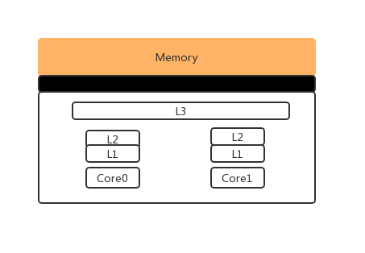
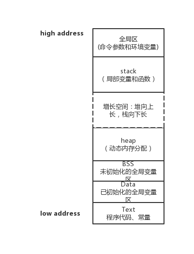
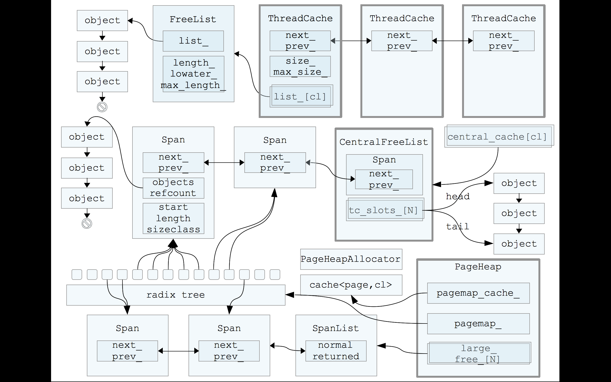
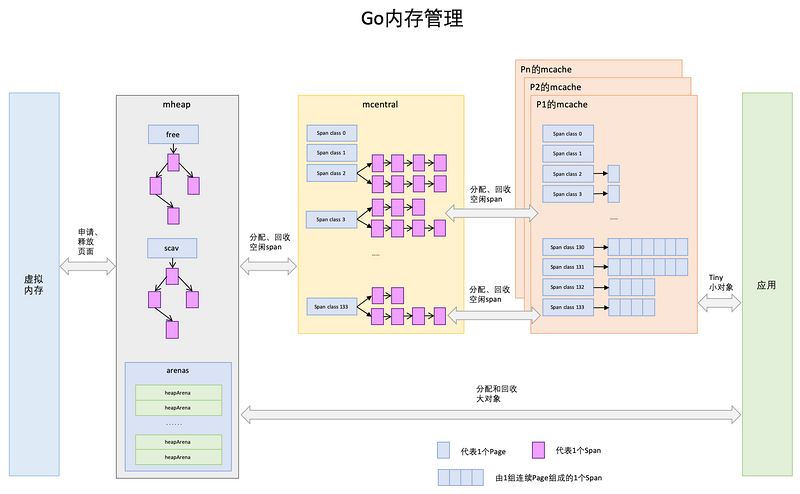
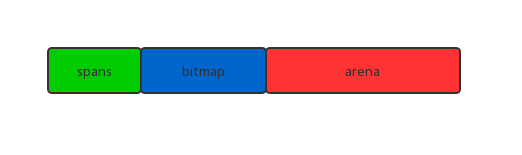
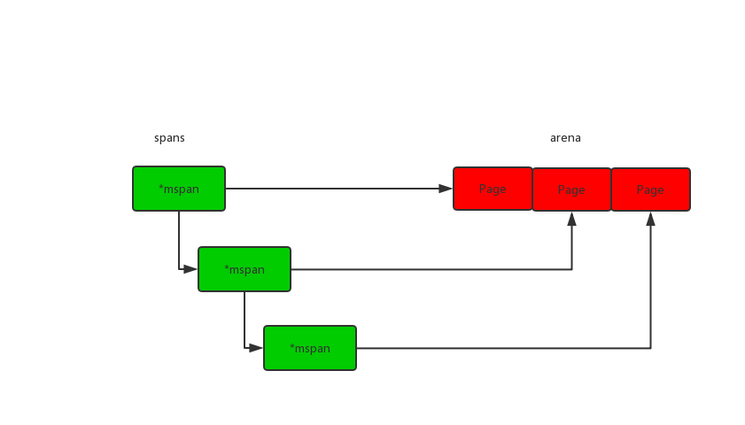
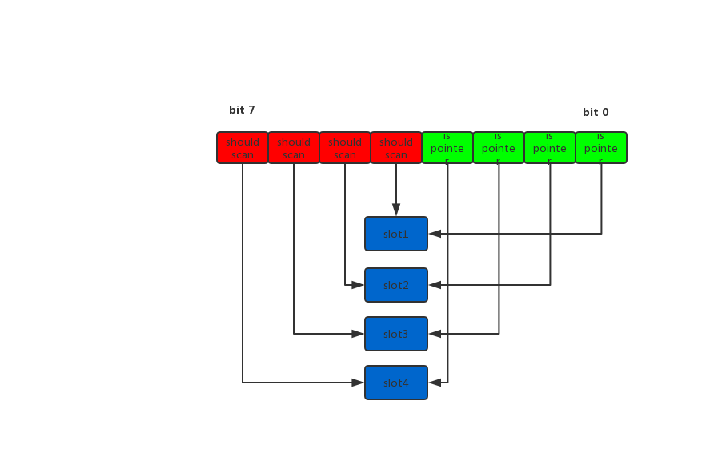
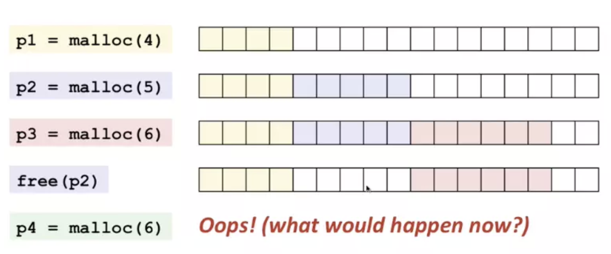
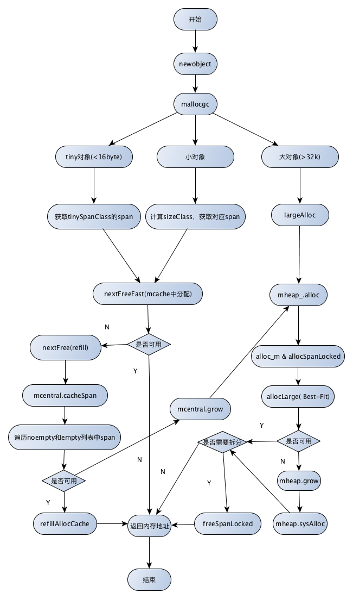

## 内存分析

### CPU缓存
CPU的发展的速度远快于内存的发展，CPU的处理速度也比内存访问速度快很多。这样很多情况下，CPU必须要等内存的相应，为了应对这种情况，CPU多谢缓存就出现了。

计算机内存金字塔图



缓存大小L1<L2<L3, 速度L1>L2>L3， L1和L2通常用在单核中，L3则用来多核中。CPU缓存的命中率代表了CPU缓存复用的情况。 CPU读取数据是从先从缓存中寻找，如果找到就立即返回给CPU处理，如果没有找到，就从相对慢的速度中读取并返回给CPU处理，同时把这个数据加入缓存中。

### 程序内存
unix系统进程内存占用示意图

* text段在内存映射中是只读的，data和bss是可读可写
* data和bss属于静态内存分配。data是初始化过的，bss是未出华的

### TCmalloc
TCmalloc全称Thread-Cacheing Malloc, 即线程缓存的malloc，是由Google开发的内存分配器(https://gperftools.github.io/gperftools/tcmalloc.html)。

TCmalloc通过多级缓存，降低了多线程中锁竞争的情况，通过不同的sizeclass，空间利用率高，碎片少。



如果想了解细节可以看下：
* [tcmalloc浅析](https://yq.aliyun.com/articles/6045)
* [TCMalloc解密](https://wallenwang.com/2018/11/tcmalloc/)


### Go内存分配
Golang内存分配最开始也是TCmalloc的，后来再次基础上也改动了许多，包括内存池、预分配和延迟分配等。

#### 介绍

Page: Golang里面的Page大小是8KB（x64操作系统页一般是4KB），一般是操作系统页的几倍
maxTinySize： 小于16Byte
tinySizeClass: 16B < size <= 32KB
maxSmallSize： size > 32K
Spans: 存放mspan的指针，指针大小是8byte，每个指针指向arena的一个page
bitmap:用于保存arena对应某个地址是否存在对象，以及对象是否被GC扫描过
arena：由一堆page组成
object: 

从别的地方引用的一张内存管理图



#### go内存结构


总共分为3个区域，spans，bitmap和areaa

##### mspan
每个mspan对一个一个page


##### bitmap
每个bitmap对应arena 4个指针的内存，相当于2bit对应1个指针大小的内存，两个2bit分别代表是否指针和是否应该扫描


#### size class
每个mspan会按照SizeClass的大小分配成若干的object，每个object可以存储一个对象。并且使用allocBits表示object使用情况，mspan会按照上面的分配原则给object分配对象
```go
// class  bytes/obj  bytes/span  objects  tail waste  max waste
//     1          8        8192     1024           0     87.50%
//     2         16        8192      512           0     43.75%
//     3         32        8192      256           0     46.88%
//     4         48        8192      170          32     31.52%
//     5         64        8192      128           0     23.44%
//     6         80        8192      102          32     19.07%
//     7         96        8192       85          32     15.95%
//     8        112        8192       73          16     13.56%
//     9        128        8192       64           0     11.72%
//    10        144        8192       56         128     11.82%
//    11        160        8192       51          32      9.73%
//    12        176        8192       46          96      9.59%
//    13        192        8192       42         128      9.25%
//    14        208        8192       39          80      8.12%
//    15        224        8192       36         128      8.15%
//    16        240        8192       34          32      6.62%
//    17        256        8192       32           0      5.86%
//    18        288        8192       28         128     12.16%
//    19        320        8192       25         192     11.80%
//    20        352        8192       23          96      9.88%
//    21        384        8192       21         128      9.51%
//    22        416        8192       19         288     10.71%
//    23        448        8192       18         128      8.37%
//    24        480        8192       17          32      6.82%
//    25        512        8192       16           0      6.05%
//    26        576        8192       14         128     12.33%
//    27        640        8192       12         512     15.48%
//    28        704        8192       11         448     13.93%
//    29        768        8192       10         512     13.94%
//    30        896        8192        9         128     15.52%
//    31       1024        8192        8           0     12.40%
//    32       1152        8192        7         128     12.41%
//    33       1280        8192        6         512     15.55%
//    34       1408       16384       11         896     14.00%
//    35       1536        8192        5         512     14.00%
//    36       1792       16384        9         256     15.57%
//    37       2048        8192        4           0     12.45%
//    38       2304       16384        7         256     12.46%
//    39       2688        8192        3         128     15.59%
//    40       3072       24576        8           0     12.47%
//    41       3200       16384        5         384      6.22%
//    42       3456       24576        7         384      8.83%
//    43       4096        8192        2           0     15.60%
//    44       4864       24576        5         256     16.65%
//    45       5376       16384        3         256     10.92%
//    46       6144       24576        4           0     12.48%
//    47       6528       32768        5         128      6.23%
//    48       6784       40960        6         256      4.36%
//    49       6912       49152        7         768      3.37%
//    50       8192        8192        1           0     15.61%
//    51       9472       57344        6         512     14.28%
//    52       9728       49152        5         512      3.64%
//    53      10240       40960        4           0      4.99%
//    54      10880       32768        3         128      6.24%
//    55      12288       24576        2           0     11.45%
//    56      13568       40960        3         256      9.99%
//    57      14336       57344        4           0      5.35%
//    58      16384       16384        1           0     12.49%
//    59      18432       73728        4           0     11.11%
//    60      19072       57344        3         128      3.57%
//    61      20480       40960        2           0      6.87%
//    62      21760       65536        3         256      6.25%
//    63      24576       24576        1           0     11.45%
//    64      27264       81920        3         128     10.00%
//    65      28672       57344        2           0      4.91%
//    66      32768       32768        1           0     12.50%
```
class: class ID, 每个span都有class ID
bytes/obj: 对象的字节数
bytes/span: 每个span占用的字节数
objects: 每个span可以分配的对象 (bytes/span) / (bytes/obj)
waste bytes: 每个span产生的碎片， (bytes/span) % (bytes/obj)

这么做有什么好处呢？ 可以看下这个图

如果p2释放掉后，是不是就会造成有很多内存碎片？

##### span class
每个Size Class对应两个mspan，一个是含指针对象，一个是不含指针对象的，主要是方便GC
```go
    Size_Class = Span_class / 2
```

#### mspan
mspan是个双向链表，是go里面最小的管理单元，是由一堆Pages组成的连续内存

```go
type mspan struct {
	next *mspan     // next span in list, or nil if none
	prev *mspan     // previous span in list, or nil if none
	list *mSpanList // For debugging. TODO: Remove.

	startAddr uintptr // span其实地址
	npages    uintptr // 页数

	manualFreeList gclinkptr // list of free objects in mSpanManual spans

    // 定位下一个空闲的object， 范围在0~nelems
	freeindex uintptr
	// object的数量
	nelems uintptr // number of object in the span.

	// 缓存freeindex开始的bitmap， allocCache是allocBits的补码
	allocCache uint64

    // 分配位图，每一位代表是否已分配
	allocBits  *gcBits

	// 用于在gc的时候标记哪些对象存活，每次GC后gcmarkBits变成allocBits
	gcmarkBits *gcBits

	sweepgen    uint32
	divMul      uint16     // for divide by elemsize - divMagic.mul
	baseMask    uint16     // if non-0, elemsize is a power of 2, & this will get object allocation base
    // 已分配的object数量
    allocCount  uint16     // number of allocated objects
	spanclass   spanClass  // size class and noscan (uint8)
	state       mSpanState // mspaninuse etc
	needzero    uint8      // needs to be zeroed before allocation
	divShift    uint8      // for divide by elemsize - divMagic.shift
	divShift2   uint8      // for divide by elemsize - divMagic.shift2
	scavenged   bool       // whether this span has had its pages released to the OS
	elemsize    uintptr    // computed from sizeclass or from npages
	unusedsince int64      // first time spotted by gc in mspanfree state
	limit       uintptr    // end of data in span
	speciallock mutex      // guards specials list
	specials    *special   // linked list of special records sorted by offset.
}
```

#### mcache
mcache是每个P单独拥有的，所以不需要锁
```go
type mcache struct {
	// numSpanClasses = _NumSizeClasses << 1, 也就是67*2=134
	alloc [numSpanClasses]*mspan 
}
```
alloc的分布


span class分为scan和noscan，如果对象含有指针则分为scan，否则分配到noscan，这样在GC的时候，如果对应的是noscan，则不用再去bitmap中找对应的对象

#### mcentral
mcentral为每个mcache提供mspan， 每个mcentral保存未分配和已分批的span，当mcache没有合适或是空闲的mspan,就会从mcentral申请
```go
type mcentral struct {
	lock      mutex
	spanclass spanClass
	nonempty  mSpanList // 有空闲Object的mspan的链表
	empty     mSpanList // 没有空闲Objectde mspan的链表， 或者被mcache取走的mspan链表

	// 累计分配object的数量
	nmalloc uint64
}
```
下面两个操作都需要加锁
* 当mcache从mcentral申请mspan的时候，如果noempty中有空闲，那么会从noempty拿走，并加入到empty中
* 归还的话，从empty删除，并加入到noempty中

#### mheap
mheap是一个全局的内存管理
```go
type mheap struct {
	lock      mutex
	// mTreap 是个二叉排序树，按照span的page数量排序
	free      mTreap // 保存span是空闲并且非垃圾回收的span
	scav      mTreap // 保存span是空闲并且垃圾回收的span
	// 指向spans区域，
	allspans []*mspan // all spans out there

	// arenas 是一个map，指向了每个heap arena对应的metadata
	// Linux平台上arenaL1Bits是0， arenaL2Bits=heapAddrBits-logHeapArenaBytes(48-26)=22
	arenas [1 << arenaL1Bits]*[1 << arenaL2Bits]*heapArena

	// 32位平台上预留空闲
	arena linearAlloc

	// 记录arena的增长地址
	arenaHints *arenaHint

	// 如果sweepgen == mheap.sweepgen - 2, span需要扫描
	// 如果sweepgen == mheap.sweepgen - 1, span正在被扫描
	// 如果sweepgen == mheap.sweepgen, span已经扫描完成，等待被使用
	// 如果sweepgen == mheap.sweepgen + 1, span已经被缓存，现在仍然缓存中，则需要扫描
	// 如果sweepgen == mheap.sweepgen + 3, span已经扫描过了，还处在缓存中
	sweepgen    uint32

	// central 是一个针对小对象(32KB)的列表，用spanClass索引
	central [numSpanClasses]struct {
		mcentral mcentral
		pad      [cpu.CacheLinePadSize - unsafe.Sizeof(mcentral{})%cpu.CacheLinePadSize]byte
	}

	spanalloc             fixalloc // allocator for span*
	cachealloc            fixalloc // allocator for mcache*
	treapalloc            fixalloc // allocator for treapNodes*
	specialfinalizeralloc fixalloc // allocator for specialfinalizer*
	specialprofilealloc   fixalloc // allocator for specialprofile*
}
```

##### heapArena
heapArena 保存heap arena的元数据
```go
type heapArena struct {
	// bitmap表示arena哪些地址保存了对象， heapArenaBitmapBytes是2048K
	bitmap [heapArenaBitmapBytes]byte

	// spans 保存了page和mspan的对应关系， pagesPerArena是8KB
	spans [pagesPerArena]*mspan

	// pageInUse is a bitmap that indicates which spans are in
	// state mSpanInUse. This bitmap is indexed by page number,
	// but only the bit corresponding to the first page in each
	// span is used.
	//
	// Writes are protected by mheap_.lock.
	pageInUse [pagesPerArena / 8]uint8

	// pageMarks is a bitmap that indicates which spans have any
	// marked objects on them. Like pageInUse, only the bit
	// corresponding to the first page in each span is used.
	//
	// Writes are done atomically during marking. Reads are
	// non-atomic and lock-free since they only occur during
	// sweeping (and hence never race with writes).
	//
	// This is used to quickly find whole spans that can be freed.
	//
	// TODO(austin): It would be nice if this was uint64 for
	// faster scanning, but we don't have 64-bit atomic bit
	// operations.
	pageMarks [pagesPerArena / 8]uint8
}
```


### 分配过程

#### newobject
从堆上分配对象会从newobject
```go
func newobject(typ *_type) unsafe.Pointer {
	return mallocgc(typ.size, typ, true)
}
```

#### mallocgc
mallocgc 代码非常长，这里我们一种一种情况说
```go
func mallocgc(size uintptr, typ *_type, needzero bool) unsafe.Pointer {
	// 省略...
	// 判断是否需要辅助GC工作
	var assistG *g
	if gcBlackenEnabled != 0 {
		// Charge the current user G for this allocation.
		assistG = getg()
		if assistG.m.curg != nil {
			assistG = assistG.m.curg
		}
		// Charge the allocation against the G. We'll account
		// for internal fragmentation at the end of mallocgc.
		assistG.gcAssistBytes -= int64(size)

		if assistG.gcAssistBytes < 0 {
			// This G is in debt. Assist the GC to correct
			// this before allocating. This must happen
			// before disabling preemption.
			gcAssistAlloc(assistG)
		}
	}

	// 设置m的mallocing，防止被抢占
	mp := acquirem()
	if mp.mallocing != 0 {
		throw("malloc deadlock")
	}
	if mp.gsignal == getg() {
		throw("malloc during signal")
	}
	mp.mallocing = 1

	shouldhelpgc := false
	dataSize := size
	// 获取mcache
	c := gomcache()

	// 省略...
}
```

##### 小对象(<=32KB)
```go
	// 如果是极小对象(<16B)并且对象不包含指针，则进行特殊处理
	if noscan && size < maxTinySize {
			// 因为span最小是8byte，如果是过小的对象，也会被浪费掉，非常小的对象可以整合在class 2 noscan(大小为16 byte)
			off := c.tinyoffset
			// Align tiny pointer for required (conservative) alignment.
			if size&7 == 0 {
				off = round(off, 8)
			} else if size&3 == 0 {
				off = round(off, 4)
			} else if size&1 == 0 {
				off = round(off, 2)
			}
			if off+size <= maxTinySize && c.tiny != 0 {
				// The object fits into existing tiny block.
				x = unsafe.Pointer(c.tiny + off)
				c.tinyoffset = off + size
				c.local_tinyallocs++
				mp.mallocing = 0
				releasem(mp)
				return x
			}
			// tinySpanClass = 5, 按照span class排列，正好的16byte noscan span class
			span := c.alloc[tinySpanClass]
			v := nextFreeFast(span)
			if v == 0 {
				v, _, shouldhelpgc = c.nextFree(tinySpanClass)
			}
			x = unsafe.Pointer(v)
			(*[2]uint64)(x)[0] = 0
			(*[2]uint64)(x)[1] = 0
			// See if we need to replace the existing tiny block with the new one
			// based on amount of remaining free space.
			if size < c.tinyoffset || c.tiny == 0 {
				c.tiny = uintptr(x)
				c.tinyoffset = size
			}
			size = maxTinySize
		} else {
			// 其他按小对象分配
			var sizeclass uint8
			// 按size大小判断应该落在哪个span类型上
			if size <= smallSizeMax-8 {
				sizeclass = size_to_class8[(size+smallSizeDiv-1)/smallSizeDiv]
			} else {
				sizeclass = size_to_class128[(size-smallSizeMax+largeSizeDiv-1)/largeSizeDiv]
			}
			size = uintptr(class_to_size[sizeclass])
			// 等于sizeclass * 2
			spc := makeSpanClass(sizeclass, noscan)
			span := c.alloc[spc]
			v := nextFreeFast(span)
			if v == 0 {
				// 如果分配失败，需要从mcentral或者mheap中获取
				// 如果分配到了shouldhelpgc会返回true，接下来会判断是否触发GC
				v, span, shouldhelpgc = c.nextFree(spc)
			}
			x = unsafe.Pointer(v)
			if needzero && span.needzero != 0 {
				memclrNoHeapPointers(unsafe.Pointer(v), size)
			}
		}
```

##### 对象(>32KB)
```go
		// 大对象直接从mheap分配， 这个class是0
		var s *mspan
		shouldhelpgc = true
		systemstack(func() {
			s = largeAlloc(size, needzero, noscan)
		})
		s.freeindex = 1
		s.allocCount = 1
		x = unsafe.Pointer(s.base())
		size = s.elemsize
```

##### 后续
```go
	// 如果是指针对象，需要设置对应的bitmap，记录哪些位置包含了指针
	if !noscan {
		if typ == deferType {
			dataSize = unsafe.Sizeof(_defer{})
		}
		heapBitsSetType(uintptr(x), size, dataSize, typ)
		if dataSize > typ.size {
			// Array allocation. If there are any
			// pointers, GC has to scan to the last
			// element.
			if typ.ptrdata != 0 {
				scanSize = dataSize - typ.size + typ.ptrdata
			}
		} else {
			scanSize = typ.ptrdata
		}
		c.local_scan += scanSize
	}
	// ...
	// GC中发生了分配，则将对象标记为“黑色”，防止回收
	if gcphase != _GCoff {
		gcmarknewobject(uintptr(x), size, scanSize)
	}

	// 允许抢占
	mp.mallocing = 0
	releasem(mp)

	// Profile记录
	if rate := MemProfileRate; rate > 0 {
		if rate != 1 && int32(size) < c.next_sample {
			c.next_sample -= int32(size)
		} else {
			mp := acquirem()
			profilealloc(mp, x, size)
			releasem(mp)
		}
	}

	if assistG != nil {
		// Account for internal fragmentation in the assist
		// debt now that we know it.
		assistG.gcAssistBytes -= int64(size - dataSize)
	}

	// 如果之前获取了新的span，需要启动下gc
	if shouldhelpgc {
		if t := (gcTrigger{kind: gcTriggerHeap}); t.test() {
			gcStart(t)
		}
	}
```

##### nextFreeFast
快速分配
```go
func nextFreeFast(s *mspan) gclinkptr {
	// 获取第一个非0的bit是第几bit（从右边排），用来判断是否未分配
	theBit := sys.Ctz64(s.allocCache)
	// 如果有未分配的,
	if theBit < 64 {
		result := s.freeindex + uintptr(theBit)
		// 索引值小于当前元素数量
		if result < s.nelems {
			// 下一个freeidx
			freeidx := result + 1
			// 如果是64的倍数，需要特殊处理
			if freeidx%64 == 0 && freeidx != s.nelems {
				return 0
			}
			// 更新freeindex和allocCache
			s.allocCache >>= uint(theBit + 1)
			s.freeindex = freeidx
			// 更新计数器
			s.allocCount++
			return gclinkptr(result*s.elemsize + s.base())
		}
	}
	return 0
}
```


##### nextFree
如果nextFreeFast没有分配到元素，则需要调用nextFree
```go
func (c *mcache) nextFree(spc spanClass) (v gclinkptr, s *mspan, shouldhelpgc bool) {
	// 获取目标span
	s = c.alloc[spc]
	shouldhelpgc = false
	// 获取下一个freeIndex
	freeIndex := s.nextFreeIndex()
	// span已经满了
	if freeIndex == s.nelems {
		if uintptr(s.allocCount) != s.nelems {
			println("runtime: s.allocCount=", s.allocCount, "s.nelems=", s.nelems)
			throw("s.allocCount != s.nelems && freeIndex == s.nelems")
		}
		// 申请新的span
		c.refill(spc)
		// 标记检查gc
		shouldhelpgc = true
		s = c.alloc[spc]

		freeIndex = s.nextFreeIndex()
	}

	if freeIndex >= s.nelems {
		throw("freeIndex is not valid")
	}

	// 返回元素所在的地址
	v = gclinkptr(freeIndex*s.elemsize + s.base())
	// 分配计数++
	s.allocCount++
	if uintptr(s.allocCount) > s.nelems {
		println("s.allocCount=", s.allocCount, "s.nelems=", s.nelems)
		throw("s.allocCount > s.nelems")
	}
	return
}
```

##### refill
当mache中没有空闲的span时候，需要调用refill申请新的span
注： refill过程中，已经标记G不能被抢占
```go
func (c *mcache) refill(spc spanClass) {
	// Return the current cached span to the central lists.
	s := c.alloc[spc]

	// 确保元素已经分配完
	if uintptr(s.allocCount) != s.nelems {
		throw("refill of span with free space remaining")
	}
	// 设置sweepgen属性，
	if s != &emptymspan {
		// 将这个span标记为不在缓存
		if s.sweepgen != mheap_.sweepgen+3 {
			throw("bad sweepgen in refill")
		}
		atomic.Store(&s.sweepgen, mheap_.sweepgen)
	}

	// 从mcenral 申请一个新的span
	s = mheap_.central[spc].mcentral.cacheSpan()
	if s == nil {
		throw("out of memory")
	}

	if uintptr(s.allocCount) == s.nelems {
		throw("span has no free space")
	}

	// 将此标记为已扫描
	s.sweepgen = mheap_.sweepgen + 3
	// 将当前span加入到mcache中
	c.alloc[spc] = s
}
```

##### cacheSpan
从mcentral获取span
```go
func (c *mcentral) cacheSpan() *mspan {
	// 需要分配span的字节大小
	spanBytes := uintptr(class_to_allocnpages[c.spanclass.sizeclass()]) * _PageSize
	deductSweepCredit(spanBytes, 0)

	// 加锁
	lock(&c.lock)
	traceDone := false
	if trace.enabled {
		traceGCSweepStart()
	}
	sg := mheap_.sweepgen
retry:
	var s *mspan
	// 从nonempty中获取mspan
	for s = c.nonempty.first; s != nil; s = s.next {
		// sweepgen ==  mheap_.sweepgen, 表示span已经sweep
		// sweepgen ==  mheap_.sweepgen - 1，表示span正在sweep
		// sweepgen ==  mheap_.sweepgen - 2, 表示span还没sweep
		if s.sweepgen == sg-2 && atomic.Cas(&s.sweepgen, sg-2, sg-1) {
			// 如果获取到了，将nonempty移除，并加入到empty，
			c.nonempty.remove(s)
			c.empty.insertBack(s)
			unlock(&c.lock)
			s.sweep(true)
			goto havespan
		}
		// 如果span正在被其他线程sweep，跳过
		if s.sweepgen == sg-1 {
			continue
		}

		// sweep已经sweep，noempty至少有1个未分配的span，直接分配
		c.nonempty.remove(s)
		c.empty.insertBack(s)
		unlock(&c.lock)
		goto havespan
	}
	
	// 从empty中获取mspan
	for s = c.empty.first; s != nil; s = s.next {
		// span正在等待sweep
		if s.sweepgen == sg-2 && atomic.Cas(&s.sweepgen, sg-2, sg-1) {
			// 从empty中移除，并加入到链表末尾
			c.empty.remove(s)
			c.empty.insertBack(s)
			unlock(&c.lock)
			// TODO: 尝试sweep
			s.sweep(true)
			// 检查下是否有未分配的对象，有则分配
			freeIndex := s.nextFreeIndex()
			if freeIndex != s.nelems {
				s.freeindex = freeIndex
				goto havespan
			}
			lock(&c.lock)
			// the span is still empty after sweep
			// it is already in the empty list, so just retry
			goto retry
		}
		if s.sweepgen == sg-1 {
			// the span is being swept by background sweeper, skip
			continue
		}
		// 找不到未分配对象的span
		break
	}
	if trace.enabled {
		traceGCSweepDone()
		traceDone = true
	}
	unlock(&c.lock)

	// Replenish central list if empty.
	// 如果依然没找到，则从mheap分配，分配后直接加入到empty
	s = c.grow()
	if s == nil {
		return nil
	}
	lock(&c.lock)
	c.empty.insertBack(s)
	unlock(&c.lock)

	// At this point s is a non-empty span, queued at the end of the empty list,
	// c is unlocked.
havespan:
	if trace.enabled && !traceDone {
		traceGCSweepDone()
	}
	n := int(s.nelems) - int(s.allocCount)
	if n == 0 || s.freeindex == s.nelems || uintptr(s.allocCount) == s.nelems {
		throw("span has no free objects")
	}
	// Assume all objects from this span will be allocated in the
	// mcache. If it gets uncached, we'll adjust this.
	atomic.Xadd64(&c.nmalloc, int64(n))
	usedBytes := uintptr(s.allocCount) * s.elemsize
	atomic.Xadd64(&memstats.heap_live, int64(spanBytes)-int64(usedBytes))
	if trace.enabled {
		// heap_live changed.
		traceHeapAlloc()
	}
	if gcBlackenEnabled != 0 {
		// heap_live changed.
		gcController.revise()
	}
	freeByteBase := s.freeindex &^ (64 - 1)
	whichByte := freeByteBase / 8
	// Init alloc bits cache.
	s.refillAllocCache(whichByte)

	// Adjust the allocCache so that s.freeindex corresponds to the low bit in
	// s.allocCache.
	s.allocCache >>= s.freeindex % 64

	return s
}
```


##### grow
向mheap申请一个新的span
```go
func (c *mcentral) grow() *mspan {
	// 根据mcentral的类型计算需要申请span的大小
	npages := uintptr(class_to_allocnpages[c.spanclass.sizeclass()])
	size := uintptr(class_to_size[c.spanclass.sizeclass()])
	n := (npages << _PageShift) / size

	// 向mheap申请一个新的span
	s := mheap_.alloc(npages, c.spanclass, false, true)
	if s == nil {
		return nil
	}

	// 返回mspan.startAddr
	p := s.base()
	s.limit = p + size*n
	// 分配并初始化span
	heapBitsForAddr(s.base()).initSpan(s)
	return s
}

```

##### alloc
调用alloc，分配span
```go
func (h *mheap) alloc(npage uintptr, spanclass spanClass, large bool, needzero bool) *mspan {
	// Don't do any operations that lock the heap on the G stack.
	// It might trigger stack growth, and the stack growth code needs
	// to be able to allocate heap.
	var s *mspan
	systemstack(func() {
		s = h.alloc_m(npage, spanclass, large)
	})

	if s != nil {
		if needzero && s.needzero != 0 {
			memclrNoHeapPointers(unsafe.Pointer(s.base()), s.npages<<_PageShift)
		}
		s.needzero = 0
	}
	return s
}
```


##### alloc_m

```go
func (h *mheap) alloc_m(npage uintptr, spanclass spanClass, large bool) *mspan {
	_g_ := getg()

	// 为了过度分配，我们这里需要分配npage前，sweep和回收至少npage
	if h.sweepdone == 0 {
		h.reclaim(npage)
	}
	// 对mheap上锁
	lock(&h.lock)

	// 更新全局计数
	memstats.heap_scan += uint64(_g_.m.mcache.local_scan)
	_g_.m.mcache.local_scan = 0
	memstats.tinyallocs += uint64(_g_.m.mcache.local_tinyallocs)
	_g_.m.mcache.local_tinyallocs = 0
	// 分配span
	s := h.allocSpanLocked(npage, &memstats.heap_inuse)
	if s != nil {
		// 设置span的sweepsgen = mheap sweepgen
		atomic.Store(&s.sweepgen, h.sweepgen)
		// sweepSpans[h.sweepgen/2%2] 保存当前正在使用的span列表
		// sweepSpans[1-sweepgen/2%2] 保存等待sweep的span列表
		h.sweepSpans[h.sweepgen/2%2].push(s)
		s.state = mSpanInUse
		s.allocCount = 0
		s.spanclass = spanclass
		if sizeclass := spanclass.sizeclass(); sizeclass == 0 {
			s.elemsize = s.npages << _PageShift
			s.divShift = 0
			s.divMul = 0
			s.divShift2 = 0
			s.baseMask = 0
		} else {
			s.elemsize = uintptr(class_to_size[sizeclass])
			m := &class_to_divmagic[sizeclass]
			s.divShift = m.shift
			s.divMul = m.mul
			s.divShift2 = m.shift2
			s.baseMask = m.baseMask
		}

		// Mark in-use span in arena page bitmap.
		arena, pageIdx, pageMask := pageIndexOf(s.base())
		arena.pageInUse[pageIdx] |= pageMask

		// update stats, sweep lists
		h.pagesInUse += uint64(npage)

		if large {
			memstats.heap_objects++
			mheap_.largealloc += uint64(s.elemsize)
			mheap_.nlargealloc++
			atomic.Xadd64(&memstats.heap_live, int64(npage<<_PageShift))
		}
	}
	// heap_scan and heap_live were updated.
	if gcBlackenEnabled != 0 {
		gcController.revise()
	}

	if trace.enabled {
		traceHeapAlloc()
	}

	// h.spans is accessed concurrently without synchronization
	// from other threads. Hence, there must be a store/store
	// barrier here to ensure the writes to h.spans above happen
	// before the caller can publish a pointer p to an object
	// allocated from s. As soon as this happens, the garbage
	// collector running on another processor could read p and
	// look up s in h.spans. The unlock acts as the barrier to
	// order these writes. On the read side, the data dependency
	// between p and the index in h.spans orders the reads.
	unlock(&h.lock)
	return s
}
```

##### allocSpanLocked

```go
func (h *mheap) allocSpanLocked(npage uintptr, stat *uint64) *mspan {
	var s *mspan

	// 从free和scav中查找符合条件的最小span
	// 1. 如果free中存在，并且find scav为nil或者free找的span的pages小于等于scav，则返回free找到的span并且删除对应节点
	// 2. 如果scav中存在，并且find free为nil或者free找的span pages 大于scav的，则返回scav的span并删除对应的节点
	s = h.pickFreeSpan(npage)
	if s != nil {
		goto HaveSpan
	}

	// 如果寻找失败，则尝试再次增加heap大小
	if !h.grow(npage) {
		return nil
	}
	// 再次重试
	s = h.pickFreeSpan(npage)
	if s != nil {
		goto HaveSpan
	}
	throw("grew heap, but no adequate free span found")

HaveSpan:
	// 检查得到的span
	if s.state != mSpanFree {
		throw("candidate mspan for allocation is not free")
	}
	if s.npages < npage {
		throw("candidate mspan for allocation is too small")
	}

	// 减掉我们释放回操作系统的内存
	memstats.heap_released -= uint64(s.released())

	// 如果获取到的pages超过我们的要求的pages
	if s.npages > npage {
		// 分割剩余的pages，将其再放回到heap中
		t := (*mspan)(h.spanalloc.alloc())
		t.init(s.base()+npage<<_PageShift, s.npages-npage)
		s.npages = npage
		h.setSpan(t.base()-1, s)
		h.setSpan(t.base(), t)
		h.setSpan(t.base()+t.npages*pageSize-1, t)
		t.needzero = s.needzero
		// If s was scavenged, then t may be scavenged.
		start, end := t.physPageBounds()
		if s.scavenged && start < end {
			memstats.heap_released += uint64(end - start)
			t.scavenged = true
		}
		s.state = mSpanManual // prevent coalescing with s
		t.state = mSpanManual
		h.freeSpanLocked(t, false, false, s.unusedsince)
		s.state = mSpanFree
	}
	// "Unscavenge" s only AFTER splitting so that
	// we only sysUsed whatever we actually need.
	if s.scavenged {
		// sysUsed all the pages that are actually available
		// in the span. Note that we don't need to decrement
		// heap_released since we already did so earlier.
		sysUsed(unsafe.Pointer(s.base()), s.npages<<_PageShift)
		s.scavenged = false
	}
	s.unusedsince = 0
	// 设置spans，哪些地址对应哪个span
	h.setSpans(s.base(), npage, s)

	*stat += uint64(npage << _PageShift)
	memstats.heap_idle -= uint64(npage << _PageShift)

	//println("spanalloc", hex(s.start<<_PageShift))
	if s.inList() {
		throw("still in list")
	}
	return s
}
```

##### grow
```go
func (h *mheap) grow(npage uintptr) bool {
	ask := npage << _PageShift
	// 申请
	v, size := h.sysAlloc(ask)
	if v == nil {
		print("runtime: out of memory: cannot allocate ", ask, "-byte block (", memstats.heap_sys, " in use)\n")
		return false
	}

	// Scavenge some pages out of the free treap to make up for
	// the virtual memory space we just allocated. We prefer to
	// scavenge the largest spans first since the cost of scavenging
	// is proportional to the number of sysUnused() calls rather than
	// the number of pages released, so we make fewer of those calls
	// with larger spans.
	h.scavengeLargest(size)

	// 创建一个InUse的span，然后释放掉，保证能正常的合并
	s := (*mspan)(h.spanalloc.alloc())
	s.init(uintptr(v), size/pageSize)
	h.setSpans(s.base(), s.npages, s)
	atomic.Store(&s.sweepgen, h.sweepgen)
	s.state = mSpanInUse
	h.pagesInUse += uint64(s.npages)
	h.freeSpanLocked(s, false, true, 0)
	return true
}
```


##### sysAlloc
sysAlloc会分配至少n字节的
```go
func (h *mheap) sysAlloc(n uintptr) (v unsafe.Pointer, size uintptr) {
	n = round(n, heapArenaBytes)

	// 首先，尝试从arena分配
	v = h.arena.alloc(n, heapArenaBytes, &memstats.heap_sys)
	if v != nil {
		size = n
		goto mapped
	}

	// 尝试增长heap
	for h.arenaHints != nil {
		hint := h.arenaHints
		p := hint.addr
		if hint.down {
			p -= n
		}
		if p+n < p {
			// We can't use this, so don't ask.
			v = nil
		} else if arenaIndex(p+n-1) >= 1<<arenaBits {
			// Outside addressable heap. Can't use.
			v = nil
		} else {
			// 调用系统的mmap函数
			v = sysReserve(unsafe.Pointer(p), n)
		}
		if p == uintptr(v) {
			// 获取成功，更新hint
			if !hint.down {
				p += n
			}
			hint.addr = p
			size = n
			break
		}

		// 获取失败，放弃这个hint，尝试下一个
		if v != nil {
			sysFree(v, n, nil)
		}
		h.arenaHints = hint.next
		h.arenaHintAlloc.free(unsafe.Pointer(hint))
	}

	if size == 0 {
		if raceenabled {
			// The race detector assumes the heap lives in
			// [0x00c000000000, 0x00e000000000), but we
			// just ran out of hints in this region. Give
			// a nice failure.
			throw("too many address space collisions for -race mode")
		}

		// 所有的hints都失败了
		v, size = sysReserveAligned(nil, n, heapArenaBytes)
		if v == nil {
			return nil, 0
		}

		// 创建新的hints
		hint := (*arenaHint)(h.arenaHintAlloc.alloc())
		hint.addr, hint.down = uintptr(v), true
		hint.next, mheap_.arenaHints = mheap_.arenaHints, hint
		hint = (*arenaHint)(h.arenaHintAlloc.alloc())
		hint.addr = uintptr(v) + size
		hint.next, mheap_.arenaHints = mheap_.arenaHints, hint
	}

	// 检查指针
	{
		var bad string
		p := uintptr(v)
		if p+size < p {
			bad = "region exceeds uintptr range"
		} else if arenaIndex(p) >= 1<<arenaBits {
			bad = "base outside usable address space"
		} else if arenaIndex(p+size-1) >= 1<<arenaBits {
			bad = "end outside usable address space"
		}
		if bad != "" {
			// This should be impossible on most architectures,
			// but it would be really confusing to debug.
			print("runtime: memory allocated by OS [", hex(p), ", ", hex(p+size), ") not in usable address space: ", bad, "\n")
			throw("memory reservation exceeds address space limit")
		}
	}

	if uintptr(v)&(heapArenaBytes-1) != 0 {
		throw("misrounded allocation in sysAlloc")
	}

	// Back the reservation.
	sysMap(v, size, &memstats.heap_sys)

mapped:
	// 创建heapArena
	for ri := arenaIndex(uintptr(v)); ri <= arenaIndex(uintptr(v)+size-1); ri++ {
		l2 := h.arenas[ri.l1()]
		if l2 == nil {
			// Allocate an L2 arena map.
			l2 = (*[1 << arenaL2Bits]*heapArena)(persistentalloc(unsafe.Sizeof(*l2), sys.PtrSize, nil))
			if l2 == nil {
				throw("out of memory allocating heap arena map")
			}
			atomic.StorepNoWB(unsafe.Pointer(&h.arenas[ri.l1()]), unsafe.Pointer(l2))
		}

		if l2[ri.l2()] != nil {
			throw("arena already initialized")
		}
		var r *heapArena
		r = (*heapArena)(h.heapArenaAlloc.alloc(unsafe.Sizeof(*r), sys.PtrSize, &memstats.gc_sys))
		if r == nil {
			r = (*heapArena)(persistentalloc(unsafe.Sizeof(*r), sys.PtrSize, &memstats.gc_sys))
			if r == nil {
				throw("out of memory allocating heap arena metadata")
			}
		}

		// Add the arena to the arenas list.
		if len(h.allArenas) == cap(h.allArenas) {
			size := 2 * uintptr(cap(h.allArenas)) * sys.PtrSize
			if size == 0 {
				size = physPageSize
			}
			newArray := (*notInHeap)(persistentalloc(size, sys.PtrSize, &memstats.gc_sys))
			if newArray == nil {
				throw("out of memory allocating allArenas")
			}
			oldSlice := h.allArenas
			*(*notInHeapSlice)(unsafe.Pointer(&h.allArenas)) = notInHeapSlice{newArray, len(h.allArenas), int(size / sys.PtrSize)}
			copy(h.allArenas, oldSlice)
			// Do not free the old backing array because
			// there may be concurrent readers. Since we
			// double the array each time, this can lead
			// to at most 2x waste.
		}
		h.allArenas = h.allArenas[:len(h.allArenas)+1]
		h.allArenas[len(h.allArenas)-1] = ri

		// Store atomically just in case an object from the
		// new heap arena becomes visible before the heap lock
		// is released (which shouldn't happen, but there's
		// little downside to this).
		atomic.StorepNoWB(unsafe.Pointer(&l2[ri.l2()]), unsafe.Pointer(r))
	}

	// Tell the race detector about the new heap memory.
	if raceenabled {
		racemapshadow(v, size)
	}

	return
}

```

#### 分配图
从别的地方转载的一张图



### 参考
* [深入理解Go-内存分配](https://segmentfault.com/a/1190000020086739)
* [图解Golang的内存分配](https://www.jianshu.com/p/2904efc7f1a8)
* [Golang源码探索(三) GC的实现原理](https://www.cnblogs.com/zkweb/p/7880099.html)