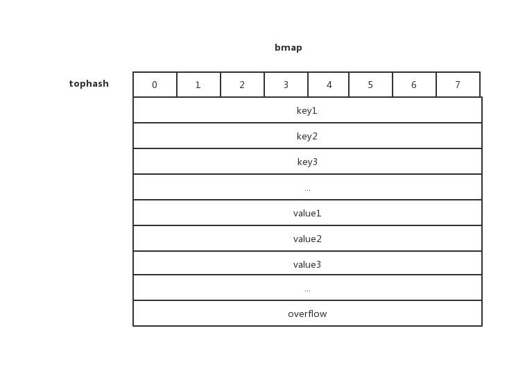
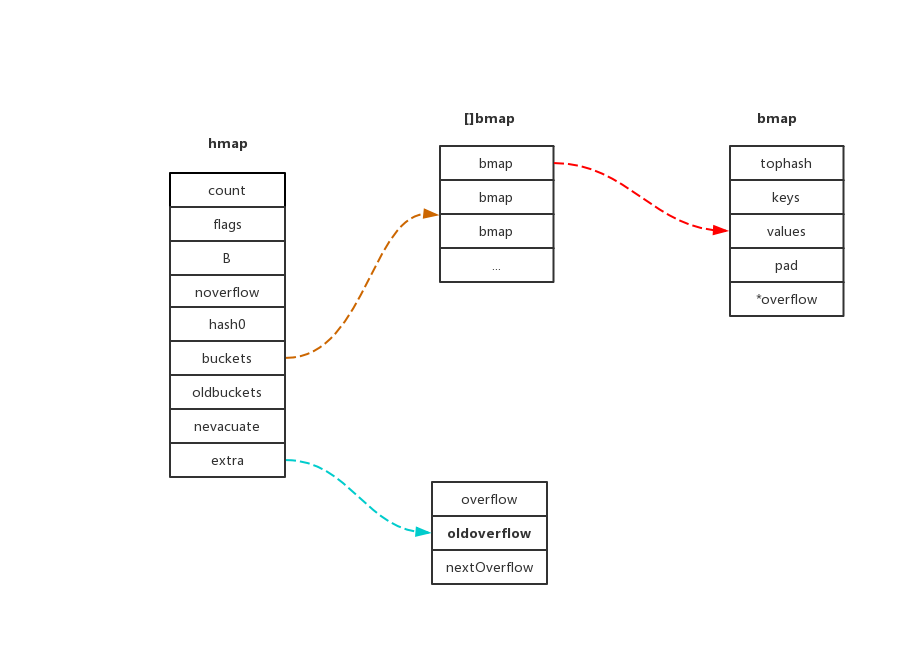

## 深入理解Map

### 常量

```go
const(
    // 1个bucket允许key/value的最大数量
    bucketCntBits = 3
    bucketCnt     = 1 << bucketCntBits

    // 平均负载因子 loadFactorNum/loadFactorDen = 6.5
    loadFactorNum = 13
    loadFactorDen = 2
    
    // topHash可能得值
    emptyRest      = 0 // 为空，并且在overflows也没有cell，初始状态
    emptyOne       = 1 // 为空，已迁移到新的bucket
    evacuatedX     = 2 // key/value已经变迁完毕，但是key都在bucket    的前半部分
    evacuatedY     = 3 // 同上，key在后半部分
    evacuatedEmpty = 4 // 为空，bucket正在搬迁
    minTopHash     = 5 // 最小的值， h > emptyOne && h < minTopHash, 表明是正在搬迁
    

    //flag
    iterator     = 1 // 有迭代器正在请求buckets
    oldIterator  = 2 // 有迭代器正在查询oldbuckets
    hashWriting  = 4 // 一个goroutine正在写map
    sameSizeGrow = 8 // 当前map正在增长到另一个map
)
    
```

### 数据结构

```go
type hmap struct {
	// Note: the format of the hmap is also encoded in cmd/compile/internal/gc/reflect.go.
	// Make sure this stays in sync with the compiler's definition.
	count     int // 元素数量
	flags     uint8  // flag
	B         uint8  // bucket的对数 2^B
	noverflow uint16 // overflow的近似数
	hash0     uint32 // 计算key的hash

	buckets    unsafe.Pointer // 2^B的bucket数组，如果count=0，则为nil
	oldbuckets unsafe.Pointer // 扩容的时候，buckets是oldbuckets的两倍
	nevacuate  uintptr        // 迁移进度，小于该地址的bucket都已完成迁移

	extra *mapextra // optional fields
}
```


```go
type mapextra struct {
	// 当key和value都不包含指针的时候， 会将bucket类型标记为不含指针，这样可以避免GC
	overflow    *[]*bmap
	oldoverflow *[]*bmap

	// nextOverflow 包含一个指针指向空闲的overflow bucket
	nextOverflow *bmap
}
```

bucket数据结构

```go
type bmap struct {
	tophash [bucketCnt]uint8
}
```

bmap只有一个tophash？ 那key和value是在哪存储的? 编译器其实会在编译的时候做一些加工，那我们看下究竟加工了哪些地方？
```go
type bmap struct{
    topbits  [BUCKETSIZE]uint8
    keys     [BUCKETSIZE]keytype
    values   [BUCKETSIZE]valuetype
    pad      uintptr    // padding字段
    overflow uintptr
}
```

我们用一张图看下bmap是如何存储数据的
注：tophash[0] 如果小于minTopHash, 就代表bucket的迁移状态
下面tophash的0 ~ 7就代表topbits[0] ~ topbits[7]对应的值


从上图看出bmap存储key/value的方式key/key/key/.../value/value/value..., 奇怪为什么不是key/value/key/value/...这种方式存储呢？
这个就需要设计到内存对齐，举个例子如果map[int64]int8, 如果key/value这种存储，那么在存完1个value后还需要在padding7个字节，而用key/key/.../value/value/... 这种方式只需要
在最后padding即可。

#### 整体图



### Map


#### makemap
创建map
```go
func makemap(t *maptype, hint int, h *hmap) *hmap {
	mem, overflow := math.MulUintptr(uintptr(hint), t.bucket.size)
	if overflow || mem > maxAlloc {
		hint = 0
	}

	// 初始化hmap
	if h == nil {
		h = new(hmap)
	}

	// 获取hash
	h.hash0 = fastrand()

	// Find the size parameter B which will hold the requested # of elements.
	// For hint < 0 overLoadFactor returns false since hint < bucketCnt.
	// 获取B的大小，使得2^B > 6.5
	B := uint8(0)
	for overLoadFactor(hint, B) {
		B++
	}
	h.B = B

	// allocate initial hash table
	// if B == 0, the buckets field is allocated lazily later (in mapassign)
	// If hint is large zeroing this memory could take a while.
	// 初始化hash table
	// 如果B == 0， bucket谁延迟分配
	// 如果hint很大，则分配需要一些时间
	if h.B != 0 {
		var nextOverflow *bmap
		h.buckets, nextOverflow = makeBucketArray(t, h.B, nil)
		if nextOverflow != nil {
			h.extra = new(mapextra)
			h.extra.nextOverflow = nextOverflow
		}
	}

	return h
}
```

#### makeBucketArray
创建buckets
```go
func makeBucketArray(t *maptype, b uint8, dirtyalloc unsafe.Pointer) (buckets unsafe.Pointer, nextOverflow *bmap) {
	base := bucketShift(b)
	nbuckets := base
	// For small b, overflow buckets are unlikely.
	// Avoid the overhead of the calculation.
	// 对于过小的B值，不会可能会溢出，避免计算开销
	if b >= 4 {
		// Add on the estimated number of overflow buckets
		// required to insert the median number of elements
		// used with this value of b.
		nbuckets += bucketShift(b - 4)
		sz := t.bucket.size * nbuckets
		up := roundupsize(sz)
		if up != sz {
			nbuckets = up / t.bucket.size
		}
	}

	if dirtyalloc == nil {
		buckets = newarray(t.bucket, int(nbuckets))
	} else {
		// dirtyalloc was previously generated by
		// the above newarray(t.bucket, int(nbuckets))
		// but may not be empty.
		buckets = dirtyalloc
		size := t.bucket.size * nbuckets
		if t.bucket.kind&kindNoPointers == 0 {
			memclrHasPointers(buckets, size)
		} else {
			memclrNoHeapPointers(buckets, size)
		}
	}

	if base != nbuckets {
		// We preallocated some overflow buckets.
		// To keep the overhead of tracking these overflow buckets to a minimum,
		// we use the convention that if a preallocated overflow bucket's overflow
		// pointer is nil, then there are more available by bumping the pointer.
		// We need a safe non-nil pointer for the last overflow bucket; just use buckets.
		nextOverflow = (*bmap)(add(buckets, base*uintptr(t.bucketsize)))
		last := (*bmap)(add(buckets, (nbuckets-1)*uintptr(t.bucketsize)))
		last.setoverflow(t, (*bmap)(buckets))
	}
	return buckets, nextOverflow
}
```


#### mapaccess1
map访问
```go
func mapaccess1(t *maptype, h *hmap, key unsafe.Pointer) unsafe.Pointer {
    // 省略...
    
    // 如果h为nil或者count = 0， 返回0值
	if h == nil || h.count == 0 {
		if t.hashMightPanic() {
			t.key.alg.hash(key, 0) // see issue 23734
		}
		return unsafe.Pointer(&zeroVal[0])
	}
	// 读写冲突
	if h.flags&hashWriting != 0 {
		throw("concurrent map read and map write")
	}

	// 不同类型key的hash函数
	alg := t.key.alg
	// 通过key和hash0计算hash值
	hash := alg.hash(key, uintptr(h.hash0))
	// m = 1 << b - 1， 二进制全为1
	m := bucketMask(h.B)
	// bucket的地址， hash&m 相当于取低#TODO:
	b := (*bmap)(add(h.buckets, (hash&m)*uintptr(t.bucketsize)))
	// oldbuckets不为nil，说明发生了扩容
	if c := h.oldbuckets; c != nil {
		// 如果不是同size扩容
		if !h.sameSizeGrow() {
			// 新bucket是老数量的两倍
			m >>= 1
		}
		// 求出key在老map中的位置
		oldb := (*bmap)(add(c, (hash&m)*uintptr(t.bucketsize)))
		// 如果oldb没有迁移到新的bucket，那就在老bucket中寻找
		if !evacuated(oldb) {
			b = oldb
		}
	}
	// 右移56位，相当于取高8位
	top := tophash(hash)
bucketloop:
    // 遍历所有的buckets
	for ; b != nil; b = b.overflow(t) {
		// 遍历8个bucket
		for i := uintptr(0); i < bucketCnt; i++ {
			// tophash 不匹配，跳过
			if b.tophash[i] != top {
				if b.tophash[i] == emptyRest {
					break bucketloop
				}
				continue
			}
			// tophash匹配，定位到key的位置
			// key的起始地址是unsafe.Pointer(b)+dataOffset, 第i个key的地址是要加上key的size大小
			k := add(unsafe.Pointer(b), dataOffset+i*uintptr(t.keysize))
			if t.indirectkey() {
				// key是指针，解引用
				k = *((*unsafe.Pointer)(k))
			}
			// key相当
			if alg.equal(key, k) {
				// 定位value的位置， value的位置是遍历完所有的key之后，再加上value的大小
				v := add(unsafe.Pointer(b), dataOffset+bucketCnt*uintptr(t.keysize)+i*uintptr(t.valuesize))
				if t.indirectvalue() {
					// 解引用
					v = *((*unsafe.Pointer)(v))
				}
				return v
			}
		}
	}
	return unsafe.Pointer(&zeroVal[0])
}
```

### 扩容

map扩容触发的时机，在插入新key的时候(mapassign)，会进行判断，满足下面2个条件，就会触发扩容
1. 装载因子超过6.5, 即key的个数 / (2^B) > 6.5
2. overflow的bucket数量过多，当B小于15，如果noverflow大于B，如果B大于15，如果noverflow大于15


#### hashGrow
```go
func hashGrow(t *maptype, h *hmap) {
	// 如果命中了大于load factor，则扩充2倍
	// 否则，有太多的overflow bucket，要保持相同的bucket数量，并横向增长
	bigger := uint8(1)
	if !overLoadFactor(h.count+1, h.B) {
		bigger = 0
		h.flags |= sameSizeGrow
	}
	// 将buckets赋值给oldbuckets
	oldbuckets := h.buckets
	// 申请新的buckets空间
	newbuckets, nextOverflow := makeBucketArray(t, h.B+bigger, nil)

	flags := h.flags &^ (iterator | oldIterator)
	if h.flags&iterator != 0 {
		// 如果当前在处于迭代状态，则将flag变更多oldIterator
		flags |= oldIterator
	}

	// 提交grow请求
	h.B += bigger
	h.flags = flags
	h.oldbuckets = oldbuckets
	h.buckets = newbuckets
	// 搬迁进度为0
	h.nevacuate = 0
	// overflow buckets数量为0
	h.noverflow = 0

	if h.extra != nil && h.extra.overflow != nil {
		// Promote current overflow buckets to the old generation.
		if h.extra.oldoverflow != nil {
			throw("oldoverflow is not nil")
		}
		h.extra.oldoverflow = h.extra.overflow
		h.extra.overflow = nil
	}
	if nextOverflow != nil {
		if h.extra == nil {
			h.extra = new(mapextra)
		}
		h.extra.nextOverflow = nextOverflow
	}

	// the actual copying of the hash table data is done incrementally
	// by growWork() and evacuate().
}

```

#### growWork
```go
func growWork(t *maptype, h *hmap, bucket uintptr) {
	// make sure we evacuate the oldbucket corresponding
	// to the bucket we're about to use
	// 确认搬迁老的bucket对应正在使用的bucket
	evacuate(t, h, bucket&h.oldbucketmask())

	// 再搬迁1个bucket， 加快搬迁进度
	if h.growing() {
		
		evacuate(t, h, h.nevacuate)
	}
}
```
bucket&h.oldbucketmask()判断搬迁的bucket是否是我们要找的bucket，算法是通过寻找B，然后bucketshift后，得到mask，再与hash值相与，得到低B位。


#### evacuate
evacuate 实现了bucket搬迁

我们首先了解下evacDst的结构，这个搬迁目的的结构

```go
type evacDst struct {
	b *bmap          // 目的的bucket
	i int            // bucket的索引
	k unsafe.Pointer // 指向key的存储
	v unsafe.Pointer // 指向value的存储
}
```

```go
func evacuate(t *maptype, h *hmap, oldbucket uintptr) {
	// 定位oldbucket的位置
	b := (*bmap)(add(h.oldbuckets, oldbucket*uintptr(t.bucketsize)))
	// oldbucket的bucketshift后的值, 2^oldB
	newbit := h.noldbuckets()
	// 如果bucket还没有搬迁
	if !evacuated(b) {
		// xy是个数组，x和y表示搬迁的目标地址
		var xy [2]evacDst
		// 默认使用x来搬迁，前后bucket序号不变
		x := &xy[0]
		// x 相当于等size扩容，前后bucket序号不变
		x.b = (*bmap)(add(h.buckets, oldbucket*uintptr(t.bucketsize)))
		x.k = add(unsafe.Pointer(x.b), dataOffset)
		x.v = add(x.k, bucketCnt*uintptr(t.keysize))

		// 不是同size扩容，前后bucket变化
		if !h.sameSizeGrow() {
			// 使用y来搬迁
			y := &xy[1]
			// y的bucket序号增加了2^oldb
			y.b = (*bmap)(add(h.buckets, (oldbucket+newbit)*uintptr(t.bucketsize)))
			y.k = add(unsafe.Pointer(y.b), dataOffset)
			y.v = add(y.k, bucketCnt*uintptr(t.keysize))
		}
		// 遍历所有bucket，包括overflow bucket
		for ; b != nil; b = b.overflow(t) {
			// 初始key和value的位置
			k := add(unsafe.Pointer(b), dataOffset)
			v := add(k, bucketCnt*uintptr(t.keysize))
			// 遍历所有cell
			for i := 0; i < bucketCnt; i, k, v = i+1, add(k, uintptr(t.keysize)), add(v, uintptr(t.valuesize)) {
				top := b.tophash[i]
				// 如果是空，没有key
				if isEmpty(top) {
					// 标记成已搬迁
					b.tophash[i] = evacuatedEmpty
					continue
				}
				// 未搬迁的应该不会出现这个值
				if top < minTopHash {
					throw("bad map state")
				}
				k2 := k
				// 如果key是指针，则解引用
				if t.indirectkey() {
					k2 = *((*unsafe.Pointer)(k2))
				}

				// 0是搬迁到上半部分，1是搬迁到下半部分
				var useY uint8
				if !h.sameSizeGrow() {
					// 计算hash值
					hash := t.key.alg.hash(k2, uintptr(h.hash0))
					// 有goroutine正在遍历map，并且相同key算出来的hash值不一样，只有NaN!=Nan才会出现
					if h.flags&iterator != 0 && !t.reflexivekey() && !t.key.alg.equal(k2, k2) {
						// 如果Key的hash不一致，随机搬迁到X或者Y，根据最低位分配bucket
						useY = top & 1
						top = tophash(hash)
					} else {
						// Hash值的B位置如果不等于0，则搬迁到下半部分
						if hash&newbit != 0 {
							useY = 1
						}
					}
				}
				// 错误的搬迁值
				if evacuatedX+1 != evacuatedY || evacuatedX^1 != evacuatedY {
					throw("bad evacuatedN")
				}

				b.tophash[i] = evacuatedX + useY // evacuatedX + 1 == evacuatedY
				dst := &xy[useY]                 // 搬迁的目的

				if dst.i == bucketCnt {
					dst.b = h.newoverflow(t, dst.b)
					dst.i = 0
					dst.k = add(unsafe.Pointer(dst.b), dataOffset)
					dst.v = add(dst.k, bucketCnt*uintptr(t.keysize))
				}
				dst.b.tophash[dst.i&(bucketCnt-1)] = top // mask dst.i as an optimization, to avoid a bounds check
				if t.indirectkey() {
					*(*unsafe.Pointer)(dst.k) = k2 // 复制指针
				} else {
					typedmemmove(t.key, dst.k, k) // 复制值
				}
				if t.indirectvalue() {
					*(*unsafe.Pointer)(dst.v) = *(*unsafe.Pointer)(v)
				} else {
					typedmemmove(t.elem, dst.v, v)
				}
				// 定位下一个cell，防止溢出
				dst.i++
				dst.k = add(dst.k, uintptr(t.keysize))
				dst.v = add(dst.v, uintptr(t.valuesize))
			}
		}
		// Unlink the overflow buckets & clear key/value to help GC.
		// 接触overflow buckets， 清除key和value 帮助gc
		if h.flags&oldIterator == 0 && t.bucket.kind&kindNoPointers == 0 {
			b := add(h.oldbuckets, oldbucket*uintptr(t.bucketsize))
			// Preserve b.tophash because the evacuation
			// state is maintained there.
			ptr := add(b, dataOffset)
			n := uintptr(t.bucketsize) - dataOffset
			memclrHasPointers(ptr, n)
		}
	}

	if oldbucket == h.nevacuate {
		advanceEvacuationMark(h, t, newbit)
	}
}

```

这里我们也用一个图说明下如果不是同size扩容的情况
这里假定我们的size是8, 前8位是tophash的值，用来判断cell位置，后B位用来定位Bucket的位置，第一行搬迁前的bucket位置是170，搬迁后的位置是426

阶段|高8位| 中间数据 | 低B位
---|---|---|---|
扩容前(5)|10110101|0.....1|10101010
扩容后(6)|10110101|0.....0|110101010

### Map的遍历
我们写一段测试代码，去看下map遍历如何调用

```go
package main

func main(){
	var m = map[string]string{
		"a":"a",
		"b":"b",
		"c":"c",
	}

	for k,v := range m{
		_,_= k,v
	}
}
```

```bash
go build -gcflags=all="-N -l" map_demo.go
go tool objdump -s "main.main" map_demo|grep CALL

map_demo.go:5		0x1056c6c		e84babffff			CALL 0x10517bc
map_demo.go:5		0x1056c9c		e8bf9bfeff			CALL runtime.fastrand(SB)
map_demo.go:6		0x1056d1d		e88e8cfbff			CALL runtime.mapassign_faststr(SB)
map_demo.go:7		0x1056db4		e8f78bfbff			CALL runtime.mapassign_faststr(SB)
map_demo.go:8		0x1056e4b		e8608bfbff			CALL runtime.mapassign_faststr(SB)
map_demo.go:11		0x1056ea3		e849a9ffff			CALL 0x10517f1
map_demo.go:11		0x1056ece		e83d63fbff			CALL runtime.mapiterinit(SB)   
map_demo.go:11		0x1056f46		e8b564fbff			CALL runtime.mapiternext(SB)
map_demo.go:8		0x1056f5d		e80e9effff			CALL runtime.gcWriteBarrier(SB)
map_demo.go:7		0x1056f67		e8049effff			CALL runtime.gcWriteBarrier(SB)
map_demo.go:6		0x1056f74		e8f79dffff			CALL runtime.gcWriteBarrier(SB)
map_demo.go:4		0x1056f7e		e80d80ffff			CALL runtime.morestack_noctxt(SB)
```
从上面输入上看，首先是执行了mapiterinit函数，然后又执行了mapiternext函数，那么这两个函数又做了什么？ 咱们接着看！

要了解mapiterinit，首先要了解hiter
```go
type hiter struct {
	key         unsafe.Pointer // key的指针
	value       unsafe.Pointer // value的指针
	t           *maptype       // map的类型, 包含key、value和bucket的大小等
	h           *hmap          // 
	buckets     unsafe.Pointer // 初始化时指向bucket的指针
	bptr        *bmap          // 当前遍历的bucket
	overflow    *[]*bmap       // keeps overflow buckets of hmap.buckets alive
	oldoverflow *[]*bmap       // keeps overflow buckets of hmap.oldbuckets alive
	startBucket uintptr        // 起始遍历的bucket
	offset      uint8          // bucket内的偏移量
	wrapped     bool           // true则不从头遍历， false则反之
	B           uint8          // B的大小
	i           uint8
	bucket      uintptr
	checkBucket uintptr        // 需要检查的bucket
}
```
我们看完了hiter，接下来我们看下hiter初始化操作
#### mapiterinit
```go
func mapiterinit(t *maptype, h *hmap, it *hiter) {
	if raceenabled && h != nil {
		callerpc := getcallerpc()
		racereadpc(unsafe.Pointer(h), callerpc, funcPC(mapiterinit))
	}

	if h == nil || h.count == 0 {
		return
	}

	if unsafe.Sizeof(hiter{})/sys.PtrSize != 12 {
		throw("hash_iter size incorrect") // see cmd/compile/internal/gc/reflect.go
	}
	it.t = t
	it.h = h

	// grab snapshot of bucket state
	it.B = h.B
	it.buckets = h.buckets
	if t.bucket.kind&kindNoPointers != 0 {
		// Allocate the current slice and remember pointers to both current and old.
		// This preserves all relevant overflow buckets alive even if
		// the table grows and/or overflow buckets are added to the table
		// while we are iterating.
		h.createOverflow()
		it.overflow = h.extra.overflow
		it.oldoverflow = h.extra.oldoverflow
	}

	// 生成随机数r，这也是map是无序的一个重要因素
	r := uintptr(fastrand())
	if h.B > 31-bucketCntBits {
		r += uintptr(fastrand()) << 31
	}
	// 起始bucket，在0和2^B-1之间
	it.startBucket = r & bucketMask(h.B)
	// bucket内的偏移量
	it.offset = uint8(r >> h.B & (bucketCnt - 1))

	// iterator state
	it.bucket = it.startBucket

	// Remember we have an iterator.
	// Can run concurrently with another mapiterinit().
	if old := h.flags; old&(iterator|oldIterator) != iterator|oldIterator {
		atomic.Or8(&h.flags, iterator|oldIterator)
	}

	mapiternext(it)
}
```
接下来我们看mapiternext

```go
func mapiternext(it *hiter) {
	h := it.h
	if raceenabled {
		callerpc := getcallerpc()
		racereadpc(unsafe.Pointer(h), callerpc, funcPC(mapiternext))
	}
	if h.flags&hashWriting != 0 {
		throw("concurrent map iteration and map write")
	}
	t := it.t
	bucket := it.bucket
	b := it.bptr
	i := it.i
	checkBucket := it.checkBucket
	alg := t.key.alg

next:
	if b == nil {
		if bucket == it.startBucket && it.wrapped {
			// 代表已经从bucket->last bucket -> first bucket -> bucket，结束迭代
			it.key = nil
			it.value = nil
			return
		}
		if h.growing() && it.B == h.B {
			// 如果迭代器是从map扩容时开始迭代，那么我们还需要看下oldbuck是否迁移完成，如果没有，那我们还需要迭代oldbucket，
			// 但是只返回那些需要搬迁的key即可
			oldbucket := bucket & it.h.oldbucketmask()
			b = (*bmap)(add(h.oldbuckets, oldbucket*uintptr(t.bucketsize)))
			if !evacuated(b) {
				// 没有迁移，还需要检查oldbuck
				checkBucket = bucket
			} else {
				// 迁移中
				b = (*bmap)(add(it.buckets, bucket*uintptr(t.bucketsize)))
				checkBucket = noCheck
			}
		} else {
			b = (*bmap)(add(it.buckets, bucket*uintptr(t.bucketsize)))
			checkBucket = noCheck
		}
		bucket++
		// 如果遍历到末尾，则将bucket设置成0，并将wrapped设置成true
		if bucket == bucketShift(it.B) {
			bucket = 0
			it.wrapped = true
		}
		i = 0
	}
	// 
	for ; i < bucketCnt; i++ {
		offi := (i + it.offset) & (bucketCnt - 1)
		if isEmpty(b.tophash[offi]) || b.tophash[offi] == evacuatedEmpty {
			// cell为空或是迁移为空，则跳过
			continue
		}
		// 获取key的地址
		k := add(unsafe.Pointer(b), dataOffset+uintptr(offi)*uintptr(t.keysize))
		if t.indirectkey() {
			k = *((*unsafe.Pointer)(k))
		}
		// 获取value的地址
		v := add(unsafe.Pointer(b), dataOffset+bucketCnt*uintptr(t.keysize)+uintptr(offi)*uintptr(t.valuesize))
		if checkBucket != noCheck && !h.sameSizeGrow() {
			// 如果需要检查oldbucket，并且不是同size扩容，我们需要检查oldbucket，
			// 并且跳过那些需要搬迁到新bucket的（每个oldbucket在扩容的时候都会扩展为两个bucket）
			if t.reflexivekey() || alg.equal(k, k) {
				// If the item in the oldbucket is not destined for
				// the current new bucket in the iteration, skip it.
				// 如果oldbucket中的item
				hash := alg.hash(k, uintptr(h.hash0))
				if hash&bucketMask(it.B) != checkBucket {
					continue
				}
			} else {
				// Hash isn't repeatable if k != k (NaNs).  We need a
				// repeatable and randomish choice of which direction
				// to send NaNs during evacuation. We'll use the low
				// bit of tophash to decide which way NaNs go.
				// NOTE: this case is why we need two evacuate tophash
				// values, evacuatedX and evacuatedY, that differ in
				// their low bit.

				// NaN not a number
				if checkBucket>>(it.B-1) != uintptr(b.tophash[offi]&1) {
					continue
				}
			}
		}
		if (b.tophash[offi] != evacuatedX && b.tophash[offi] != evacuatedY) ||
			!(t.reflexivekey() || alg.equal(k, k)) {
			// This is the golden data, we can return it.
			// OR
			// key!=key, so the entry can't be deleted or updated, so we can just return it.
			// That's lucky for us because when key!=key we can't look it up successfully.
			// key!=key 我们直接返回，因为我们无法找到它
			it.key = k
			if t.indirectvalue() {
				v = *((*unsafe.Pointer)(v))
			}
			it.value = v
		} else {
			rk, rv := mapaccessK(t, h, k)
			// key已经被删除
			if rk == nil {
				continue
			}
			it.key = rk
			it.value = rv
		}
		it.bucket = bucket
		if it.bptr != b { // 避免不必要的写屏障; https://github.com/golang/go/issues/14921
			it.bptr = b
		}
		it.i = i + 1
		it.checkBucket = checkBucket
		return
	}
	b = b.overflow(t)
	i = 0
	goto next
}
```

### Map赋值
map赋值
```go
func mapassign(t *maptype, h *hmap, key unsafe.Pointer) unsafe.Pointer {
	// 不能给未初始化的map赋值
	if h == nil {
		panic(plainError("assignment to entry in nil map"))
	}
	if raceenabled {
		callerpc := getcallerpc()
		pc := funcPC(mapassign)
		racewritepc(unsafe.Pointer(h), callerpc, pc)
		raceReadObjectPC(t.key, key, callerpc, pc)
	}
	if msanenabled {
		msanread(key, t.key.size)
	}
	// 读写控制
	if h.flags&hashWriting != 0 {
		throw("concurrent map writes")
	}
	alg := t.key.alg
	hash := alg.hash(key, uintptr(h.hash0))

	// Set hashWriting after calling alg.hash, since alg.hash may panic,
	// in which case we have not actually done a write.
	// 设置flag为hashWriting，放到alg.hash之后是因为可能会panic，但是实际上我们还没有开始执行写操作
	h.flags ^= hashWriting
	
	if h.buckets == nil {
		h.buckets = newobject(t.bucket) // newarray(t.bucket, 1)
	}

again:
	bucket := hash & bucketMask(h.B)
	// 扩容中，开始搬迁
	if h.growing() {
		growWork(t, h, bucket)
	}
	// 获取当前bucket
	b := (*bmap)(unsafe.Pointer(uintptr(h.buckets) + bucket*uintptr(t.bucketsize)))
	top := tophash(hash)

	// 插入的位置
	var inserti *uint8
	// 插入的key
	var insertk unsafe.Pointer
	// val的位置
	var val unsafe.Pointer
bucketloop:
	for {
		for i := uintptr(0); i < bucketCnt; i++ {
			// 不匹配
			if b.tophash[i] != top {
				// 当前cell为空，并且inserti == nil，则设置inserti, insertk, val 位置
				if isEmpty(b.tophash[i]) && inserti == nil {
					inserti = &b.tophash[i]
					insertk = add(unsafe.Pointer(b), dataOffset+i*uintptr(t.keysize))
					val = add(unsafe.Pointer(b), dataOffset+bucketCnt*uintptr(t.keysize)+i*uintptr(t.valuesize))
				}
				// cell为空，并且更高索引的也为空
				if b.tophash[i] == emptyRest {
					break bucketloop
				}
				continue
			}
			// 获取k
			k := add(unsafe.Pointer(b), dataOffset+i*uintptr(t.keysize))
			if t.indirectkey() {
				k = *((*unsafe.Pointer)(k))
			}
			// 如果key不相等不等于，跳过
			if !alg.equal(key, k) {
				continue
			}

			// 当前key已经有值了，则开始更新
			if t.needkeyupdate() {
				typedmemmove(t.key, k, key)
			}
			val = add(unsafe.Pointer(b), dataOffset+bucketCnt*uintptr(t.keysize)+i*uintptr(t.valuesize))
			// 更新val的位置
			goto done
		}
		ovf := b.overflow(t)
		if ovf == nil {
			break
		}
		b = ovf
	}

	// 如果bucket没有在扩容，并且需要扩容
	if !h.growing() && (overLoadFactor(h.count+1, h.B) || tooManyOverflowBuckets(h.noverflow, h.B)) {
		hashGrow(t, h)
		// 扩容完了，然后再执行下赋值操作
		goto again // Growing the table invalidates everything, so try again
	}

	if inserti == nil {
		// 当前的buckets已经都满了，需要重新分配一个bucket
		newb := h.newoverflow(t, b)
		inserti = &newb.tophash[0]
		insertk = add(unsafe.Pointer(newb), dataOffset)
		val = add(insertk, bucketCnt*uintptr(t.keysize))
	}

	// 储存新的key和value到插入的位置
	if t.indirectkey() {
		kmem := newobject(t.key)
		*(*unsafe.Pointer)(insertk) = kmem
		insertk = kmem
	}
	if t.indirectvalue() {
		vmem := newobject(t.elem)
		*(*unsafe.Pointer)(val) = vmem
	}
	// 赋值
	typedmemmove(t.key, insertk, key)
	*inserti = top
	h.count++

done:
	// 并发写检查
	if h.flags&hashWriting == 0 {
		throw("concurrent map writes")
	}
	// 解除写flag
	h.flags &^= hashWriting
	if t.indirectvalue() {
		val = *((*unsafe.Pointer)(val))
	}
	return val
}
```

#### mapdelete
map删除比较简单

1. 检查key的hash，算出所属的bucket
2. 判断map正在扩容，如果是则触发一次搬迁
3. 两层循环去删除
4. 找到key的位置后，对key和value执行清除操作，如果是指针，则直接赋值为nil，如果是非指针，则需要从内存中删除


### NaN
当key是NaN的时候？Map是如何处理的？这种情况下，是永远无法获取到值的，只能通过遍历获取到


### 参考资料

[深入解密Go语言之map](https://www.cnblogs.com/qcrao-2018/p/10903807.html)
[哈希表](https://draveness.me/golang/datastructure/golang-hashmap.html)