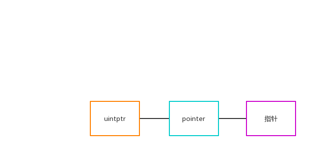

## 深入理解unsafe

### 指针
Go里面为什么会有指针？这里我们看个例子，例子来源于https://go101.org/article/pointer.html
```go
func add(i int) {
    i+= i
}

func main(){
    a := 1
    add(a)
    fmt.Println(a)
}
```
上面的代码运行会输出什么呢？ 大家肯定都知道，那就是1，因为go里面是值传递，但是如果我们想真正实现加i的功能要怎么做? 那就需要指针

我们把add这个函数改造下,那么这次输出什么呢？ 那么会输出什么？答案是2，因为我们使用的指针传参，并且用`*i+=*i`将指针所指向的值做加i的操作
```go
func add(i *int) {
    *i+= *i
}

func main(){
    a := 1
    add(&a)
    fmt.Println(a)
}
```

那我们再改一下,那么这次会输出什么呢？
```go
func add(i *int) {
    *i+= *i
    i = nil
}

func main(){
    a := 1
    add(&a)
    fmt.Println(a)
}
```
输出还是2吗？ 那我们执行下， 还真是2，这是为什么？因为函数是值传递，i和&a指向的是同一块地址，当把*i的值改变时，那么a对应的值也会改变，但是如果只是把i的设为nil，只是修改了指向，不会影响a本身的值。


### Unsafe
Go里面使用指针是相对安全，不过也有诸多限制，比如类型转换， 这时unsafe就派上用场了。unsafe提供了一些非安全的指针操作，可以让我们绕过系统进行操作



#### Pointer

```go
// ArbitraryType代表任意类型
type ArbitraryType int
// 1. 任何类型的指针都可以转为Pointer
// 2. Pointer可以转换为任何类型的指针
// 3. uintptr 可以转换为Pointer
// 4. Pointer 可以转换为uintptr


type Pointer *ArbitraryType

// 获取任意类型的，返回时x类型大小的描述符，不是具体引用的内存
func Sizeof(x ArbitraryType) uintptr

// 返回结构体中字段的offset
func Offsetof(x ArbitraryType) uintptr

// 返回变量对齐字段的数量
func Alignof(x ArbitraryType) uintptr
```


#### uintptr
uintptr没有指针的语义，所以uintptr所指向的对象会被GC回收，但是pointer有指针语义，所以它指向的对象在被引用的时候不会被GC回收

### 使用
下面我们用几个例子简单说明：

#### slice
```go
	s := make([]int, 5, 10)
	// 根据偏移量，获取到slice的长度
	l := (*int)(unsafe.Pointer(uintptr(unsafe.Pointer(&s)) + uintptr(unsafe.Sizeof(0))))
	fmt.Println(*l)

	// 获取slice的cap
	c := (*int)(unsafe.Pointer(uintptr(unsafe.Pointer(&s)) + 2*uintptr(unsafe.Sizeof(0))))
	fmt.Println(*c)
```


#### map
```go
	r := make(map[string]int)
	r["a"] = 1
	r["b"] = 2
	r["c"] = 3

	// map的第一个字段是count，由于map都是指针，所以需要两次解引用
	count := **(**int)(unsafe.Pointer(&r))
	fmt.Println(count)
```

#### struct
```go
type Demo struct {
	name string `json:"name"`
	age  int    `json:"age"`
}

func main(){
	var d  = Demo{"leon", 21}
	dd := unsafe.Pointer(d)
	v := uintptr(0)
	// 获取第一个字段，offset是0
	p := (*string)(unsafe.Pointer(uintptr(dd) + v))
	fmt.Println(*p)

	// 获取age字段，string占用2个字节，所以offset是16
	age := (*int)(unsafe.Pointer(uintptr(dd) + uintptr(16)))
	fmt.Println(*age)
}

```

#### 转换
string和bytes转换
```go
func string2Slice(s string) []byte {
	stringHeader := (*reflect.StringHeader)(unsafe.Pointer(&s))

	b := reflect.SliceHeader{
		Data: stringHeader.Data,
		Len:  stringHeader.Len,
		Cap:  stringHeader.Len,
	}

	return *(*[]byte)(unsafe.Pointer(&b))
}

func bytes2String(b []byte) string {
	sliceHeader := (*reflect.SliceHeader)(unsafe.Pointer(&b))

	s := reflect.StringHeader{
		Data: sliceHeader.Data,
		Len:  sliceHeader.Len,
	}

	return *(*string)(unsafe.Pointer(&s))
}
```